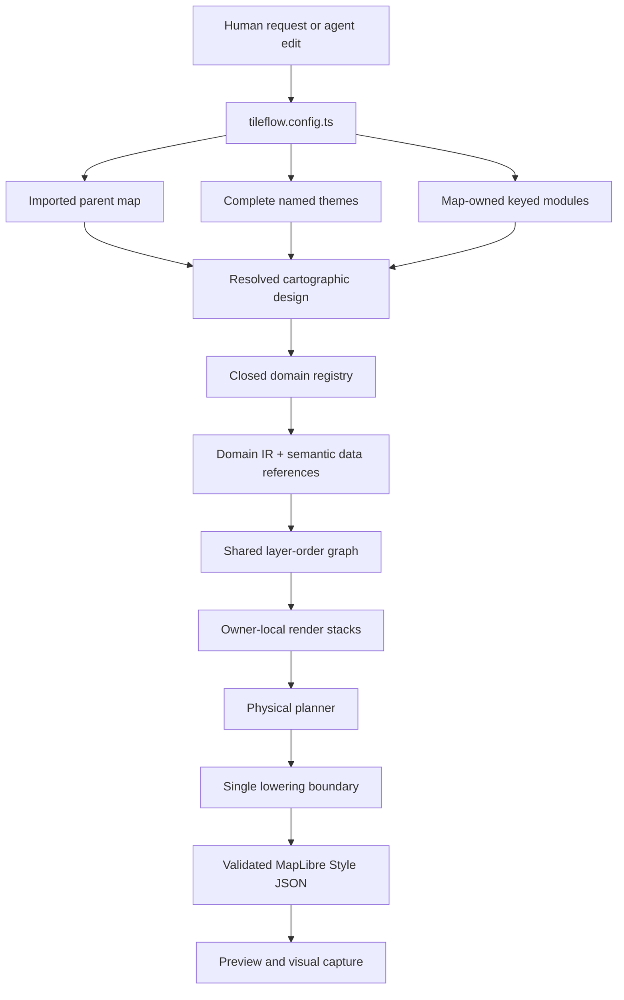

# Cartographic authoring contract

## Purpose and ownership

The SDK owns the cartographic authoring loop because configuration, semantic modules, compilation,
and visual evidence must change atomically. The canonical workbench is
the official maps under `packages/maps/src/official/`. The Tileflow Tiles playground consumes
exact npm packages after publication; it is not the place to invent SDK controls.

Streets, Baedeker, Cyberpunk, Ferraris, Härad, Matrix, Siegfried, Soundings, Verdant, and San
Francisto are Tileflow's first-party standalone maps, declared with `defineMap()` and compiled
directly from Tileflow-owned semantic modules. The sole semantic compiler is implicit, and they
define their full designs independently: no official map imports or extends another official map,
and each owns its asset providers. Streets owns coordinated light and dark appearances.
Applications customize maps through the inheritance and theme contracts. None of these maps
clones, bundles, or patches an upstream style. Coverage and design comparisons use external visual
references rather than a template stored in the compiler package.

## How authoring becomes a map

The public API is deliberately agent-friendly:

- Every `tileflow.config.ts` exports one map.
- `defineMap({...})` without `extends` creates a complete standalone semantic map.
- `defineMap({extends: parent})` creates a versioned map from another imported map object.
- Omitting `data` selects the compiler-owned Tileflow World `v1` generation.
- `data` changes the compatible dataset, never the drawing system.
- `modules` is an object keyed by domain; key order never controls z-order and duplicates are
  impossible.
- Themes expose one stable, typed semantic-token schema across all named appearances.
- Module presets describe intent, while visual semantic targets accept token refs, documented
  `fixed()` values, zoom functions, and the closed `expr.*` data-expression builders.
- Every contribution has one module owner and disappears when that module is replaced or disabled.

A map extending Streets is complete even when `modules` is omitted. Omitted module domains inherit;
declaring a domain replaces that inherited module request as a unit. Inside a module request,
unspecified fields preserve its module defaults, arrays replace, and expressions and zoom values are
atomic. Use `disable()` for deliberate removal of a complete semantic domain; `enabled` remains
available only on documented nested capabilities such as individual road classes and treatments.

Shared symbol ranges govern text and icon together and are inherited by an optional marker. A
marker can refine that range because it compiles to a separate circle layer; incompatible text and
icon ranges fail because those parts share one MapLibre symbol layer.

Tileflow World's canonical POI projection owns classification, editorial zoom eligibility, and
cross-source ranking. The SDK validates `category`, `type`, `icon`, `min_zoom`, `filter_rank`, and
`size_rank` on the `poi` layer. It does not reinterpret OpenMapTiles `class`, `subclass`, or
`rank`. `filter_rank` is bounded to 0–5; the module's numeric `density` is an inclusive 1–5
threshold and defaults to 3. `size_rank` is bounded to 0–16 and orders eligible candidates before
MapLibre collision placement, which remains authoritative. The closed category vocabulary is
`arts-entertainment`, `education`, `food-drink`, `landmark`, `lodging`, `medical`, `park-nature`,
`public-services`, `religion`, `retail`, `sport-leisure`, `transport`, and `visitor-amenity`.
Producer `type` and `icon` values are snake_case; an unavailable icon falls back safely to its
category image. Category styles are presentational and cannot replace producer selection.

Official maps own their source assets in `@tileflow/maps/assets/<id>/`. Streets declares
`icons: [streetsIcons]`; Cyberpunk and Matrix independently declare `[cyberpunkIcons]` and
`[matrixIcons]`. Baedeker, Ferraris, Härad, Siegfried, Soundings, Verdant, and San Francisto likewise
declare only `[baedekerIcons]`, `[ferrarisIcons]`, `[haradIcons]`, `[siegfriedIcons]`,
`[soundingsIcons]`, `[verdantIcons]`, and `[sanFrancistoIcons]`, respectively; none composes another
official map's assets. Baedeker owns eight original patterns informed by historical Baedeker and
Wagner & Debes visual references without redistributing scans, source pixels, historical
typefaces, legend artwork, geospatial data, or source maps; it is not affiliated with or endorsed
by Baedeker or Wagner & Debes. Its separately licensed Cormorant files and OFL license live in its
own package asset closure. Its contours are derived in the browser from Mapterhorn terrain tiles,
none of which are packaged. Härad's directory contains nine original Tileflow SVG patterns inspired by
Lantmäteriet's CC0 Häradsekonomiska kartan series (1859–1934) and official legend. The package
redistributes no Lantmäteriet scan, source pixel, legend artwork, font, or map data.
Siegfried owns nine semantic engraving motifs with separate light and dark SVG sources in one asset
directory. Both themes compile the same layer topology; the dark theme changes only semantic ink,
paper, and image-token values and is documented as an original nocturnal interpretation.
The Soundings asset directory retains ten original chart symbols and patterns. The official map
selects only its harbor and paper/water patterns; buoy, light, lighthouse, wreck, and rock symbols
remain available for the separate experimental Nautical canary and are not part of official
Soundings. Its GEBCO-derived depth bands and labels provide broad visual context and are not
navigation-grade survey soundings. Applications use the same rule with a config-relative
directory, for example `icons: [...streets.icons, './icons']`. San Francisto's asset closure
contains four original drafting patterns and one schematic POI symbol for its dark blueprint
design.

`icons` is only an ordered directory array. Omission inherits the parent's exact array, declaration
replaces it atomically, and `[]` means no icons. `<id>.<ext>` publishes an icon as `<id>`, while
`<id>.pattern.<ext>` publishes an intrinsic-size pattern as `<id>`; published IDs are canonical
lower-kebab. Directories apply left to right, so a later file with the same exact ID wins; case-only
collisions fail. There are no icon provider selectors, mappings, or compatibility aliases. Node
preparation compiles the final composition into deterministic MapLibre sprite files, and final
style validation rejects every unresolved `icon-image`, `fill-pattern`, or `line-pattern` literal.
Disabling POI icons removes its icon layers without changing map asset ownership.

Text assets use one atomic provider. `fonts` is an ordered array of local or package directories;
`glyphs` is one complete URL provider and enumerates the exact comma-joined MapLibre request keys
in `fontStacks`. They are mutually exclusive. Omitting both inherits the parent's provider, while
declaring either replaces an inherited provider of either kind. Font preparation uses OpenType full
names as IDs, requires a
`LICENSE.txt` in each contributing directory, applies later exact-name replacements, and emits only
faces used by the final style. `font` contains an exact face ID; local `fallbacks` contain exact face
names or explicit CSS generic families. There is no weight field or family-plus-weight synthesis.
After inheritance resolves, a map that emits text has exactly one provider. Streets, Ferraris,
Härad, Soundings, Verdant, and San Francisto each declare the canonical Tileflow URL with exact
`Noto Sans Regular` and `Noto Sans Bold` stacks. Cyberpunk and Matrix use packaged `Oxanium Medium`
and `Oxanium SemiBold` faces; Baedeker and Siegfried each use their own packaged
`Cormorant Garamond Regular`, `Cormorant Garamond SemiBold`, and `Cormorant Garamond Italic`
faces. The glyph URL is canonical
rather than content-addressed; the service uses revalidating cache semantics and does not claim an
exact-byte receipt. A reproducible official PBF provider uses an explicit
`/base/<assetSetSha256>/glyphs/...` URL backed by a validated immutable global base-asset manifest.
In that URL, `assetSetSha256` is the identity defined by the global base-asset contract; it is not
the same-domain value as the per-map `assetSetSha256` recorded in `build-manifest.json` for generated
sprite/font outputs. The pipeline has no map-name or font-family special case and never invents a
fallback URL.

The compiler creates every neutral `tileflow-*` physical layer from a domain compiler. It resolves domain conflicts
before graph assembly—for example, roads determine eligible road-label classes, aeroways own
runway geometry and runway references while labels own aerodrome text/codes, and transit owns
rail/ferry/cableway geometry
while POI owns stations and stops.

The shared graph also preserves a physical pitched-scene stack. Ground areas and pedestrian
surfaces sit below road and aeroway geometry; transport markings sit above their carriageways but
below buildings; road names, shields, and junction references share that transport phase; buildings
sit below vegetation; and geographic, water, aerodrome, runway, address, landform, and POI labels
remain the final annotation
phase.
Overview business-corridor areas use a separate background slot, so moving building volumes above
roads cannot make a thematic wash cover the transport network.

Road targets are cartographic semantics rather than raw source values. Motor-road targets are
`motorway`, `trunk`, `primary`, `secondary`, `tertiary`, `minor`, `service`, and `track`. The path
family is split into `pedestrian`, `footway`, `cycleway`, `steps`, and residual `pathway`. Enabling
`roads({extras: {paths: true}})` draws the complete family with independent stable layers; naming a
class explicitly also enables that class without enabling its siblings. Every class can style
`surface`, `tunnel`, and `bridge`, each with `shadow`, `casing`, `fill`, and an optional repeated
diagonal `hatch`. Hatch appearance is semantic road detail rather than a raw layer patch. It accepts
color, opacity, spacing, size, angle, zoom bounds, and an optional sprite pattern. Without a pattern,
marks inherit the resolved fill width when size is omitted and do not reserve collision space. With
a pattern, the compiler emits a repeated line texture clipped to the resolved fill width, so no
pattern pixel can protrude beyond the road deck. When `patternWidths` accompanies a resolved pattern
prefix, Tileflow evaluates the fully treated fill width and selects the closest intrinsic-height
sprite. Geometrically spaced variants bound transverse scaling and keep thin marks visually stable
across road classes and zoom interpolation. The labels module uses the same class names and selectors,
so authors do not write OpenMapTiles `class`/`subclass` filters.
Tunnel phases are ordered above base hydrography and ground areas so a navigation map can preserve
road continuity through parks or beneath water. Their lighter fill and optional hatch carry the
underground meaning instead of transparency or a broken line. Tunnels remain below aeroways,
surface and bridge transport, buildings, vegetation, and the shared symbol phase, so surface-level
geometry and annotations retain their physical priority.
The selectors remain valid when those field names are remapped by the data contract and are
pairwise disjoint, preventing the same path from being painted by multiple semantic targets.
Line-like pedestrian ways use `roads.classes.pedestrian`; polygon plazas use the separate
`roads.areas.pedestrian` fill target. Both share the same semantic selector, while the geometry
constraint prevents overlap and lets authors style plaza fill, outline, opacity, or pattern without
raw MapLibre filters. Road areas occupy a dedicated graph slot below tunnel, surface, and bridge
line stacks, so a plaza polygon cannot cover its pedestrian street axes or any crossing road.

Optional detailed-city extensions remain schema-bound rather than hard-coded. `roads.sidewalks`
uses the bound `sidewalk` polygon layer and renders its surface, optional pattern, and optional
outline between tunnel decks and surface transport. `roads.roundabouts` uses the bound
`circularFeature` point layer plus metric radius fields to keep circular road rings aligned with
the linear road stack. `roads.crossings` uses the bound `streetFurniture` layer and `direction`
field; authors must provide its icon image because prepared sprites are independent of tile data.
When any required binding is absent, the compiler omits only that optional detail.

Road conditions are orthogonal to class and structure. `roads.modifiers` supports `construction`,
`expressway`, `indoor`, `official`, `ramp`, and `unpaved`; `roads.restrictions` supports `access`,
`bicycle`, `foot`, `horse`, and `toll`; `roads.serviceTypes` supports `alley`, `crossover`,
`driveway`, `parkingAisle`, and `yard`; and `roads.mountainBike` addresses the exact OpenMapTiles
scales from `0` through `6`, including the intermediate `0+` through `3+` values. Each treatment
can be disabled, scale inherited widths, and refine the surface/tunnel/bridge shadow/casing/fill
paint with typed token refs, documented `fixed()` values, zoom functions, or expressions. Fixed
per-property precedence is
construction, modal restrictions, general access, toll, expressway, ramp, unpaved, indoor,
official, mountain-bike scale, then service subtype. Object key order never changes it. A feature
matching several conditions can therefore take its ramp width and unpaved dash at the same time,
while the earlier treatment wins only when both set the same paint property.

`labels.shields` controls road-reference coverage independently from road names, and
`labels.styles.shields` provides a default symbol plus optional deterministic per-network styles.
An icon-backed shield uses `icon.textFit` and four-value `icon.textFitPadding`; coupling icon and
text with `optional: false` makes the badge one collision unit. A worldwide design must retain a
generic fallback because the canonical OpenMapTiles `network` vocabulary does not distinguish
every national shield family.
`labels.junctions` controls motorway-junction references. Both use the same road eligibility and
remappable data bindings as road geometry; neither requires an author to know a source-layer,
field name, or generated layer ID.

The road compiler reads all selectors through the versioned data bindings. It also uses remappable
`layer` and `level` fields as the stable line sort key inside a semantic layer. Construction classes
remain part of their base semantic road target, so visibility and road-label eligibility continue
to compose with the roads module rather than creating a parallel construction domain.

## Data contract

Tileflow World is an OpenMapTiles-compatible default selected by `tileflowWorld()`. Omission selects
`world-v1/current`; an exact replay selects one canonical `releaseId + descriptorSha256`.
Compilation emits the TileJSON selector `https://api.tileflow.dev/tiles/world/tiles.json`, adding
those exact query parameters for a pinned release. Runtime and capture resolve `current` once to one
immutable release before requesting its exact tiles, so one session never treats a mutable pointer
as a tile template. A custom vector source must declare a versioned schema contract and attribution.
It can use one TileJSON URL or a direct tile-template list, including a repository-owned PMTiles
fixture. A source can remap
source-layer and field names through `openMapTiles({layers, fields})`; module compilers read that
data binding rather than a map-specific translator.

The standard contract includes `housenumber` and `mountain_peak`, plus remappable `capital`,
elevation, runway-reference, IATA, and ICAO fields. Semantic modules consume those values directly;
they do not require raw source-layer overrides.

Compiler output records exact durable identity:

- `tileflow:map = <resolved map id>`
- `tileflow:mapVersion = <resolved map version>`
- `tileflow:compiler = tileflow-semantic` (system-generated; it is not author-configurable)
- `tileflow:compilerVersion = 1`
- `tileflow:extends = [<parent ids>]` when the map is derived
- `tileflow:theme = <concrete theme name>`
- `tileflow:colorScheme = light | dark`
- `tileflow:data = {kind, generation?, revision?, schema, schemaVersion, sourceId, worldSelection?}`

World output uses `generation: "v1"`, records its `worldSelection`, and never uses the external
source `revision` field. Only external fixture/source identity may use `revision`. World selection
does not provide glyphs or sprites: each map owns its text and icon providers independently. The
separate `Map by Tileflow` product credit does not replace upstream source attribution.

Owner-local render stacks address semantic targets, bind every feature and field through the
resolved data schema, and never accept a physical ID, source layer, raw filter, or positional layer
anchor. The compiler preserves those references in Domain IR and resolves them at one lowering
boundary. The physical planner may split a target at a zoom handoff or combine proven-equivalent
targets into a data-driven cohort; it never infers semantics from generated IDs. Map versions
describe editorial revisions, while the implicit compiler versions physical-output compatibility
independently.

The physical planner must preserve resolved paint, layout, selectors, zoom range, and drawing order.
Core performs MapLibre validation after planning and refuses to return an invalid style. Its
z0–z22 structural sweep is a required regression gate alongside browser capture.

## Evidence-first loop

One map is reviewed through several committed scenes so an improvement cannot optimize a single
camera only. The initial lab covers overview hierarchy, dense neighborhood and close-street detail,
motorways, airport geometry, transit, a rural edge, coastline, and a narrow high-DPR viewport.

Work in this order:

1. Express the requested result with the existing theme and semantic modules.
2. Open the map in the Tileflow Tiles playground, optionally selecting one committed scene.
3. Inspect the current render, visual diff, and capture receipt in that repository.
4. If config cannot express the result, keep the revealing scene and add the smallest reusable
   semantic control to its owning module.
5. Update the playground-owned approved baselines only after review.
6. Merge config, compiler/module behavior, tests, documentation, and visual evidence together.

Phrase gaps as cartographic intent—label hierarchy, boundary emphasis, road width by zoom—not as a
request to expose a reference style's layer ID.

Reference-style inventories can reveal missing concepts, but they are not Tileflow APIs. Tileflow
World already supplies the fields used by road treatments, road references, networks, and motorway
junctions. Traffic signals, per-lane widths, and barriers are absent from its current public
TileJSON contract. Detailed datasets may opt into the typed `streetFurniture`, `sidewalk`, and
`circularFeature` bindings used by the semantic road controls above. Sidewalk coverage is
source-backed and may be incomplete; never infer missing polygons by buffering road centerlines.
Do not emulate missing concepts with copied layer IDs or silently claim support when the selected
dataset does not expose the required feature.

## Preview, baselines, and promotion

`tileflow preview` opens the map exported by the selected config; `--scene <name>` selects one of
that map's committed scenes (`tileflow dev` remains an alias). The map uses its `view`; a scene uses
its committed camera and CSS viewport. Exact DPR
belongs to capture. Valid watched edits reload the same selection; invalid edits preserve the last
valid artifact and show diagnostics.

Approved lab baselines and capture receipts live under
the visual baselines owned by the Tileflow Tiles playground. Remote resources make a capture useful evidence,
not a guarantee that the network can never change. Baseline changes therefore require human visual
review.

After an SDK change is published, update `tileflow-demos` through its npm SDK-sync flow. Never
commit workspace links or unpublished package substitutions to that consumer repository.
