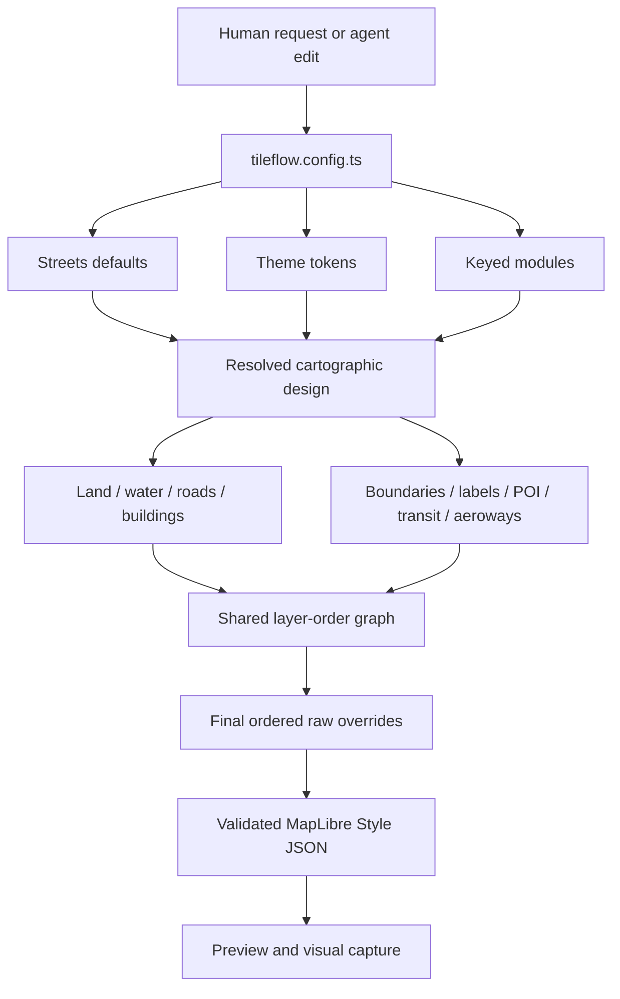

# Cartographic authoring contract

## Purpose and ownership

The SDK owns the cartographic authoring loop because configuration, semantic modules, compilation,
and visual evidence must change atomically. The canonical workbench is
`examples/cartography-lab/tileflow.config.ts`. The separate `tileflow-demos` repository consumes
exact npm packages after publication; it is not the place to invent SDK controls.

Tileflow Streets is compiled directly from Tileflow-owned module recipes. It does not inherit,
clone, bundle, or patch an upstream style. Coverage and design comparisons use external visual
references rather than a template stored in the compiler package.

## How authoring becomes a map

The public API is deliberately agent-friendly:

- `basemap: streets()` selects one explicit, versioned design recipe.
- Omitting `data` selects the SDK-pinned Tileflow World revision.
- `data` changes the compatible dataset, never the drawing system.
- `modules` is an object keyed by domain; key order never controls z-order and duplicates are
  impossible.
- Module presets describe intent, while exact semantic targets accept constants, zoom functions,
  and MapLibre expressions.
- Raw MapLibre overrides are an ordered final escape hatch and fail closed.

Every default Streets map is complete even when `modules` is omitted. A requested module is a
partial overlay on the Streets recipe. Unspecified fields preserve recipe defaults; arrays replace;
expressions and zoom values are atomic. Use `enabled: false` for deliberate removal.

The compiler creates every `streets-*` layer from a domain compiler. It resolves domain conflicts
before graph assembly—for example, roads determine eligible road-label classes, aeroways own
runway geometry while labels own aerodrome text, and transit owns rail/ferry/cableway geometry
while POI owns stations and stops.

## Data contract

Tileflow World is an OpenMapTiles-compatible default resolved offline from the SDK version. A
custom vector source must declare a versioned schema contract and attribution. A source can remap
source-layer and field names through `openMapTiles({layers, fields})`; module compilers read that
data binding rather than a basemap-specific translator.

Compiler output records exact durable identity:

- `tileflow:basemap = streets`
- `tileflow:basemapVersion = 1`
- `tileflow:variant = light | dark`
- `tileflow:data = {kind, revision?, schema, schemaVersion, sourceId}`

Generated layer IDs and structural ordering are part of the alpha Streets contract because raw
overrides can address them. A deliberate incompatible change requires a basemap-version bump or a
documented breaking SDK release.

## Evidence-first loop

One map is reviewed through several committed scenes so an improvement cannot optimize a single
camera only. The initial lab covers overview hierarchy, dense neighborhood and close-street detail,
motorways, airport geometry, transit, a rural edge, coastline, and a narrow high-DPR viewport.

Work in this order:

1. Express the requested result with the existing theme and semantic modules.
2. Run `pnpm dev:cartography`, optionally selecting one scene with `--scene`.
3. Run `pnpm visual:cartography` and inspect the current PNG, diff, and receipt.
4. If config cannot express the result, keep the revealing scene and add the smallest reusable
   semantic control to its owning module.
5. Update approved baselines only with `pnpm visual:cartography:update`, after review.
6. Merge config, compiler/module behavior, tests, documentation, and visual evidence together.

Phrase gaps as cartographic intent—label hierarchy, boundary emphasis, road width by zoom—not as a
request to expose a reference style's layer ID.

## Preview, baselines, and promotion

`tileflow dev` accepts `--map <name>` or `--scene <name>`. Without either it previews the first
configured map. A map uses its `view`; a scene uses its committed camera and CSS viewport. Exact DPR
belongs to capture. Valid watched edits reload the same selection; invalid edits preserve the last
valid artifact and show diagnostics.

Approved lab baselines and schema-version-2 receipts live under
`examples/cartography-lab/test/visual-baselines`. Remote resources make a capture useful evidence,
not a guarantee that the network can never change. Baseline changes therefore require human visual
review.

After an SDK change is published, update `tileflow-demos` through its npm SDK-sync flow. Never
commit workspace links or unpublished package substitutions to that consumer repository.
