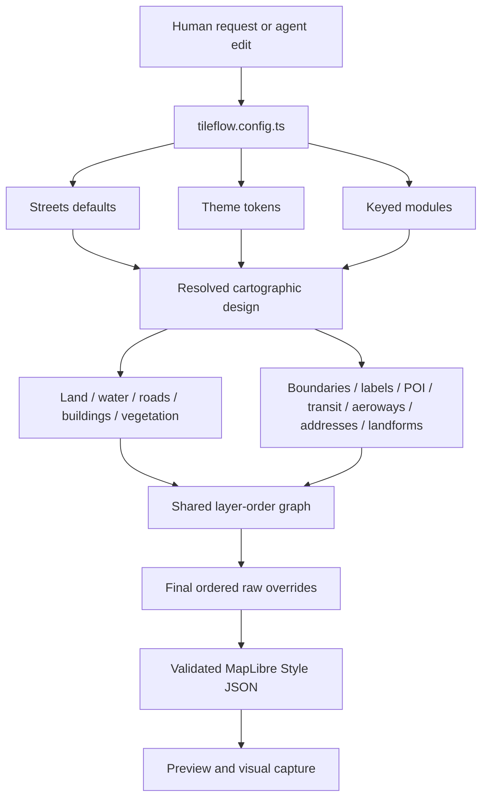

# Cartographic authoring contract

## Purpose and ownership

The SDK owns the cartographic authoring loop because configuration, semantic modules, compilation,
and visual evidence must change atomically. The canonical workbench is
`examples/tileflow-streets/tileflow.config.ts`. The separate `tileflow-demos` repository consumes
exact npm packages after publication; it is not the place to invent SDK controls.

Tileflow Streets is compiled directly from Tileflow-owned module recipes. It does not inherit,
clone, bundle, or patch an upstream style. Coverage and design comparisons use external visual
references rather than a template stored in the compiler package.

## How authoring becomes a map

The public API is deliberately agent-friendly:

- `basemap: streets()` selects one explicit, versioned design recipe.
- Omitting `data` selects the compiler-owned Tileflow World `v1` generation.
- `data` changes the compatible dataset, never the drawing system.
- `modules` is an object keyed by domain; key order never controls z-order and duplicates are
  impossible.
- Module presets describe intent, while exact semantic targets accept constants, zoom functions,
  and MapLibre expressions.
- Raw MapLibre overrides are an ordered final escape hatch and fail closed.

Every default Streets map is complete even when `modules` is omitted. A requested module is a
partial overlay on the Streets recipe. Unspecified fields preserve recipe defaults; arrays replace;
expressions and zoom values are atomic. Use `enabled: false` for deliberate removal.

Shared symbol ranges govern text and icon together and are inherited by an optional marker. A
marker can refine that range because it compiles to a separate circle layer; incompatible text and
icon ranges fail because those parts share one MapLibre symbol layer.

POI density and label/icon detail choose rank-bounded candidate sets before MapLibre collision
placement. Because importance ranks are not distributed equally across categories, a category may
set an inclusive `maxRank`; that explicit semantic ceiling replaces the preset ceiling for the
category's marker, icon, and label without exposing a raw source-layer filter.

Asset-aware Streets flows provide the versioned `tileflow-streets` POI catalog by default. It maps
the semantic food, coffee, culture, transit, shopping, lodging, health, education, and services
categories to nine original Tileflow SVG pictograms. An explicit local or external icon set replaces
the catalog; a mapping-only map override extends its semantic mapping. Disabling POI icons
suppresses the implicit package.

The compiler creates every `streets-*` layer from a domain compiler. It resolves domain conflicts
before graph assembly—for example, roads determine eligible road-label classes, aeroways own
runway geometry and runway references while labels own aerodrome text/codes, and transit owns
rail/ferry/cableway geometry
while POI owns stations and stops.

The shared graph also preserves a physical pitched-scene stack. Ground areas and pedestrian
surfaces sit below road and aeroway geometry; transport markings sit above their carriageways but
below buildings; road names, shields, and junction references share that transport phase; buildings
sit below vegetation; and geographic, water, aerodrome, runway, address, landform, and POI labels
remain the final annotation
phase.
Overview business-corridor areas use a separate background slot, so moving building volumes above
roads cannot make a thematic wash cover the transport network.

Road targets are cartographic semantics rather than raw source values. Motor-road targets are
`motorway`, `trunk`, `primary`, `secondary`, `tertiary`, `minor`, `service`, and `track`. The path
family is split into `pedestrian`, `footway`, `cycleway`, `steps`, and residual `pathway`. Enabling
`roads({extras: {paths: true}})` draws the complete family with independent stable layers; naming a
class explicitly also enables that class without enabling its siblings. Every class can style
`surface`, `tunnel`, and `bridge`, each with `shadow`, `casing`, `fill`, and an optional repeated
diagonal `hatch`. Hatch appearance is semantic road detail rather than a raw layer patch. It accepts
color, opacity, spacing, size, angle, zoom bounds, and an optional sprite pattern. Without a pattern,
marks inherit the resolved fill width when size is omitted and do not reserve collision space. With
a pattern, the compiler emits a repeated line texture clipped to the resolved fill width, so no
pattern pixel can protrude beyond the road deck. When `patternWidths` accompanies a literal pattern
prefix, Tileflow evaluates the fully treated fill width and selects the closest intrinsic-height
sprite. Geometrically spaced variants bound transverse scaling and keep thin marks visually stable
across road classes and zoom interpolation. The labels module uses the same class names and selectors,
so authors do not write OpenMapTiles `class`/`subclass` filters.
Tunnel phases are ordered above base hydrography and ground areas so a navigation map can preserve
road continuity through parks or beneath water. Their lighter fill and optional hatch carry the
underground meaning instead of transparency or a broken line. Tunnels remain below aeroways,
surface and bridge transport, buildings, vegetation, and the shared symbol phase, so surface-level
geometry and annotations retain their physical priority.
The selectors remain valid when those field names are remapped by the data contract and are
pairwise disjoint, preventing the same path from being painted by multiple semantic targets.
Line-like pedestrian ways use `roads.classes.pedestrian`; polygon plazas use the separate
`roads.areas.pedestrian` fill target. Both share the same semantic selector, while the geometry
constraint prevents overlap and lets authors style plaza fill, outline, opacity, or pattern without
raw MapLibre filters. Road areas occupy a dedicated graph slot below tunnel, surface, and bridge
line stacks, so a plaza polygon cannot cover its pedestrian street axes or any crossing road.

Road conditions are orthogonal to class and structure. `roads.modifiers` supports `construction`,
`expressway`, `indoor`, `official`, `ramp`, and `unpaved`; `roads.restrictions` supports `access`,
`bicycle`, `foot`, `horse`, and `toll`; `roads.serviceTypes` supports `alley`, `crossover`,
`driveway`, `parkingAisle`, and `yard`; and `roads.mountainBike` addresses the exact OpenMapTiles
scales from `0` through `6`, including the intermediate `0+` through `3+` values. Each treatment
can be disabled, scale inherited widths, and refine the surface/tunnel/bridge shadow/casing/fill
paint with constants, zoom functions, or expressions. Fixed per-property precedence is
construction, modal restrictions, general access, toll, expressway, ramp, unpaved, indoor,
official, mountain-bike scale, then service subtype. Object key order never changes it. A feature
matching several conditions can therefore take its ramp width and unpaved dash at the same time,
while the earlier treatment wins only when both set the same paint property.

`labels.shields` controls road-reference coverage independently from road names, and
`labels.styles.shields` provides a default symbol plus optional deterministic per-network styles.
`labels.junctions` controls motorway-junction references. Both use the same road eligibility and
remappable data bindings as road geometry; neither requires an author to know a source-layer,
field name, or generated layer ID.

The road compiler reads all selectors through the versioned data bindings. It also uses remappable
`layer` and `level` fields as the stable line sort key inside a semantic layer. Construction classes
remain part of their base semantic road target, so visibility and road-label eligibility continue
to compose with the roads module rather than creating a parallel construction domain.

## Data contract

Tileflow World is an OpenMapTiles-compatible default resolved offline from the compiler's generation
descriptor. The generated source contains the direct stable `v1` tile template and never a TileJSON,
catalog, data-revision, or archive selector. A custom vector source must declare a versioned schema
contract and attribution. It can use one TileJSON URL or a direct tile-template list, including a
repository-owned PMTiles fixture. A source can remap
source-layer and field names through `openMapTiles({layers, fields})`; module compilers read that
data binding rather than a basemap-specific translator.

The standard contract includes `housenumber` and `mountain_peak`, plus remappable `capital`,
elevation, runway-reference, IATA, and ICAO fields. Semantic modules consume those values directly;
they do not require raw source-layer overrides.

Compiler output records exact durable identity:

- `tileflow:basemap = streets`
- `tileflow:basemapVersion = 3`
- `tileflow:variant = light | dark`
- `tileflow:data = {kind, generation?, revision?, schema, schemaVersion, sourceId}`

World output uses `generation: "v1"` and never `revision`. Only external fixture/source identity may
use `revision`. The full public descriptor also binds immutable glyph/sprite URLs and upstream
attribution; the separate `Map by Tileflow` product credit does not replace that attribution.

Raw overrides address compiler layer IDs and are applied before the final physical-layer optimizer.
The optimizer may split an ID at a zoom handoff or combine several IDs into a data-driven cohort;
this does not change the semantic override target. For this single-consumer alpha workflow the
performance materialization remains on basemap version 3. A future multi-consumer compatibility
promise must version the physical output separately or restore a basemap-version bump policy.

The optimizer must preserve the resolved paint, layout, filters, zoom range, and drawing order. Its
z0–z22 structural sweep is a required regression gate, alongside MapLibre style validation and
browser capture.

## Evidence-first loop

One map is reviewed through several committed scenes so an improvement cannot optimize a single
camera only. The initial lab covers overview hierarchy, dense neighborhood and close-street detail,
motorways, airport geometry, transit, a rural edge, coastline, and a narrow high-DPR viewport.

Work in this order:

1. Express the requested result with the existing theme and semantic modules.
2. Run `pnpm dev:streets`, optionally selecting one scene with `--scene`.
3. Run `pnpm visual:streets` and inspect the current PNG, diff, and receipt.
4. If config cannot express the result, keep the revealing scene and add the smallest reusable
   semantic control to its owning module.
5. Update approved baselines only with `pnpm visual:streets:update`, after review.
6. Merge config, compiler/module behavior, tests, documentation, and visual evidence together.

Phrase gaps as cartographic intent—label hierarchy, boundary emphasis, road width by zoom—not as a
request to expose a reference style's layer ID.

Reference-style inventories can reveal missing concepts, but they are not Tileflow APIs. Tileflow
World already supplies the fields used by road treatments, road references, networks, and motorway
junctions. Traffic signals, zebra crossings, per-lane widths, sidewalk geometry, and barriers are
absent from its current public TileJSON contract. The Spain development preview used by the Streets
workbench additionally carries marked crossings in a raw `street_furniture` extension and explicit
OSM pedestrian-area polygons in a raw `sidewalk` extension. The example may exercise that preview
data through explicit overrides, but neither extension is a stable Streets API. Sidewalk coverage is
source-backed and incomplete; never infer missing polygons by buffering road centerlines.
Do not emulate missing concepts with copied layer IDs or silently claim support when the selected
dataset does not expose the required feature.

## Preview, baselines, and promotion

`tileflow dev` accepts `--map <name>` or `--scene <name>`. Without either it previews the first
configured map. A map uses its `view`; a scene uses its committed camera and CSS viewport. Exact DPR
belongs to capture. Valid watched edits reload the same selection; invalid edits preserve the last
valid artifact and show diagnostics.

Approved lab baselines and schema-version-2 receipts live under
`examples/tileflow-streets/test/visual-baselines`. Remote resources make a capture useful evidence,
not a guarantee that the network can never change. Baseline changes therefore require human visual
review.

After an SDK change is published, update `tileflow-demos` through its npm SDK-sync flow. Never
commit workspace links or unpublished package substitutions to that consumer repository.
