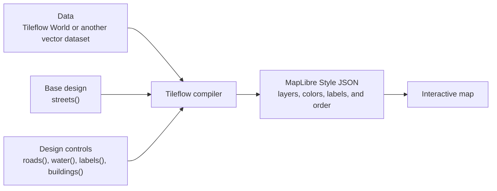

# Build Tileflow Streets from universal cartographic modules

This ExecPlan is a living document. The sections `Progress`, `Surprises & Discoveries`, `Decision
Log`, and `Outcomes & Retrospective` must be kept up to date as work proceeds.

This plan follows Tileflow's ExecPlan standard. It repeats the required context and decisions so a
contributor can execute it from this repository without access to prior conversations.

## Purpose / Big Picture

Build Tileflow Streets as the first complete proof of Tileflow's cartographic language. Normal
authoring should be this small:

```ts
export default defineTileflow({
  maps: {
    madrid: {
      basemap: streets(),
      modules: {
        roads: roads({hierarchy: 'strong'}),
        labels: labels({language: 'es'}),
      },
    },
  },
});
```

`streets()` supplies a complete default recipe made from semantic modules. Map modules are typed,
partial overlays on that recipe. A domain compiler creates complete MapLibre layers or symbol
intents; it does not search for or patch layers from an external style. Shared symbol composition
and a common layer graph assemble every domain deterministically into the final Style JSON.

Streets starts as a Tileflow-owned root style assembled entirely from resolved modules. It does not
inherit, bundle, or ship another style, reference inventory, notice, or default sprite. External
reference images may inform human review, but they are not compiler or package inputs.

The normal config does not declare data. Omitted `data` resolves offline and deterministically to a
revision of Tileflow's official world dataset pinned by the installed SDK. Advanced authors may
select another official revision or one external OpenMapTiles-compatible vector source with a single
explicit `data` field.

Only `streets()` is public in this plan. Do not add compatibility basemaps, seek upstream pixel
parity, or build a generic interpreter for arbitrary Style JSON. Future basemaps will be different
complete recipes over the same proven modules.

## How the system works



- **Data** says what exists: roads, water, buildings, names, and other geographic features.
- **Streets** supplies Tileflow's complete default cartographic design.
- **Modules** express a human or AI request to change that design without naming MapLibre layer IDs.
- The **compiler** turns the resolved design and data contract into the real ordered MapLibre layers.

This plan does not add entities, clustering, selection, popups, business APIs, hosted API
implementation, satellite basemaps, or a public third-party module plugin protocol. Existing terrain
uses a secondary raster source; preserve it and integrate its ordering, but do not redesign it as
part of the primary vector-data API.

## Progress

- [x] (2026-08-15 08:48Z) Audited the compiler, schema, renderer split, modules, OSM Bright template,
      generated layers, data precedence, cartography lab, CLI deploy, manifests, capture receipts,
      packaging, and documentation.
- [x] (2026-08-15 08:48Z) Created and indexed an initial three-basemap/profile-based ExecPlan.
- [x] (2026-08-15 09:10Z) Replaced that architecture after the owner chose to build Streets directly
      from modules, retain OSM Bright only as reference evidence, and defer other public basemaps.
- [x] (2026-08-15 09:51Z) Froze the vendored OSM Bright bytes, 128 exact layer IDs/order, one-owner
      domain ledger, legacy 23-layer inventory, asset/license evidence, baseline tests, and current
      cartography diffs. The importing commit did not preserve an upstream commit hash, so the
      vendored SHA-256 is the byte-exact reference.
- [x] (2026-08-15) Implemented deterministic implicit/explicit primary `data`, Streets identity,
      typed style values, exact semantic styles, module factories, direct compilers for all nine
      domains, deterministic graph assembly, strict raw overrides, and a direct-only root style.
- [x] (2026-08-15) Switched the public core API/schema to required `streets()` and keyed modules;
      removed public `osm()`, `styleOverride()`, renderer fallback, modules arrays, and old data
      paths. The generated default is MapLibre-valid and contains no inherited layer IDs.
- [x] (2026-08-15) Implemented coordinated road-label eligibility and POI rank/icon/text/coupling
      policy before graph assembly. Kept the OSM Bright-derived default sprite explicitly
      attributed and licensed; local/hosted icon packages replace it with validated generated
      sprites and never leak source paths.
- [x] (2026-08-15) Migrated dev, CLI, capture receipt 2, manifest 2, build packages, wrappers, the
      initializer, icon tooling, the nine-scene cartography lab, and durable contracts/READMEs.
- [x] (2026-08-15) Deleted the legacy compiler, schema, OSM basemap, generated renderer, template
      controls, and style-override module from the executable source graph.
- [x] (2026-08-15) Ran focused typechecks/tests, full workspace `verify` (194 pass, 13 intentional
      integration skips), and reviewed/accepted nine schema-2 visual baselines. Visual review found
      and fixed ignored POI detail modes plus overlapping service/main rail filters.
- [x] (2026-08-15 11:34Z) Ran final `pnpm check`, `pnpm build`, packaged public capture smoke, and
      alpha publication dry-run successfully. Migrated the packaged-smoke fixture from the rejected
      legacy renderer/data/module shape to the public Streets + receipt-2 contract. Reviewed the
      final diff/status without publishing. `git diff --check` passes; repository-wide Prettier
      reports only the two unchanged files already unformatted on the clean base:
      `scripts/reconcile-release.mjs` and `scripts/reconcile-release.test.mjs`.
- [x] (2026-08-15 12:10Z) Removed the remaining vendored reference JSON, coverage ledger/test, packaged
      notice, default sprite, and provenance metadata. Streets now defaults to POI text with icons
      disabled until an explicit local or hosted icon set is provided; all nine visual baselines
      were reviewed and regenerated without that dependency. Re-ran `pnpm check`, `pnpm build`,
      packaged public smoke, and the alpha publication dry-run successfully after the removal.
- [x] (2026-08-15) Documented the accepted values beside the active Cartography Lab recipe and made
      the built-in dev preview persist validated longitude, latitude, zoom, bearing, and pitch in
      the URL. Config-triggered and manual reloads now preserve the current camera, while missing or
      invalid camera parameters fall back to the configured map or scene camera. Focused dev and lab
      tests cover URL round-tripping, bounds replacement, query preservation, and invalid fallback.
- [x] (2026-08-15) Replaced the coarse public `path` road target with disjoint semantic targets for
      `pedestrian`, `footway`, `cycleway`, `steps`, and residual `pathway`; apply the same taxonomy to
      road labels and all surface/tunnel/bridge phases; remove the Cartography Lab's raw
      `class`/`subclass` expressions; validate the output and review the close-street scene. Focused
      core tests pass 67/67, the lab config validates, its tests pass 3/3, the Atocha zoom-17 preview
      was reviewed, and the complete workspace/build/public-smoke/alpha-dry-run gates pass.

## Surprises & Discoveries

- Observation: `basemap: osm()` does not currently select one visual system. `renderer: 'auto'`
  chooses the 128-layer OSM Bright template only while a syntax predicate passes. Adding colors,
  density, buildings, source-layer overrides, or unsupported modules can silently select a generated
  23-layer style.
  Evidence: `isOsmBrightTemplateCompatible()` and renderer branches in
  `packages/core/src/compiler.ts`, plus `packages/core/test/compiler.test.ts`.

- Observation: module array semantics are inconsistent. `.find()` makes the first roads/labels/POI
  duplicate win while `styleOverride` modules are ordered.
  Evidence: module collection at the beginning of `createStyle()`.

- Observation: existing roads, labels, and POI code contains useful semantic knowledge but is split
  between generated factories and OSM Bright control passes. Preserve the knowledge, not two
  renderers.
  Evidence: `packages/core/src/modules`, `packages/core/src/basemaps/osm/layers.ts`, and
  `packages/core/src/templates/osm-bright`.

- Observation: seven abbreviated modules cannot cover all 128 reference layers. Aeroways and transit have
  independent geometry and behavior. Some frozen reference symbol layers also combine eligibility,
  icon, and text, so the coverage ledger must assign each whole reference layer to one owner.
  Evidence: the OSM Bright inventory includes aeroway/aerodrome, rail/transit/ferry, station, and
  compound symbol layers.

- Observation: zero inherited layers does not prove independence. Sprites, glyph choices, filters,
  expressions, source assumptions, and copied metrics may remain derived.
  Evidence: OSM Bright assets/provenance are supplied separately from the layer array.

- Observation: primary data currently has project `tilesets`, map `tileset`, map `tiles`, fields on
  `osm()`, and another deploy precedence pass.
  Evidence: `TileflowProjectConfig`, `TileflowConfig`, `TileflowOsmBasemapConfig`,
  `createStyleFromProject()`, `resolveMapTileset()`, and `createHostedDeployMapConfig()`.

- Observation: tileset-specific config/metadata is cross-package. Core runtime, dev inspection,
  capture receipts, CLI, build plugins, and framework inline config consume `tileBaseUrl`,
  `tilesetVersion`, or related fields.
  Evidence: references under `packages/core/src/runtime.ts`, `packages/dev`, `packages/capture`,
  `packages/cli`, and framework/build packages.

- Observation: deploy currently JSON-serializes rewritten config plus mandatory `tilesetId` for the
  server to compile again. This conflicts with removed fields and future repository-local recipes.
  Evidence: CLI deploy preparation and POST `/v1/styles`; hosted API code is outside this repo.

- Observation: the branch already has a user-owned palette diff in
  `examples/cartography-lab/tileflow.config.ts`. Do not overwrite or misattribute it.
  Evidence: `git diff -- examples/cartography-lab/tileflow.config.ts` on `basemap-system`.

- Observation: the repository records the official OSM Bright repository and license but not the
  upstream commit/tag used by the initial import. The local vendored style is therefore the only
  provable byte-exact source snapshot.
  Evidence: the template first appears in SDK commit `32927e3`; its SHA-256 is
  `b8c4d676640b105e089f2606f2bbc5558932c5efcb9527401d8b31a43cfbddc7` and the official upstream is
  `https://github.com/openmaptiles/osm-bright-gl-style`.

- Observation: the four existing visual baselines differ from the current lab because the
  user-owned palette changed after those baselines were accepted. Capture completes successfully
  outside the browser sandbox and records all four diffs; do not update the baselines implicitly.
  Evidence: `pnpm run visual:cartography` and `.tileflow/diffs` at the Milestone 0 checkpoint.

- Observation: the first direct visual pass exposed two semantic bugs that structural style tests
  could not reveal. POI `minimal`/`balanced`/`full` and `essential`/`full` collapsed to the same
  output, and service rail rendered on top of every main rail.
  Evidence: the nine lab captures. POI now compiles independent/coupled rank policies and transit
  filters main/service rail through the versioned `service` field binding.

- Observation: the packaged public smoke was the final executable consumer of the removed legacy
  authoring shape. It correctly failed schema validation until its fixture used `streets()`, keyed
  modules, `vectorTiles(openMapTiles())`, and capture receipt schema 2.
  Evidence: the first `pnpm run smoke:capture-public` final-gate run and the migrated fixture in
  `scripts/capture-public-smoke.mjs`.

- Observation: the first Streets road API collapses every OpenMapTiles path into one public `path`
  target, even though the data contract exposes `subclass`. This forced the Cartography Lab to use
  raw MapLibre expressions to make pedestrian streets road-like, footways narrow, and pedestrian
  labels eligible. Tile inspection around Atocha confirms named and unnamed `pedestrian`, `footway`,
  and `steps` features, including bridge and tunnel variants; the official schema also defines
  `cycleway`, `path`, `bridleway`, `corridor`, and `platform` subclasses.
  Evidence: `packages/core/src/modules/roads/compiler.ts`,
  `packages/core/src/modules/labels/compiler.ts`, the raw filters in
  `examples/cartography-lab/tileflow.config.ts`, Tileflow World feature inspection at zoom 17, and
  the OpenMapTiles transportation/transportation_name schema.

## Decision Log

- Decision: Make a clean break; do not normalize old and new authoring models together.
  Rationale: the owner confirmed there are no consumers to protect. Compatibility would preserve
  ambiguous defaults and renderer fallback.
  Date/Author: 2026-08-15, owner and Codex.

- Superseded decision: Launch public `osmBright()`, `streets()`, and `minimal()`, require initial OSM
  Bright/Streets parity, and use per-basemap profiles/bindings to translate modules.
  Rationale for supersession: Streets is now the single product and modules are its renderer. OSM
  Bright is migration/reference evidence; the 23-layer generated style is research input only.
  Date/Author: 2026-08-15, owner and Codex.

- Superseded decision: Export generic custom basemap/profile authoring in this plan.
  Rationale for supersession: first prove that modules can produce direct-only Streets. Future custom
  basemaps are recipes, not arbitrary Style JSON interpreters, bindings, or custom translators.
  Date/Author: 2026-08-15, owner and Codex.

- Decision: Keep TypeScript config canonical and Style JSON compiled.
  Rationale: factories, types, reuse, and diagnostics give humans and agents a stable language while
  retaining a deliberate raw escape hatch.
  Date/Author: 2026-08-15, owner and Codex.

- Decision: Require `basemap` and initially export only `streets()`.
  Rationale: one callable grammar is explicit. OSM Bright and Minimal are not user choices.
  Date/Author: 2026-08-15, owner and Codex.

- Decision: Model Streets as a complete module recipe and merge keyed map requests over it.
  Rationale: `modules: {}` must yield a complete map. A partial request inherits unmentioned Streets
  values; `enabled: false` explicitly removes a domain or target.
  Date/Author: 2026-08-15, owner and Codex.

- Decision: Compile each resolved domain directly to complete owned layers.
  Rationale: there is no adapter, inherited layer, or Style JSON translator. The data schema maps
  OpenMapTiles fields; compilers own IDs, filters, paint, layout, assets, and ordering for generated
  output. The first implementation emits final owned layers directly; cross-domain coordinators
  resolve eligibility before those compilers run rather than exposing a generic symbol-intent IR.
  Date/Author: 2026-08-15, owner and Codex.

- Decision: Resolve shared symbol/visibility policy before generation and assemble contributions
  with one constraint graph.
  Rationale: labels, POI, transit, aeroways, and roads interact. Neither module object order nor
  compiler invocation order may decide collisions, ownership, or z-order.
  Date/Author: 2026-08-15, Codex.

- Decision: Give every frozen reference layer exactly one domain owner as test evidence.
  Rationale: exhaustive ownership prevents forgotten feature families. Compound symbol layers receive
  one whole-layer owner while generated shared-symbol policy remains coordinated separately.
  Date/Author: 2026-08-15, owner and Codex.

- Superseded decision: Use the frozen OSM Bright template as a temporary hybrid seed and migrate
  whole domains across releaseable checkpoints.
  Rationale for supersession: the owner chose a simpler direct-only architecture. The 128-layer
  ledger remains coverage evidence, but no seed layer enters the Streets compiler or an artifact.
  This removes the long-lived hybrid, source remapping, partial-release/versioning problem, and any
  need to inherit before drawing Streets with modules.
  Date/Author: 2026-08-15, owner and Codex.

- Decision: Ship this as one atomic SDK cutover, not a sequence of hybrid renderer releases.
  Rationale: domain atomicity is a correctness rule, while releasing an internally consistent
  hybrid would have been a product choice. The owner explicitly rejected inheritance, and there are
  no SDK consumers to migrate, so all nine generated domains and every package contract change land
  together. The external hosted compiled-artifact endpoint remains a release-integration blocker;
  it is not a reason to restore seed layers or legacy config serialization.
  Date/Author: 2026-08-15, owner and Codex.

- Decision: Use nine named domains: land, water, roads, transit, aeroways, buildings, boundaries,
  labels, and POI. Export all nine together with the atomic Streets cutover after their semantics,
  direct compilers, validation, and scenes are coherent.
  Rationale: exhaustive coverage cannot be claimed through an unnamed `other` bucket.
  Date/Author: 2026-08-15, Codex.

- Superseded decision: Keep the audited upstream style as a frozen reference, not a parent or pixel
  target.
  Rationale for supersession: after direct compilation and multi-scene coverage were complete, the
  owner required removal of the remaining reference files from core. External comparisons can be
  performed without bundling another style in the SDK.
  Date/Author: 2026-08-15, owner and Codex.

- Decision: Use Google Maps only as a human reference for clarity, road hierarchy, density,
  legibility, and zoom behavior.
  Rationale: do not copy its exact design, screenshots, branding, or assets.
  Date/Author: 2026-08-15, owner and Codex.

- Superseded decision: Retain the prior notice and provenance while the inherited default sprite
  remained.
  Rationale for supersession: the sprite and every vendored reference file were removed. Streets
  ships no default sprite; icon rendering is explicit through Tileflow's icon-package pipeline.
  Date/Author: 2026-08-15, owner and Codex.

- Decision: Omitted `data` means `tileflowWorld()` with initial SDK revision `2026-06-07`, unless
  verification proves that archive unavailable.
  Rationale: normal config should omit hosted plumbing, but builds/receipts cannot use moving latest.
  Date/Author: 2026-08-15, owner and Codex.

- Decision: Make `data` the only primary vector dataset field; support
  `tileflowWorld({revision})` and `vectorTiles({url, schema, attribution})`.
  Rationale: data states what is drawn and where it comes from; Streets states how it is drawn.
  Delete project/map/basemap tileset/source precedence.
  Date/Author: 2026-08-15, owner and Codex.

- Decision: Use `tileflow` as the stable primary source ID and require every direct compiler to read
  resolved OpenMapTiles layer/field bindings from the data contract.
  Rationale: there is no legacy source bridge. Canonical and explicitly remapped compatible schemas
  use the same direct compiler path from the first Streets artifact.
  Date/Author: 2026-08-15, owner and Codex.

- Decision: Emit durable Streets identity as `tileflow:basemap = 'streets'`,
  `tileflow:basemapVersion = 1`, `tileflow:variant = 'light'`, and the separate `tileflow:data`
  object. Any breaking generated-layer ID or structural-order change increments basemap version.
  Rationale: raw overrides make generated IDs and placement observable even though semantic modules
  are canonical. No internal migration metadata appears in a Streets artifact.
  Date/Author: 2026-08-15, Codex.

- Decision: Use keyed module factories and combine qualitative presets with exact
  class/category/structure/zoom/filter/expression controls.
  Rationale: keys give stable AST paths and prevent duplicates; serious design needs more than a
  simplified preset config.
  Date/Author: 2026-08-15, owner and Codex.

- Decision: Preserve named themes for reusable palette/typography defaults, with exact module values
  winning afterward.
  Rationale: one design instruction should be expressible in one domain subtree without raw IDs.
  Date/Author: 2026-08-15, Codex.

- Decision: Raw MapLibre operations are ordered, final, and fail closed. Built-in Streets may not
  use OSM-ID raw patches.
  Rationale: raw access is a user escape hatch and a signal of missing module capability, not the
  built-in rendering architecture.
  Date/Author: 2026-08-15, owner and Codex.

- Decision: Compile hosted artifacts locally and deploy Style JSON plus a non-secret receipt instead
  of serialized config.
  Rationale: repository-local factories are code and the deployable artifact is the validated style.
  The required hosted endpoint change is an external release dependency.
  Date/Author: 2026-08-15, Codex.

- Decision: Generate local manifest schema 2 and capture receipt schema 2 after removing
  tileset-specific fields.
  Rationale: changing version 1 semantics would make stored artifacts ambiguous.
  Date/Author: 2026-08-15, Codex.

- Decision: `vectorTiles().url` is public; require schema/non-empty attribution, reject URL user
  information, and document query strings as public.
  Rationale: protected provider credentials belong in runtime `transformRequest`.
  Date/Author: 2026-08-15, Codex.

- Decision: Public road targets are cartographic semantics, not raw OpenMapTiles `class` values.
  Replace ambiguous `path` with disjoint `pedestrian`, `footway`, `cycleway`, `steps`, and
  `pathway` targets. The OpenMapTiles contract maps each target to `class=path` plus a non-overlapping
  `subclass` set; `pathway` owns residual outdoor path subclasses and does not catch the four named
  targets. Road geometry and road labels share this selector contract, while labels remain owned by
  the labels module. Existing structure controls automatically apply to every target, so each can
  independently style surface, tunnel, bridge, casing, fill, and shadow without raw layer IDs.
  Rationale: agents and humans should ask for a pedestrian street or cycleway directly. A generic
  path layer overlaps the more precise targets, makes ordering determine appearance, and leaks data
  schema details into author config.
  Date/Author: 2026-08-15, owner and Codex.

## Outcomes & Retrospective

The initial SDK implementation completed the Streets-first cutover. `streets()` now compiles a
104-layer default map directly from nine keyed module domains and one resolved OpenMapTiles data
contract. There is no runtime template, fallback renderer, layer translator, or hidden data
precedence. The lab's explicit Editorial City overlays compile 111 layers and have nine reviewed
schema-2 baselines spanning urban, road, rail, airport, coast, rural, and mobile views.

The visual loop materially improved the design language: it exposed POI modes that were type-level
choices but did not yet change pixels, and it exposed a duplicated rail filter that structural
validity could not catch. Both are now deterministic module behavior with focused tests. This is why
the lab and receipt contract are part of the compiler change rather than follow-up demo work.

The Cartography Lab config is also a readable control surface: its active properties name their
accepted values inline. The dev preview writes its live camera to the URL without adding browser
history entries, so an author can edit module code and continue reviewing the same location and zoom
after the watcher reloads the style.

Durable behavior is recorded in `docs/contracts/cartographic-authoring.md`,
`docs/contracts/local-visual-capture.md`, `packages/core/README.md`, `packages/cli/README.md`, and
owning package READMEs. All repository, build, packaged-smoke, and publication dry-run gates pass.
The only cross-repository release dependency is the hosted API accepting the new compiled-style
artifact; this repository deliberately does not implement that service or restore legacy serialized
config.

The visual refinement loop subsequently reopened Milestone 5: the coarse `path` target is not a
sufficient semantic road language. The active follow-up above makes path families disjoint before
calling the road module complete again. MapTiler's layer inventory is design evidence only; traffic
signals, zebra crossings, junction symbols, shields, access restrictions, ramps, and construction
remain separate semantic capabilities and must be added only where the versioned data contract can
supply them rather than by copying another style's layer IDs.

That follow-up is now complete. The lab no longer reads OpenMapTiles `subclass` to distinguish its
paths: it styles the five public road targets directly. Geometry and road-label compilers share one
selector implementation, exact class requests participate in label eligibility, disabled classes
are removed from both domains, and remapped `class`/`subclass` field names are covered by tests. The
current Editorial City recipe emits 141 layers because each enabled path semantic owns its complete
structure phases rather than sharing one overlapping `path` layer.

## Context and Orientation

MapLibre renders ordered Style JSON layers. A layer has a unique ID, type, source/source-layer where
applicable, filter, layout, and paint. One road may need shadow, casing, fill, tunnel, bridge, and
label layers. Final layer-array order controls drawing; Tileflow module order must not.

`packages/core/src/project.ts` is the canonical project/style entry. It parses through
`packages/core/src/schema-v2.ts` and delegates to `packages/core/src/cartography/streets.ts`.
`packages/core/src/basemaps/streets.ts` owns the complete default recipe; `packages/core/src/data`
owns the primary dataset contract; `packages/core/src/modules/*/compiler.ts` creates all MapLibre
layers; and `packages/core/src/cartography/graph.ts` assembles them. The deleted legacy compiler,
OSM basemap, renderer split, and template control passes are not executable recovery paths.

The visual workbench is `examples/cartography-lab/tileflow.config.ts`, owned by
`docs/contracts/cartographic-authoring.md`. It has `editorial-city` and nine scenes: Madrid overview,
neighborhood, close street, motorway, airport, transit, rural edge, Barcelona waterfront, and Madrid
mobile.

`packages/dev` compiles/watches artifacts. `packages/cli` validates, builds, previews, captures,
compares, deploys compiled styles, and manages generated icon packages. `packages/capture` stores
resolved data identity and pixel evidence. Framework/build packages compile inline config. The
repository migrates atomically.

Terms:

- A **data descriptor** resolves primary vector URL, attribution, source ID, revision, and semantic
  schema.
- A **module request** is the serializable partial returned by a module factory. Presence of a field
  records explicit author intent; omitted fields inherit the Streets recipe.
- A **basemap recipe** is ID/version plus default theme, complete module requests, assets, order, and
  provenance. Streets is the only public recipe.
- **Resolved cartography** is the complete design after Streets, theme, and user overlays merge.
- A **domain compiler** turns one resolved domain into complete layer contributions; it never
  searches OSM IDs.
- A **layer contribution** has one owner, stable target/ID, semantic graph slot/local order,
  requirements, and diagnostics.
- A **symbol policy** coordinates cross-domain eligibility before final symbol layers are emitted;
  roads constrain road labels, and POI density/icon/text/coupling resolve together.
- A **raw override** is an ordered exact-ID operation applied after semantic assembly.

Canonical authoring:

```ts
import {defineTileflow, labels, roads, streets} from '@tileflow/core';

export default defineTileflow({
  maps: {
    madrid: {
      basemap: streets(),
      modules: {
        roads: roads({hierarchy: 'strong'}),
        labels: labels({language: 'es'}),
      },
    },
  },
});
```

Advanced data:

```ts
data: tileflowWorld({revision: '2026-06-07'});
```

```ts
data: vectorTiles({
  url: 'https://tiles.example.com/tiles.json',
  schema: openMapTiles(),
  attribution: '© Example © OpenStreetMap contributors',
});
```

`vectorTiles().url` is serialized and must be publish-safe. Ordinary compilation is offline.
Protected-provider credentials belong in application `transformRequest`; Tileflow analytics must not
append sessions to foreign origins.

The internal Streets recipe is a plain frozen value:

```ts
const tileflowStreetsRecipe = Object.freeze({
  id: 'streets',
  version: 1,
  modules: Object.freeze({
    land: land(),
    water: water(),
    roads: roads(),
    transit: transit(),
    aeroways: aeroways(),
    buildings: buildings(),
    boundaries: boundaries(),
    labels: labels(),
    poi: poi(),
  }),
});
```

Advanced road control remains semantic:

```ts
roads({
  detail: 'all',
  hierarchy: 'strong',
  classes: {
    primary: {
      surface: {
        fill: {
          color: '#E4B75D',
          width: zoom.linear([
            [7, 0.6],
            [12, 2.4],
            [16, 8],
          ]),
        },
        casing: {color: '#C7933C'},
        shadow: {color: '#7F6948', opacity: 0.2},
      },
      tunnel: {fill: {opacity: 0.55, dash: [2, 1]}},
      bridge: {fill: {width: 9}, casing: {width: 11}},
    },
  },
});
```

Merge order: engine safety invariants, Streets variant recipe, named theme defaults, user qualitative
controls, user exact values, then raw overrides. `undefined` inherits, `enabled: false` removes,
objects merge by typed key, arrays replace, and wrapped expressions are atomic. Factories retain
explicitness so partial requests cannot erase Streets defaults.

## Plan of Work

### Milestone 0: freeze reference evidence and domain ownership

Snapshot the current OSM Bright Style JSON, 128 unique IDs/order, source assumptions, assets, lab
captures, hashes, and receipts. Record exact upstream reference/content hash and audit
`packages/core/OSM_BRIGHT_LICENSE.md`, sprite, and glyph provenance. Audit the generated 23-layer
path for reusable semantic knowledge only; it is not a product golden.

Create a private exhaustive ledger. The audited initial ownership by legacy index is:

```text
land        0-11, 23-24                         14 layers
water       12-22                              11 layers
buildings   25-26                               2 layers
roads       27-43, 51-70, 77-91, 104-105       54 layers
transit     44-45, 71-76, 92-95                12 layers
aeroways    46-50                               5 layers
boundaries  96-99                               4 layers
labels      100-103, 110-127                   22 layers
poi         106-109                             4 layers
total                                           128 layers
```

Verify these ranges against exact IDs before recording them as fixtures. Ferry belongs to transit,
airport labels to labels, `poi-railway` to POI, one-way layers to roads, and railway landuse to land.
Every entry stores ID, original index, owner, graph slot, and replacement target(s) or a documented
intentional omission. Validation requires every reference ID exactly once, no unknown ID, no final
`other`, and ledger reassembly equal to original order.

Inventory reference assets separately. Preserve the existing owner-selected lab palette while
recording it as the initial Streets visual recipe.

### Milestone 1: establish one primary data contract

Add `packages/core/src/data` with `tileflowWorld()`, `vectorTiles()`, and versioned
`openMapTiles()`. The schema describes source layers, properties, class values, names, ranks,
height/base, and filters; layer remapping replaces current `sourceLayers`.

Omitted data resolves to initial revision `2026-06-07` at
`{apiBaseUrl}/tiles/world/tiles.json?archiveVersion=2026-06-07`. Build through `URL`, preserve query
parameters, and never fetch in `createStyle()`. Release smoke proves default archive availability.
Use `tileflow` as the stable internal primary source ID. External data requires schema and non-empty
attribution, rejects URL user information, and treats query strings as public.

The final data contract supports source-layer and field remapping for external
OpenMapTiles-compatible data. Every compiler reads these resolved bindings directly.

Delete project `tilesets`, map `tileset`, map `tiles`, source fields on basemaps,
`TileflowStyleOptions.tileset`, and precedence code. Replace environment/build `tileBaseUrl` naming
with compile-context `apiBaseUrl`; it resolves official data/fonts/sprites but never selects author
data. Emit one non-secret `tileflow:data` identity. Remove tileset metadata. Generate local manifest
schema 2 and capture receipt schema 2.

### Milestone 2: build direct compilation foundations

Implemented layout:

```text
packages/core/src/cartography/{values,merge,context,contributions,graph,layer-style,overrides,streets}.ts
packages/core/src/basemaps/streets.ts
packages/core/src/data/
packages/core/src/modules/<domain>/{index,compiler}.ts
```

Define contracts equivalent to:

```ts
type DomainCompiler<T> = (config: T, context: DomainCompileContext) => CartographicContribution[];

type CartographicContribution = {
  kind: 'layer';
  owner: LayerDomain;
  target: string;
  slot: LayerSlot;
  localOrder: number;
  layer: MapLibreStyleLayer;
};
```

Implement typed constants, `zoom.linear()`, `zoom.step()`, and validated expression/filter wrappers.
Validate finite values, monotonic stops, result/property types. Expressions are atomic during merge.

Implement serializable module requests and canonical keyed merge whose own-field presence preserves
explicitness. Resolve road-label eligibility and POI density/icon/text/coupling policy before final
layers. Every generated layer has one owner and stable unique ID; reject conflicting ownership
rather than using invocation order.

Implement a slot DAG at least covering background, land, hydro, buildings, transport tunnels,
aeroways, surface transport, bridge transport, boundaries, and symbols, with shadow/casing/fill
subphases. Every contribution has deterministic local ordering; reject cycles/ties. Terrain/hillshade
becomes a graph contribution rather than inserting after concrete layer ID `water`.

Integrate the icon/sprite pipeline. Local package sources are validated and compiled before style
output; hosted deploy substitutes the returned sprite URL before compiling the uploaded style.
Literal/mapped icon references are inspected, while dynamic raw expressions are reported as
unanalyzable instead of being guessed.

Build the final style shell in Tileflow code and validate all resolved config, data/assets,
contributions, graph, and metadata before returning output. Fail atomically.

Keep exact-ID raw patch/add/remove/move operations final and ordered. Added/moved layers require
explicit placement; unknown IDs/incomplete layers fail. Built-in Streets cannot use OSM-ID raw
operations.

### Milestone 3: introduce direct-only Streets

Add the complete internal Streets recipe and public `streets()`. Make `basemap` required. Remove
public `osm()`, OSM basemap types, `renderer`, `TileflowRenderer`, fallback, renderer metadata, and
generated-renderer selection; reject old fields with exact paths.

The first Streets style is complete and generated only by the nine direct domain compilers. No OSM
Bright layer, ID, source remapping bridge, or `internalMigration` state may enter compilation. The
reference ledger instead drives coverage tests and later visual comparisons. Switch the lab to
`streets()` immediately. Emit durable metadata `tileflow:basemap = 'streets'`,
`tileflow:basemapVersion = 1`, `tileflow:variant`, and the resolved `tileflow:data` identity.

### Milestone 4: complete land and water

Implement land background/landuse/landcover/parks/protected/residential/commercial/industrial/civic/
cemetery/wood/grass/sand/ice, opacity, patterns, filters, and zoom. Implement water polygons,
waterways, intermittent behavior, lines, patterns, filters, and zoom. Water text is coordinated with
labels. Add city/coast/rural multi-zoom evidence and compare coverage against the reference ledger.

### Milestone 5: complete roads

Implement class visibility, zoom, source filters, surface/tunnel/bridge, fill/casing/shadow, color,
opacity, width curves, line cap/join, dash/pattern, one-way, semantic pedestrian/footway/cycleway/
steps/pathway targets, areas/piers. The five path-family filters must be pairwise disjoint and use
the resolved OpenMapTiles `class` and `subclass` bindings for both geometry and labels. Structure
phases apply uniformly to every road target. Move rail, ferry, and cableways to transit rather than
retaining `roads.extras.rail/ferry`. Road labels remain labels.

Add overview, motorway, neighborhood, close-street, bridge/tunnel, and mobile evidence. Use OSM
Bright and Google Maps manually for coverage/hierarchy, not pixel copying.

### Milestone 6: complete labels and coordinated symbols

Implement place/road/water/aerodrome text and shared symbol policy: language/field, font/weight, size
curves, color, halo, spacing, line height, max width, transform, placement, padding, overlap,
optional, priority, and sort keys. Road visibility constrains road-label eligibility.

Coordinate road-label eligibility and POI/icon/text policy before emitting final symbol layers. Add
dense-center, multilingual, waterfront, low/high zoom, and mobile collision evidence.

### Milestone 7: complete buildings and boundaries

Implement flat/extruded buildings, fill/outline, height/base, class/threshold, zoom/opacity. Implement
admin levels, disputed/maritime boundaries, filters, width, dash, opacity, and zoom. Cover dense
buildings, city edge, country/region/disputed boundaries, and 3D validity.

### Milestone 8: complete POI, aeroways, and transit

Implement POI class/category mapping, icons, visibility, zoom, priority, density, and coordinated
symbols, including station POIs. Implement aeroway runway/taxiway/area geometry and feed aerodrome
eligibility into the label policy whose generated airport-label layers are owned by labels. Implement
transit rail, ferry, and cableway geometry supported by the audited data contract. POI owns
station/stop feature and icon eligibility; POI and label compilers emit the final owned symbols
after applying the shared eligibility policies.
Do not promise transit routes until the OpenMapTiles schema audit proves suitable route data.
Export `aeroways()` and `transit()` when their public semantics and tests are coherent.

Add airport, transit hub, station, ferry, POI/icon, and collision scenes. Every reference feature
family receives generated coverage or a reviewed intentional omission; never hide it in `other`.

### Milestone 9: audit independence and provenance

Delete the unused legacy compiler, template-control, OSM basemap, and generated-renderer branches.
Delete vendored reference fixtures, notices, and provenance after the direct compiler and reviewed
scene coverage replace their temporary audit purpose; prove the package contains none of them.

Audit root style, filters, expressions, source assumptions, glyphs, sprites, icon names, metrics,
notices, and provenance. Streets ships without a default sprite. The default POI recipe emits text
and disables icons; an explicit local or hosted icon set supplies Tileflow-generated sprite assets.
Final Streets is recipe + modules + data contract + compilers + graph + explicit assets + root
builder, with no inherited ID lookups or patches.

### Milestone 10: migrate tooling, deploy, evidence, and docs

Migrate the lab to Streets with no `data`; retain existing scenes and add rural, close-street,
motorway, airport, and transit coverage. Store reviewed visual evidence and update schema-2
baselines after inspecting all nine captures.

Update dev inspection; capture receipt/data identity; CLI validate/build/dev/capture/visual; core
runtime; static/Vite/Webpack/Next; React/Vue/Svelte types/tests; manifest 2; initializer; package
smokes; contracts and READMEs. Preserve framework lifecycle behavior.

Change deploy to compile locally and POST validated Style JSON plus environment, SDK/compiler
version, hash, non-secret data identity, icon binding, and provenance. Do not serialize config or
send `tilesetId`. The coordinated hosted endpoint must validate/store/reload the artifact. This is
required even for default world data; keep branch unmerged/unpublished until integration passes.
Do not implement hosted code here.

Docs show only Streets, implicit/advanced data, module merge/exact controls, raw overrides, and OSM
Bright migration/reference provenance.

## Concrete Steps

Work from repository root on `basemap-system`. Preserve user/unrelated changes and update this plan
at each stopping point.

1.  Establish baselines:

    git status --short --branch
    pnpm --filter @tileflow/core verify
    pnpm run visual:cartography

2.  Iterate with focused checks:

        pnpm --filter @tileflow/core typecheck
        pnpm --filter @tileflow/core verify
        pnpm --filter @tileflow/dev verify
        pnpm --filter @tileflow/cli verify
        pnpm --filter @tileflow/capture verify

    Record commands/counts, generated layer inventory, visual findings, and decisions.

3.  Exercise the real authoring loop after each domain switch:

        pnpm dev:cartography -- --scene madrid-neighborhood
        pnpm run visual:cartography

    Inspect preview, Style JSON, diffs, and feature coverage. Update baselines only after approval.

4.  Before final handoff:

        pnpm check
        pnpm build
        pnpm run smoke:capture-public
        pnpm run publish:alpha:dry-run
        pnpm format:check
        git diff --check
        git status --short --branch

    Do not publish, commit, push, or open a PR unless requested.

## Validation and Acceptance

### Public authoring and data

- `basemap: streets()` with no `data` and `modules: {}` compiles a complete deterministic valid map
  using the pinned world revision.
- Only Streets is public. `osm()`, public OSM Bright/Minimal names, `renderer`, `generated`, old data
  fields, and duplicate map appearance fields fail with exact validation paths.
- Explicit official/external data changes data identity, not Streets identity. External URLs are
  publish-safe, schema/attribution-required, offline at compile, and foreign to analytics sessions.
- Conformance tests prove every direct compiler honors resolved source-layer and field mappings;
  there is no temporary canonical-only mode.
- Manifest 2 references maps/styles without data-base duplication; receipt 2 records data identity.
- Final style metadata contains Streets ID `streets`, basemap version `1`, variant `light`, and the
  resolved data identity. It contains no `tileflow:internalMigration` key.

### Module language and direct compilation

- Empty modules yields complete Streets; partial overlays preserve defaults; disabling is explicit.
- Module-key permutations produce identical resolved design, graph, metadata, layers, and style hash.
- Every explicit field affects a target or returns stable code/path; none is ignored.
- Path-family geometry and labels expose `pedestrian`, `footway`, `cycleway`, `steps`, and residual
  `pathway` without raw filters. Their generated selectors are pairwise disjoint, honor remapped
  `class`/`subclass` fields, and work independently for surface, tunnel, and bridge layers.
- Generated layers have one owner and stable unique IDs. No compiler searches/patches OSM IDs.
- Generated IDs and structural ordering are covered by basemap version; a breaking change bumps
  `tileflow:basemapVersion` and updates fixtures, receipts, and migration notes together.
- Shared visibility/symbol policy resolves before generation; compiler invocation order cannot alter
  filters, ownership, collision, priority, or output.
- Graph/data/assets/expressions validate before output. Any failure returns no partial style.
- Raw overrides are final/fail-closed; built-in Streets uses no OSM-ID overrides.

### Migration and visual quality

- Streets contains zero inherited IDs or bundled upstream style/reference files.
- The public/runtime import graph has no reference/template-control/legacy-renderer branch, and the
  packed package has no inherited notice or default sprite.
- Reviewed scenes cover overview, dense urban, close street, motorway, bridge/tunnel, coast, rural,
  buildings, boundaries, airport, transit, POI/icons, multilingual labels, and mobile/high-DPR.
- OSM Bright is coverage reference, not pixel target; Google is manual inspiration only; Streets is
  original.

### Tooling, deploy, packaging, regression

- Dev watch preserves last valid output and reloads selected Streets scene.
- CLI normal flows do not ask for tileset. Deploy uploads compiled style/receipt without config or
  `tilesetId`; platform integration stores/reloads default-world and external-data styles.
- Core, dev, capture, CLI, build packages, wrappers, SSR/readiness/lifecycle tests, package exports,
  notices, and smokes pass.
- Final repository/publication gates pass; no publication occurs.

## Idempotence and Recovery

Data resolution, merge, domain compilation, symbol composition, graph assembly, style/manifest/
receipt generation are pure for equal inputs. Default data is an SDK constant, not a network lookup.
Never mutate reference evidence, requests, recipe, or shared assets. Validate complete output before
returning it.

Re-running compilation is deterministic. If a domain fails visual review, change its module
recipe/compiler atomically; never restore inherited layers or introduce a second renderer. Delete
old public/runtime and bundled-reference paths before final acceptance.

Baseline updates are explicit/reviewable. Revert only newly generated evidence without destructive
repository-wide Git commands or losing user changes.

Hosted deploy cannot be implemented here. Keep branch unmerged/unpublished until compiled-style
integration passes; do not restore legacy serialization to bypass it.

## Artifacts and Notes

Initial evidence:

```text
Branch: basemap-system
HEAD: 8377e12 Build cartography CLI before local commands (#14)
Temporary audit reference: removed from core after direct-domain and visual coverage completed
Generated path: 23 layers under defaults, research only
Generated IDs: background, landuse, landcover, parks, water, buildings-soft,
  roads-tunnels-casing, roads-tunnels, roads-casing, roads-ferry, roads-paths, roads-rail,
  roads-minor, roads-major, roads-bridges, boundaries, place-labels, road-labels-major,
  road-shields, water-labels, water-line-labels, waterway-labels, poi-labels
Initial world revision: 2026-06-07
Lab: examples/cartography-lab/tileflow.config.ts
Scenes: madrid-overview, madrid-neighborhood, madrid-close-street, madrid-motorway,
  madrid-airport, madrid-transit, madrid-rural-edge, barcelona-waterfront, madrid-mobile
User-owned diff: editorial palette adjustments in lab config
Baseline core: build passes; 46 tests pass via node --import tsx --test before ledger test
Ledger checkpoint: 47 core tests pass after adding the frozen ownership test
Direct Streets: 104 default layers; current Editorial City: 141 layers; no inherited IDs or default
  sprite
Workspace verify: 194 pass, 13 intentional integration skips
Visual checkpoint: nine reviewed schema-2 baselines with resolved Tileflow World data identity
Default icons: text-only POI recipe; local/hosted icon packages are explicit
Hosted contract: CLI sends validated Style JSON + receipt and hosted sprite URL; platform endpoint
  coordination remains external to this repository
Final gates: pnpm check PASS; pnpm build PASS; pnpm run smoke:capture-public PASS;
  pnpm run publish:alpha:dry-run PASS (no publication)
Path semantics checkpoint: 67 core tests PASS; 3 Cartography Lab tests PASS; config validation PASS;
  zoom-17 Atocha preview reviewed; packaged public smoke and alpha dry-run PASS
Formatting: all changed files pass Prettier and git diff --check; the repository-wide command still
  reports the two unchanged reconcile-release files that also fail on the clean base
```

Add ownership fixture path, generated layer counts, upstream hash, asset provenance, style hashes, capture
reports, module gaps, hosted contract reference, tests, and final gates here. Never paste secrets,
credential-bearing URLs, large styles, or verbose logs.

## Interfaces and Dependencies

Intended public core:

```ts
function streets(options?: StreetsOptions): TileflowBasemap;

function tileflowWorld(options?: {revision?: string}): TileflowWorldData;
function vectorTiles(options: {
  url: string;
  schema: TileflowDataSchema;
  attribution: string;
  revision?: string;
}): VectorTilesData;
function openMapTiles(options?: OpenMapTilesSchemaOptions): OpenMapTilesSchema;

function land(options?: LandOptions): LandModuleRequest;
function water(options?: WaterOptions): WaterModuleRequest;
function roads(options?: RoadsOptions): RoadsModuleRequest;
function buildings(options?: BuildingsOptions): BuildingsModuleRequest;
function boundaries(options?: BoundariesOptions): BoundariesModuleRequest;
function labels(options?: LabelsOptions): LabelsModuleRequest;
function poi(options?: PoiOptions): PoiModuleRequest;
function aeroways(options?: AerowaysOptions): AerowaysModuleRequest;
function transit(options?: TransitOptions): TransitModuleRequest;

const zoom: {
  linear<T>(stops: readonly (readonly [number, T])[]): ZoomLinear<T>;
  step<T>(stops: readonly (readonly [number, T])[]): ZoomStep<T>;
};
function expression<T>(value: unknown): MapLibreExpression<T>;
function filter(value: unknown): MapLibreFilterExpression;

function patchLayer(id: string, patch: MapLibreLayerPatch): TileflowRawOverride;
function addLayer(
  layer: MapLibreStyleLayer,
  placement: {before: string} | {after: string},
): TileflowRawOverride;
function removeLayer(id: string): TileflowRawOverride;
function moveLayer(id: string, placement: {before: string} | {after: string}): TileflowRawOverride;
```

`aeroways()` and `transit()` become public only when their milestone locks semantics/tests. Do not
export generic `defineBasemap()` or profile/adapter contracts here.

Compile environment, separate from author config:

```ts
type TileflowCompileOptions = {apiBaseUrl?: string; styleBaseUrl?: string};
```

Internal contracts: `BasemapRecipe`, `ResolvedCartography`, `DomainCompiler`,
`CartographicContribution`, `LayerOrderGraph`, and `SharedSymbolPolicy`. The frozen reference ledger
is test-only evidence. Changing direct-compilation architecture requires a Decision Log update.

Dependencies: MapLibre Style Spec semantics, versioned OpenMapTiles schema, themes/icons/terrain,
Zod, dev artifacts, capture receipts, CLI deploy. Core
produces plain JSON and must not add `maplibre-gl` runtime dependency.

External boundaries: pinned Tileflow world route, hosted compiled-style upload contract,
OpenMapTiles/OpenStreetMap licenses/attribution and external providers whose schema is not fetched
during ordinary compilation.
