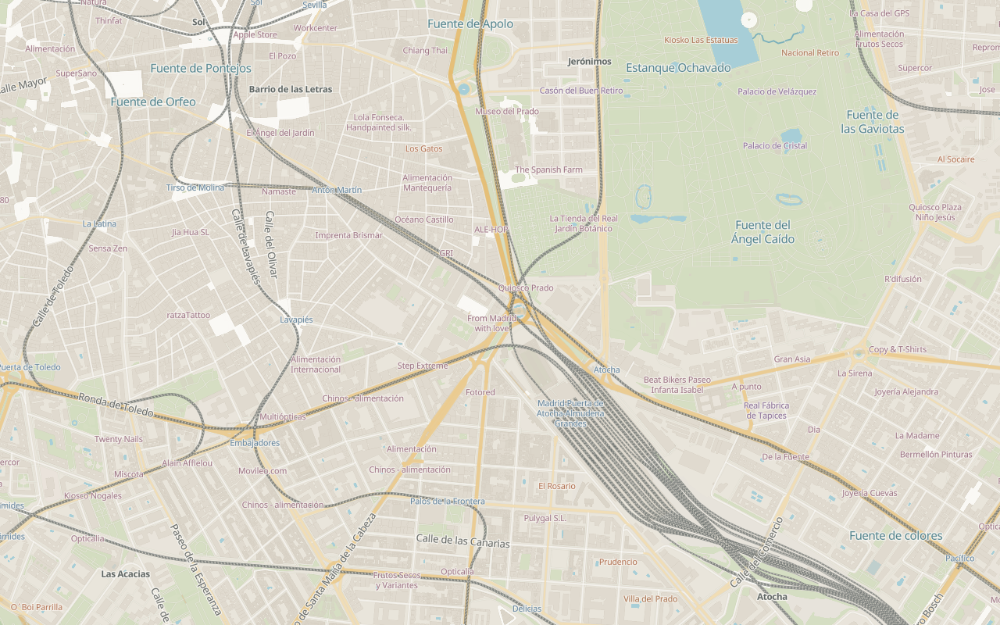

# Tileflow cartography lab

This is the SDK's shared map-design workbench. `editorial-city` uses the direct `streets()` basemap
recipe, an `editorial` theme, and keyed semantic module overlays; it is not a separate basemap or a
runtime preset.



The nine committed scenes exercise one style across city overview, neighborhood, close-street,
motorway, airport, transit, rural-edge, waterfront, and mobile views. The SDK pins the default
Tileflow World revision, and capture receipts record the resolved dataset plus the hosted Noto Sans
and browser runtime identity.

## Work on the map

From the SDK root, start the default map preview:

```sh
pnpm dev:cartography
```

Select an exact review scene when the viewport and camera matter:

```sh
pnpm dev:cartography --scene madrid-neighborhood
pnpm dev:cartography --scene barcelona-waterfront
```

Edit `tileflow.config.ts`. Valid generations reload automatically. Invalid edits preserve the last
valid preview and show bounded diagnostics. Scene preview uses the committed CSS dimensions;
deterministic DPR and pixel evidence remain the responsibility of capture.

## Review and accept a change

Capture every scene while iterating:

```sh
pnpm capture:cartography
```

Compare fresh pixels without changing the approved baselines:

```sh
pnpm visual:cartography
```

The scenes use versioned but remote resources. The comparison reports exact changes and warnings
for review, but the default lab command does not turn remote pixel inequality into a failing CI
gate.

Only after reviewing the generated diff, accept the current render deliberately:

```sh
pnpm visual:cartography:update
```

Keep shared appearance tokens in `themes.editorial`, visibility and exact cartographic behavior in
semantic modules, and ordered `overrides` as a last resort. When the desired result cannot be
expressed semantically, record the failing scene and before/after evidence, then add the smallest
missing module control and its direct layer-compiler test in the same pull request.
