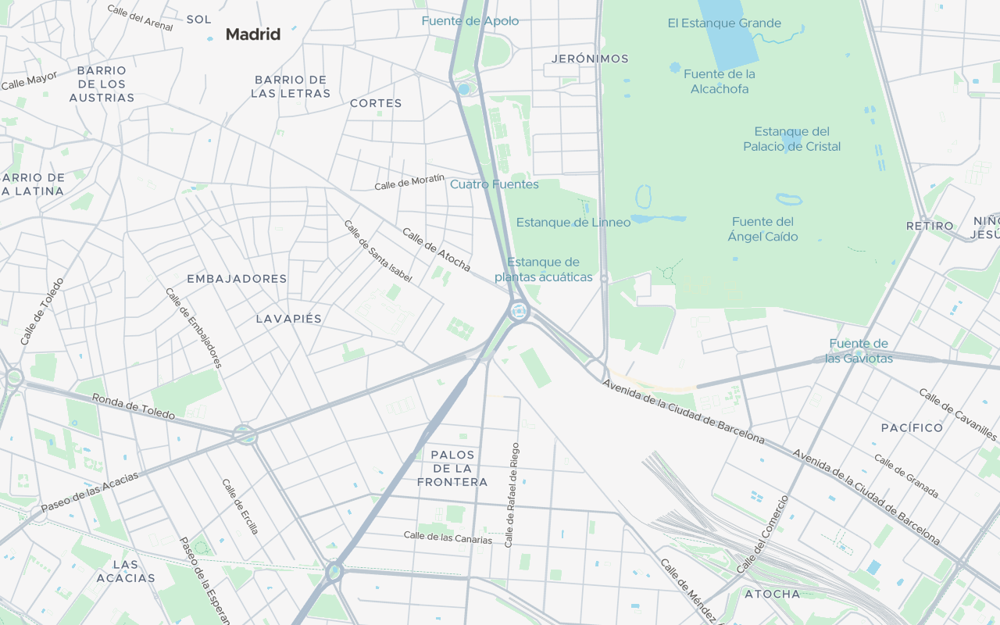

# Tileflow Streets

This is the SDK's shared map-design workbench. `editorial-city` uses the direct `streets()` basemap
recipe, an `editorial` theme, and keyed semantic module overlays; it is not a separate basemap or a
runtime preset.



The committed scenes exercise one style across city overview, neighborhood, close-street, motorway,
airport, transit, rural-edge, waterfront, and mobile views. The workbench pins the local Spain
V8.11 procedural-building revision, and capture receipts record the resolved dataset plus the hosted
Metropolis and browser runtime identity.

## Work on the map

From the SDK root, start the default map preview:

```sh
pnpm dev:streets
```

Select an exact review scene when the viewport and camera matter:

```sh
pnpm dev:streets --scene madrid-neighborhood
pnpm dev:streets --scene madrid-close-street
pnpm dev:streets --scene barcelona-waterfront
```

At zoom 16 and above, compatible development tiles expose individual trees. Use the `3D OFF/ON`
control in the preview to switch the authored building volumes on and off from zoom 15; the
separate `TREES OFF/ON` button immediately below it controls trees. Both states are saved in the
URL as `buildings3d=on|off` and `trees3d=on|off`. The building control leaves
the camera pitch untouched. The subtle native MapLibre extrusion begins at z15 without translated
screen-space shadows, because dense overview footprints otherwise form a black mesh. From z16 the
unchanged soft outline and translated core shadows appear exactly as authored for close views.
Commercial, destination, and ranked-activity volumes use a warm beige while the base building is a
cool grey; flat and 3D modes consume the same `building_tone` decision. MapLibre's vertical lighting
gradient gives both groups depth. Legacy `has_business` archives remain readable but no longer
define the active contract. The renderer does not paint windows, facade or roof
materials, source colors, or procedural roof caps onto them. Important
buildings still retain their source-backed `building:part` volumes, heights, and bases so available
geometry remains visible without invented surface detail. The building-specific facts stay in the
one vector source, and this editorial style does not load a GLB landmark manifest. Curved and
pitched `roof_shape` geometry is retained in V8.11 for a later procedural mesh renderer.
At closer zooms the preview uses simplified 3D trees by default so dense urban scenes remain smooth.
Their broadleaf models use a thicker, tapered olive-sage trunk with four branches. Variant 0 arranges
nine open, faceted lens-shaped foliage forms in varied olive greens, while variant 1 groups five
icosahedral foliage masses; conifers retain two tiers.
The pitched renderer follows physical scene height: pedestrian pavement and road paint stay on the
ground, crossings sit above their carriageways, building footprints and volumes cover that ground
geometry, trees cover buildings where their source geometry overlaps, and labels remain readable
above the scene. Street names, shields, and junction references are the exception: they stay with
the road-marking phase below buildings and trees instead of floating over the pitched geometry.
Append `?treeRenderer=complex` for ten open lenses in variant 0 or six clustered masses in variant
1; conifers use three overlapping crown tiers. In both modes those pieces remain fused into one
reusable geometry per variant and each complete tree remains one GPU instance, so the richer
silhouettes add no draw calls. During initial activation native circles remain visible until the
first 3D batch is ready. During
navigation that batch remains visible without a circle overlay until it refreshes. Distant zooms
use reduced density to keep movement smooth. Compare
`?treeRenderer=circle`, `?treeRenderer=simple`, and
`?treeRenderer=complex&treeBenchmark=1` on the same scene to inspect frame p95, refresh time, draw
calls, and triangles. Complex and simple trees use the direct WebGL2 backend by default; append
`&treeBackend=three` to compare the compatibility renderer on the same workload.
The preview reuses MapLibre's worker-built tile index for visible candidates, so the detailed models
do not require a second decoded copy of every vegetation tile. Terrain is disabled for this example
until the development DEM archive covers the reviewed cities without failed tile requests.

The V8.8 Spain preview also exposes explicit OSM pedestrian-area polygons in the `sidewalk` source
layer at native zoom 15. From display zoom 17 the workbench renders those source-backed footprints
as pale pavement with a sparse dot pattern below buildings. Coverage is intentionally incomplete:
the style does not buffer road centerlines or turn `sidewalk=*` road metadata into invented widths.

At overview zoom 13, the workbench draws the source's generalized path, track, cycleway, footway,
pedestrian, and steps geometry in one thin continuous green pass. The full semantic road stacks take
over at zoom 16, preserving bridge, tunnel, casing, and accessibility treatments without paying for
those extra buckets at overview scale. Named intermittent streams remain source-backed, but use a
continuous high-contrast blue stroke so those watercourses stay legible over woodland. The overview palette
also gives education grounds a light green wash, matching the broader park-and-campus fabric around
Casa de Campo rather than leaving those areas visually blank.

Append `?mapBenchmark=1&mapSweep=1` to run the repeatable z0–z24 performance sweep. The preview
stores per-zoom idle time, frame p95/max, active layers, rendered features, resource activity, and
errors in `data-tileflow-map-sweep` on the document body. `mapWorkers=1|2|3` enables worker A/B tests;
the default is one worker because dense urban tiles otherwise finish in main-thread upload bursts.
The compiled-style test also runs a network-free z0–z24 structural sweep. Its current budgets cap
the high-detail map at 84 active layers, 68 conservative bucket signatures, 18 symbol layers, and
36 active `transportation` layers while keeping `basemapVersion` at 3.

From zoom 16, every surface and bridge road class uses a one-pixel casing on each side. Its color
follows the road surface with 10% darkening; motorways and trunk roads use 20% darkening for clearer
separation. Major bridges retain their road-class color, while local and pedestrian bridges use the
same quiet structural grey as tunnels so narrow spans do not flare white over water. Tunnels preserve
the inherited road width and ramp scale but use an opaque pale-blue deck. Linear roads retain the
established class-and-zoom widths and `oneway` treatment; the workbench no longer consumes inferred
`road_width_m`, `road_surface`, or `road_space` data. Strictly qualified circular roundabouts are the
sole parametric road geometry: their physical inner and outer radii come from the tile, with a subtle
5% inward-only expansion already encoded by generation while the exterior edge remains fixed. At
zoom 17 a dense, fine
diagonal sprite pattern is clipped into the deck itself and repeats along the complete tunnel route;
its width-calibrated raster variants keep each diagonal about one screen pixel thick while spanning
the full deck. Unlike line-placed glyphs, it cannot protrude beyond the road edges. Underground
service roads stay suppressed because
the current source cannot distinguish public
access from the dense maintenance network around interchanges. The tunnel stack stays above base
water and land-use color for route continuity, while surface transport, buildings, vegetation,
and labels retain priority above it.

Edit `tileflow.config.ts`. Valid generations reload automatically. Invalid edits preserve the last
valid preview and show bounded diagnostics. Scene preview uses the committed CSS dimensions;
deterministic DPR and pixel evidence remain the responsibility of capture.

## Review and accept a change

Capture every scene while iterating:

```sh
pnpm capture:streets
```

Compare fresh pixels without changing the approved baselines:

```sh
pnpm visual:streets
```

The scenes use versioned but remote resources. The comparison reports exact changes and warnings
for review, but the default lab command does not turn remote pixel inequality into a failing CI
gate.

Only after reviewing the generated diff, accept the current render deliberately:

```sh
pnpm visual:streets:update
```

Keep shared appearance tokens in `themes.editorial`, visibility and exact cartographic behavior in
semantic modules, and ordered `overrides` as a last resort. When the desired result cannot be
expressed semantically, record the failing scene and before/after evidence, then add the smallest
missing module control and its direct layer-compiler test in the same pull request.
