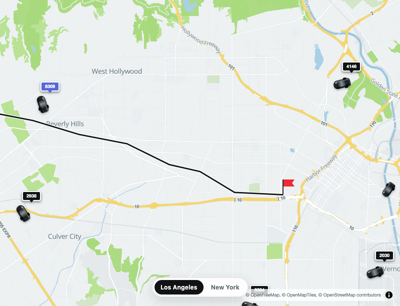
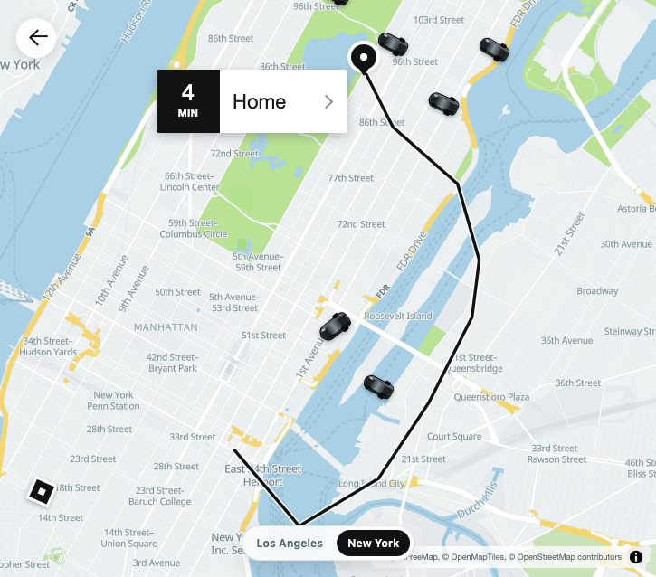

# Uber-inspired ride map

This example recreates the visual language of a classic Uber ride map without using Uber assets.
It combines one semantic Tileflow Streets map with application-owned MapLibre overlays:

- `/la` shows a wide Los Angeles trip, a black route, a red destination flag, nearby vehicles,
  and dispatch-style labels.
- `/nyc` shows a Manhattan trip, nearby vehicles, pickup/destination pins, and a `4 MIN · Home`
  trip card.

The example is an independent visual study and is not affiliated with or endorsed by Uber.





## Run the example

From the SDK root:

```sh
pnpm dev:uber
```

Open `http://127.0.0.1:5173/la` or `http://127.0.0.1:5173/nyc`. The Vite server hosts both the
React application and the generated Tileflow style, so no separate `tileflow dev` process is
needed.

## Capture and review

Keep the Vite server running, then use another terminal:

```sh
pnpm capture:uber
pnpm visual:uber
```

Only accept reviewed visual changes:

```sh
pnpm visual:uber:update
```

Edit `tileflow.config.ts` for the shared basemap. Edit `src/scenes.ts` for camera, route, and vehicle
data; `src/map-overlays.ts` owns the MapLibre operational layers and markers.
