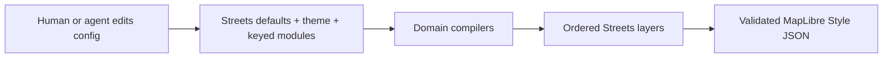

# @tileflow/core

Typed Tileflow authoring primitives and the deterministic Tileflow Streets compiler.

```ts
import {defineTileflow, labels, poi, roads, streets, water, zoom} from '@tileflow/core';

export default defineTileflow({
  themes: {
    editorial: {
      extends: 'light',
      colors: {
        background: '#E4DFD4',
        land: '#F5F2EB',
        water: '#A7CED7',
        park: '#C6D8B7',
        building: '#D6CFC3',
        road: '#FCFBF8',
        roadMajor: '#EBCB8F',
        roadCasing: '#BBB1A1',
        boundary: '#999184',
        text: '#252B2D',
        textMuted: '#626866',
        textHalo: '#FBF9F4',
      },
      typography: {font: 'Noto Sans', places: {weight: 'bold'}},
    },
  },
  maps: {
    madrid: {
      basemap: streets(),
      theme: 'editorial',
      modules: {
        water: water({bodies: {fill: {opacity: 0.95}}}),
        roads: roads({
          detail: 'streets',
          hierarchy: 'strong',
          classes: {
            primary: {
              surface: {
                fill: {
                  color: '#E4A85B',
                  width: zoom.linear([
                    [7, 0.6],
                    [16, 8],
                  ]),
                },
              },
            },
          },
        }),
        labels: labels({
          language: 'local',
          places: 'all',
          roads: 'streets',
          styles: {
            places: {city: {text: {size: 18, haloWidth: 1.5}}},
          },
        }),
        poi: poi({categories: ['food', 'culture', 'transit'], color: 'category'}),
      },
      view: {center: [-3.7038, 40.4168], pitch: 35, zoom: 12},
    },
  },
});
```

## Authoring model

`streets()` is the only built-in basemap. It identifies a versioned cartographic recipe and does
not inherit or patch another style. The compiler resolves the complete Streets design and asks
each domain module to create its own MapLibre layers. A shared graph then determines layer order.



Modules are keyed by domain, so object order never controls rendering and a domain can appear only
once. Omit a module to keep the complete Streets default. Use `enabled: false` to remove a domain
deliberately. The public domains are `land`, `water`, `roads`, `buildings`, `boundaries`, `labels`,
`poi`, `aeroways`, and `transit`.

Every styling module supports semantic shortcuts and exact semantic targets. Style values accept
constants, raw MapLibre expressions through `expression(...)`, and zoom functions through
`zoom.step(...)`, `zoom.linear(...)`, or `zoom.exponential(...)`. Exact controls address stable
concepts such as `roads.classes.primary.surface.fill`, not renderer layer IDs.

## Shared visual primitives

The same small visual language is reused across every geographic domain. This keeps an agent from
having to learn different spellings for the same MapLibre behavior:

- `BackgroundStyle`: color, opacity, pattern, visibility, and zoom range.
- `FillStyle`: color, opacity, pattern, antialiasing, visibility, and zoom range.
- `LineStyle`: color, width, opacity, dash, blur, gap, offset, pattern, caps, joins, and zoom range.
- `LineHatchStyle`: repeated diagonal detail with color, opacity, spacing, size, angle, and zoom
  range for a road structure.
- `TextStyle`: field, font, weight, fallbacks, size, color, halo, spacing metrics, transform,
  collision policy, rotation, fixed/variable anchoring, line constraints, and zoom range.
- `IconStyle`: image, size, color, halo, rotation/alignment, collision policy, and zoom range.
- `CircleStyle`: radius, fill/stroke appearance, blur, opacity, pitch behavior, and zoom range.
- `ExtrusionStyle`: color, height, base, opacity, pattern, vertical gradient, and zoom range.

Compounds express common cartographic structures: `AreaStyle` has `fill` and `outline`,
`LineStackStyle` has `shadow`, `casing`, and `fill`, and `SymbolStyle` combines placement with
optional `text`, `icon`, and `marker`. Geographic selection remains owned by semantic modules;
ordinary visual styles intentionally do not accept raw source filters.

A `SymbolStyle` root zoom range governs its text/icon layer and is inherited by its marker layer.
Because a marker is materialized as a separate circle layer, an explicit marker range may refine
that inherited default. Text and icon ranges must agree because MapLibre renders them together.

The road module distinguishes the path family semantically:

```ts
roads({
  extras: {paths: true},
  areas: {
    pedestrian: {
      fill: {color: '#F1F3F5'},
      outline: {color: '#D5DCE3', width: 1},
    },
  },
  classes: {
    primary: {
      tunnel: {
        casing: {color: '#8EA3B8', width: 10},
        fill: {color: '#F5F8FA', width: 8},
        hatch: {color: '#8EA3B8', opacity: 0.25, spacing: 10},
      },
    },
    pedestrian: {surface: {fill: {color: '#F5F6F7', width: 6}}},
    footway: {surface: {fill: {color: '#D9DEE3', width: 1.2}}},
    cycleway: {surface: {fill: {color: '#9ED8C5', width: 1.5}}},
    steps: {surface: {fill: {color: '#C7CED6', dash: [1, 1], width: 1.4}}},
    pathway: {surface: {fill: {color: '#E8ECEF', width: 1.2}}},
  },
  modifiers: {
    expressway: {widthScale: 1.06},
    ramp: {widthScale: 0.7},
    unpaved: {surface: {fill: {color: '#E6DFD3', dash: [2, 1]}}},
    construction: {surface: {fill: {dash: [2, 1], opacity: 0.7}}},
    indoor: {surface: {fill: {dash: [1, 1], opacity: 0.4}}},
  },
  restrictions: {
    access: {surface: {fill: {dash: [1.5, 1], opacity: 0.55}}},
    toll: {surface: {casing: {color: '#C5B7D8'}}},
  },
  serviceTypes: {
    driveway: {widthScale: 0.75},
    parkingAisle: {widthScale: 0.6},
  },
});
```

These targets are non-overlapping translations of the OpenMapTiles road class and subclass. The
same names are available under `labels().roadClasses` and `labels().styles.roads`. Surface, tunnel,
and bridge phases can be controlled independently for each target; each structure has
`shadow`/`casing`/`fill` and an optional `hatch`. Hatch marks inherit the resolved fill width when
`size` is omitted and never participate in label collision. No raw source filter or generated layer
ID is needed.

`classes.pedestrian` styles line-like pedestrian ways. Polygon pedestrian plazas are a distinct
geometry and use `areas.pedestrian`, including optional fill opacity, outline color, or sprite
pattern. This prevents plazas from degrading into a thin polygon outline.

Road treatments refine a class without creating another class or exposing source fields.
`construction`, `expressway`, `indoor`, `official`, `ramp`, and `unpaved` live under `modifiers`;
general, bicycle, foot, horse, and toll restrictions live under `restrictions`; `alley`,
`crossover`, `driveway`, `parkingAisle`, and `yard` live under `serviceTypes`; and exact
mountain-bike difficulty values live under `mountainBike`. Treatments reuse
surface/tunnel/bridge and casing/fill/shadow paint controls, plus a relative `widthScale`. The
compiler emits feature-driven paint expressions inside the existing stable class layers rather
than multiplying every possible combination.

Road names, shields, and motorway junctions remain label concerns:

```ts
labels({
  roads: 'all',
  shields: 'all',
  junctions: true,
  styles: {
    shields: {
      default: {text: {color: '#405264', haloColor: '#fff', haloWidth: 2, weight: 'bold'}},
      networks: {
        'network-value': {text: {color: '#B43A35'}},
      },
    },
    junctions: {text: {color: '#405264', haloColor: '#fff', haloWidth: 2}},
  },
});
```

POI `density`, `labels`, and `icons` are independent policies. Density bounds eligible feature
ranks, label detail controls text ranks, icon detail controls icon ranks, and
`placement.coupleIconAndLabel` deliberately keeps only features eligible for both. Without
coupling, icon and label layers collide normally but can be styled and zoomed independently.
The `balanced` policy keeps a practical cross-category candidate set from an overscaled
OpenMapTiles source tile; MapLibre collision placement still decides which candidates fit the
current viewport. Use a category style's inclusive `maxRank` when different feature families need
different candidate ceilings; the explicit category value replaces the density/label/icon preset
ceiling for that category without exposing a raw layer ID or filter.

Theme tokens provide shared color and typography defaults. A module-level exact style wins over a
theme token for that target. Precedence is deterministic:

1. Streets recipe defaults.
2. Selected theme and inherited named theme.
3. Explicit keyed module fields.
4. Ordered raw overrides.

Raw `addLayer`, `patchLayer`, `moveLayer`, and `removeLayer` operations are the final MapLibre escape
hatch. They are ordered, target generated `streets-*` IDs explicitly, and fail when a target or
anchor does not exist. They should be used for one-off MapLibre behavior, not ordinary design.

## Data is separate from design

Omitting `data` selects Tileflow World at the revision pinned by this SDK version:

```ts
{
  basemap: streets();
}
```

Pin the official data deliberately, or use another OpenMapTiles-compatible vector source:

```ts
import {openMapTiles, tileflowWorld, vectorTiles} from '@tileflow/core';

const official = tileflowWorld({revision: '2026-06-07'});
const external = vectorTiles({
  url: 'https://tiles.example.com/tiles.json',
  attribution: '© Example © OpenStreetMap contributors',
  schema: openMapTiles(),
});
```

The basemap controls how data is drawn; `data` controls where compatible features come from. The
compiler performs no network request. `openMapTiles({layers, fields})` can bind renamed
source-layers or properties while preserving the versioned semantic contract. External browser
credentials do not belong in public Style JSON; supply them through the framework's
`transformRequest` integration.

## Capture scenes

Commit named scenes beside maps. Scenes affect visual evidence, not style or manifest identity.

```ts
export default defineTileflow({
  maps: {madrid: {basemap: streets()}},
  scenes: {
    'madrid-desktop': {
      map: 'madrid',
      camera: {type: 'center', center: [-3.7038, 40.4168], zoom: 12},
      viewport: {width: 1280, height: 800, dpr: 1},
    },
  },
});
```

Use `tileflow dev --scene madrid-desktop` for live review and `tileflow capture madrid-desktop`
for exact pixels and a schema-version-2 receipt containing the Streets, data, style, renderer, and
image identities.

## Public API and browser subpath

Config, data, modules, compilation, validation, runtime resolution, and capture-scene APIs come
from the package root. Legacy basemap factories, `renderer`, top-level `tiles`/`tileset`, module
arrays, and raw `layers` are not part of this API.

Framework adapters import the browser-only lifecycle kernel explicitly:

```ts
import {
  attachTileflowMapLifecycle,
  createTileflowMarkerController,
  createTileflowSessionStarter,
  createTileflowTransformRequest,
} from '@tileflow/core/browser';
```

The browser entry is not re-exported from the root. It is SSR-safe to import, has no MapLibre
runtime dependency, and reads no browser global during module evaluation. See the
[framework browser runtime contract](../../docs/contracts/framework-browser-runtime.md) and the
[cartographic authoring contract](../../docs/contracts/cartographic-authoring.md).

Other source subpaths are private implementation details.

Streets build, preview, capture, and deploy flows supply a built-in POI sprite with Google Places
glyphs inside Tileflow circular markers. The markers use Google's category colors, a white rim, and
a compact shadow. A project-local icon source or explicit hosted sprite replaces that catalog;
build and deploy replace local sources with generated sprite URLs without exposing source paths.
Calling the pure core style compiler without asset preparation remains text-only unless the map
provides `icons` or `sprite` explicitly.
