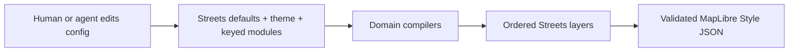

# @tileflow/core

Typed Tileflow authoring primitives and the deterministic Tileflow Streets compiler.

```ts
import {defineTileflow, labels, poi, roads, streets, water, zoom} from '@tileflow/core';

export default defineTileflow({
  themes: {
    editorial: {
      extends: 'light',
      colors: {
        background: '#E4DFD4',
        land: '#F5F2EB',
        water: '#A7CED7',
        park: '#C6D8B7',
        building: '#D6CFC3',
        road: '#FCFBF8',
        roadMajor: '#EBCB8F',
        roadCasing: '#BBB1A1',
        boundary: '#999184',
        text: '#252B2D',
        textMuted: '#626866',
        textHalo: '#FBF9F4',
      },
      typography: {font: 'Noto Sans', places: {weight: 'bold'}},
    },
  },
  maps: {
    madrid: {
      basemap: streets(),
      projection: 'globe',
      theme: 'editorial',
      modules: {
        water: water({bodies: {fill: {opacity: 0.95}}}),
        roads: roads({
          detail: 'streets',
          hierarchy: 'strong',
          classes: {
            primary: {
              surface: {
                fill: {
                  color: '#E4A85B',
                  width: zoom.linear([
                    [7, 0.6],
                    [16, 8],
                  ]),
                },
              },
            },
          },
        }),
        labels: labels({
          language: 'local',
          places: 'all',
          roads: 'streets',
          styles: {
            places: {city: {text: {size: 18, haloWidth: 1.5}}},
          },
        }),
        poi: poi({categories: ['food', 'culture', 'transit'], color: 'category'}),
      },
      view: {center: [-3.7038, 40.4168], pitch: 35, zoom: 12},
    },
  },
});
```

Set `projection: 'globe'` for MapLibre's adaptive globe preset. Global zooms render as a sphere,
then transition to Mercator between zoom 10 and 12 so detailed streets remain planar. Omit the
property, or set it to `'mercator'`, for a consistently flat map.

## Authoring model

`streets()` is the only built-in basemap. It identifies a versioned cartographic recipe and does
not inherit or patch another style. The compiler resolves the complete Streets design and asks
each domain module to create its own MapLibre layers. A shared graph then determines layer order.
`createStyle(...)` dispatches through the basemap compiler catalog; today that catalog contains only
Streets, while keeping basemap type/version ownership explicit for future recipes. The public
`createStreetsStyle(...)` entry validates the same strict map schema before compilation, including
for JavaScript callers, so it cannot emit metadata for an unsupported recipe version.



Modules are keyed by domain, so object order never controls rendering and a domain can appear only
once. Omit a module to keep the complete Streets default. Use `enabled: false` to remove a domain
deliberately. The public domains are `land`, `water`, `roads`, `buildings`, `boundaries`, `labels`,
`poi`, `aeroways`, `transit`, `vegetation`, `addresses`, and `landforms`.
The typed default recipe is exhaustive over that domain set, and a schema contract test verifies
that every recipe entry keeps its key, type tag, validator, compiler orchestration, and root export
in lockstep. Disabling `roads` also removes dependent road names, shields, and junction references;
independent place, water, aerodrome, and POI labels remain under the labels module.

Every styling module supports semantic shortcuts and exact semantic targets. Style values accept
constants, raw MapLibre expressions through `expression(...)`, and zoom functions through
`zoom.step(...)`, `zoom.linear(...)`, or `zoom.exponential(...)`. Exact controls address stable
concepts such as `roads.classes.primary.surface.fill`, not renderer layer IDs.

The `land` module exposes stable land-use targets for `cemetery`, `civic`, `commercial`,
`industrial`, `military`, `parking`, `railway`, `recreation`, and `residential`. Parking areas are
polygons from the configured land-use source; parking access aisles remain road features under
`roads.serviceTypes.parkingAisle`.

`addresses` renders the standard OpenMapTiles `housenumber` points at detailed zooms and exposes a
single semantic `labels` style. `landforms` renders the standard `mountain_peak` classes (`peak`,
`volcano`, `saddle`, `ridge`, `cliff`, and `arete`) with rank-aware collision priority and optional
metric elevation. Both source-layer and field names remain remappable through `openMapTiles(...)`;
landform names share the language selected by `labels({language: ...})`.

`aeroways.runwayRef` owns high-zoom runway designators from the remappable OpenMapTiles `ref`
field. Aerodrome names stay under `labels.styles.aerodrome`; `labels.aerodromeCodes` controls whether
they append no code, IATA only, or IATA with an ICAO fallback (`'none' | 'iata' | 'all'`).

The `vegetation` module binds individual-tree points from the optional OpenMapTiles `tree`
extension. Its default `mode: '3d'` emits a portable circle fallback plus metadata for runtimes
that can upgrade the points to instanced 3D trees. `mode: 'flat'` keeps the MapLibre circles, and
`minZoom` controls when either representation starts. The binding includes height, crown diameter,
genus, leaf type, and species fields so compatible runtimes can preserve source measurements and
botanical form without hard-coding raw property names. The pitched-scene stack follows physical
height: pedestrian and transport surfaces, transport markings and road names, buildings, then
vegetation. Place, water, aerodrome, and POI annotations remain last so geographic names stay
readable without making street paint or text float over 3D geometry.

## Shared visual primitives

The same small visual language is reused across every geographic domain. This keeps an agent from
having to learn different spellings for the same MapLibre behavior:

- `BackgroundStyle`: color, opacity, pattern, visibility, and zoom range.
- `FillStyle`: color, opacity, pattern, antialiasing, visibility, and zoom range.
- `LineStyle`: color, width, opacity, dash, blur, gap, offset, pattern, caps, joins, and zoom range.
- `LineHatchStyle`: repeated diagonal detail with color, opacity, spacing, size, angle, and zoom
  range for a road structure.
- `TextStyle`: field, font, weight, fallbacks, size, color, halo, spacing metrics, transform,
  collision policy, rotation, fixed/variable anchoring, line constraints, and zoom range.
- `IconStyle`: image, size, color, halo, rotation/alignment, collision policy, and zoom range.
- `CircleStyle`: radius, fill/stroke appearance, blur, opacity, pitch behavior, and zoom range.
- `ExtrusionStyle`: color, height, base, opacity, pattern, vertical gradient, and zoom range.

Compounds express common cartographic structures: `AreaStyle` has `fill` and `outline`,
`LineStackStyle` has `shadow`, `casing`, and `fill`, and `SymbolStyle` combines placement with
optional `text`, `icon`, and `marker`. Geographic selection remains owned by semantic modules;
ordinary visual styles intentionally do not accept raw source filters.

## Compiled-style performance

The Streets compiler resolves semantic modules and raw overrides first, then compacts equivalent
physical MapLibre layers. At high-detail zooms, road classes become a small set of data-driven
cohorts; equivalent road labels and tunnel hatches share compatible buckets; and land-cover,
land-use, and waterway classes share compatible buckets. Overrides still target the familiar
semantic compiler IDs because they run before this final materialization step.

Use the exported structural sweep to enforce budgets without loading tiles or a browser:

```ts
import {analyzeTileflowStylePerformance, createStyleFromProject} from '@tileflow/core';

const report = analyzeTileflowStylePerformance(createStyleFromProject(project, 'madrid'));
console.log(report.zooms[16]);
```

The report covers z0–z22 by default and includes active layers, conservative bucket estimates,
symbols, and active layers per source-layer. It is intended for regression gates; browser traces
remain the source of truth for decode, upload, placement, and frame time.

A `SymbolStyle` root zoom range governs its text/icon layer and is inherited by its marker layer.
Because a marker is materialized as a separate circle layer, an explicit marker range may refine
that inherited default. Text and icon ranges must agree because MapLibre renders them together.

The road module distinguishes the path family semantically:

```ts
roads({
  extras: {paths: true},
  areas: {
    pedestrian: {
      fill: {color: '#F1F3F5'},
      outline: {color: '#D5DCE3', width: 1},
    },
  },
  classes: {
    primary: {
      tunnel: {
        casing: {color: '#8EA3B8', width: 10},
        fill: {color: '#F5F8FA', width: 8},
        hatch: {color: '#8EA3B8', opacity: 0.25, spacing: 10},
      },
    },
    pedestrian: {surface: {fill: {color: '#F5F6F7', width: 6}}},
    footway: {surface: {fill: {color: '#D9DEE3', width: 1.2}}},
    cycleway: {surface: {fill: {color: '#9ED8C5', width: 1.5}}},
    steps: {surface: {fill: {color: '#C7CED6', dash: [1, 1], width: 1.4}}},
    pathway: {surface: {fill: {color: '#E8ECEF', width: 1.2}}},
  },
  modifiers: {
    expressway: {widthScale: 1.06},
    ramp: {widthScale: 0.7},
    unpaved: {surface: {fill: {color: '#E6DFD3', dash: [2, 1]}}},
    construction: {surface: {fill: {dash: [2, 1], opacity: 0.7}}},
    indoor: {surface: {fill: {dash: [1, 1], opacity: 0.4}}},
  },
  restrictions: {
    access: {surface: {fill: {dash: [1.5, 1], opacity: 0.55}}},
    toll: {surface: {casing: {color: '#C5B7D8'}}},
  },
  serviceTypes: {
    driveway: {widthScale: 0.75},
    parkingAisle: {widthScale: 0.6},
  },
});
```

These targets are non-overlapping translations of the OpenMapTiles road class and subclass. The
same names are available under `labels().roadClasses` and `labels().styles.roads`. Surface, tunnel,
and bridge phases can be controlled independently for each target; each structure has
`shadow`/`casing`/`fill` and an optional `hatch`. Glyph hatch marks inherit the resolved fill width
when `size` is omitted and never participate in label collision. Setting `hatch.pattern` instead
emits a repeated sprite texture clipped to the resolved fill width. No raw source filter or generated
layer ID is needed. `hatch.patternWidths` can list intrinsic sprite heights named
`${pattern}-${width}`; the compiler selects the nearest height from the resolved road width so the
texture's marks remain approximately constant in screen pixels across classes, ramps, and zooms.

`classes.pedestrian` styles line-like pedestrian ways. Polygon pedestrian plazas are a distinct
geometry and use `areas.pedestrian`, including optional fill opacity, outline color, or sprite
pattern. This prevents plazas from degrading into a thin polygon outline.

Road treatments refine a class without creating another class or exposing source fields.
`construction`, `expressway`, `indoor`, `official`, `ramp`, and `unpaved` live under `modifiers`;
general, bicycle, foot, horse, and toll restrictions live under `restrictions`; `alley`,
`crossover`, `driveway`, `parkingAisle`, and `yard` live under `serviceTypes`; and exact
mountain-bike difficulty values live under `mountainBike`. Treatments reuse
surface/tunnel/bridge and casing/fill/shadow paint controls, plus a relative `widthScale`. The
compiler emits feature-driven paint expressions inside the existing stable class layers rather
than multiplying every possible combination.

Road names, shields, and motorway junctions remain label concerns:

```ts
labels({
  roads: 'all',
  shields: 'all',
  junctions: true,
  styles: {
    shields: {
      default: {text: {color: '#405264', haloColor: '#fff', haloWidth: 2, weight: 'bold'}},
      networks: {
        'network-value': {text: {color: '#B43A35'}},
      },
    },
    junctions: {text: {color: '#405264', haloColor: '#fff', haloWidth: 2}},
  },
});
```

POI `density`, `labels`, and `icons` are independent policies. Density bounds eligible feature
ranks, label detail controls text ranks, icon detail controls icon ranks, and
`placement.coupleIconAndLabel` deliberately keeps only features eligible for both. Without
coupling, icon and label layers collide normally but can be styled and zoomed independently.
The `balanced` policy keeps a practical cross-category candidate set from an overscaled
OpenMapTiles source tile; MapLibre collision placement still decides which candidates fit the
current viewport. Use a category style's inclusive `maxRank` when different feature families need
different candidate ceilings; the explicit category value replaces the density/label/icon preset
ceiling for that category without exposing a raw layer ID or filter.

Theme tokens provide shared color and typography defaults. A module-level exact style wins over a
theme token for that target. Precedence is deterministic:

1. Streets recipe defaults.
2. Selected theme and inherited named theme.
3. Explicit keyed module fields.
4. Ordered raw overrides.

Raw `addLayer`, `patchLayer`, `moveLayer`, and `removeLayer` operations are the final MapLibre escape
hatch. They are ordered, target generated `streets-*` IDs explicitly, and fail when a target or
anchor does not exist. They should be used for one-off MapLibre behavior, not ordinary design.

## Data is separate from design

Omitting `data` selects the compiler-owned Tileflow World `v1` compatibility generation:

```ts
{
  basemap: streets();
}
```

Name the official generation deliberately, or use another OpenMapTiles-compatible vector source:

```ts
import {openMapTiles, tileflowWorld, vectorTiles} from '@tileflow/core';

const official = tileflowWorld();
const external = vectorTiles({
  tiles: ['pmtiles://./test/fixtures/world.pmtiles'],
  revision: 'fixture-1',
  attribution: '© Example © OpenStreetMap contributors',
  schema: openMapTiles(),
});
```

The basemap controls how data is drawn; `data` controls where compatible features come from. The
compiler emits `https://world.tileflow.dev/world/v1/{z}/{x}/{y}.pbf` directly and performs no
metadata, catalog, or TileJSON request. World data revisions can change behind that path when they
remain compatible; they are neither configuration nor replay selectors. `openMapTiles({layers,
fields})` can bind renamed
source-layers or properties while preserving the versioned semantic contract. External browser
credentials do not belong in public Style JSON; supply them through the framework's
`transformRequest` integration.

External exact-test sources may use one TileJSON `url` or a bounded direct `tiles` list with optional
`bounds`, `minzoom`, and `maxzoom`. `pmtiles://` is supported for a checked-in or bring-your-own
archive. An external `revision` participates in capture identity, so changing fixture bytes cannot
silently reuse a baseline.

Tileflow's OpenMapTiles contract also recognizes the optional `globallandcover` extension. The
default Streets style maps its `barren`, `crop`, `grass`, `shrub`, `snow`, `trees`, and `urban`
classes beneath the OSM land layers at zooms 0–7, fading to transparent at zoom 8. Sources with a
different layer name can use `openMapTiles({layers: {globalLandcover: 'my_landcover'}})`; archives
without the extension remain compatible and simply render no features for that style layer.
`crop` shares the theme's semantic `landcover.farmland` color with detailed farmland, while
`barren` uses `landcover.rock`; neither class borrows a road color.

Tileflow World V1 makes the low-zoom `bathymetry` extension mandatory. Use
`tileflowWorldV1Schema()` for that product instead of making raw layer names part of a style; it
binds `bathymetry`, `min_depth`, and `sort_key` as typed schema fields. Publication tooling can call
`validateTileflowWorldV1Tilejson(...)` to reject an archive that does not declare the layer at
z0–z9 with both numeric fields. Generic OpenMapTiles sources keep this capability absent unless it
is enabled explicitly. Resolving omitted data or `tileflowWorld(...)` uses this V1 schema directly,
so raw overrides and future semantic modules see the same required bindings as publication checks.

The optional `business_corridor` extension contains activity-selected source footprints below
buildings. Its `activity_score`, `rank`, `min_zoom`, and `confidence` fields control a quiet local
warm tint without drawing POI-radius circles. Current building footprints may carry sparse
`building_tone=commercial|destination|active`; absence means the neutral base building. The three
values preserve why the warm tone was selected even when a theme maps them to the same color.
Building visibility is fixed by the layer zoom contract and never by optional semantics. Immutable
V8.9 archives carrying `building_kind` or `has_business` remain readable as a defensive
compatibility path, but new candidates do not emit those fields. The land module also exposes
`medical`, `education`, and `government` independently instead of collapsing their already distinct
source classes into one civic color.

A public compiler release binds one validated `WorldGenerationDescriptor` containing the frozen
vector-schema hash, encoding, zooms, bounds, upstream attribution, direct World URL, and one
content-identified glyph/sprite set. Project config cannot override that descriptor. The current
prepublication branch intentionally contains no production asset-set ID or placeholder default;
release remains blocked until the complete descriptor is approved and bundled.

Upstream data attribution remains in the MapLibre source. `Map by Tileflow` is a separate product
credit/trademark surface and must not replace, obscure, or be presented as upstream attribution.

## Capture scenes

Commit named scenes beside maps. Scenes affect visual evidence, not style or manifest identity.

```ts
export default defineTileflow({
  maps: {madrid: {basemap: streets()}},
  scenes: {
    'madrid-desktop': {
      map: 'madrid',
      camera: {type: 'center', center: [-3.7038, 40.4168], zoom: 12},
      viewport: {width: 1280, height: 800, dpr: 1},
    },
  },
});
```

Use `tileflow dev --scene madrid-desktop` for live review and `tileflow capture madrid-desktop`
for exact pixels and a schema-version-2 receipt containing the Streets, data, style, renderer, and
image identities. World receipts identify `generation: "v1"`; external fixtures may identify their
explicit revision.

## Public API and browser subpath

Config, data, modules, compilation, validation, runtime resolution, and capture-scene APIs come
from the package root. Legacy basemap factories, `renderer`, top-level `tiles`/`tileset`, module
arrays, and raw `layers` are not part of this API.

Framework adapters import the browser-only lifecycle kernel explicitly:

```ts
import {
  attachTileflowFairUseNotice,
  attachTileflowMapLifecycle,
  createTileflowMarkerController,
  createTileflowSessionStarter,
  createTileflowTransformRequest,
  registerTileflowWorldRequestBridge,
} from '@tileflow/core/browser';
```

The browser entry is not re-exported from the root. It is SSR-safe to import, has no MapLibre
runtime dependency, and reads no browser global during module evaluation. See the
[framework browser runtime contract](../../docs/contracts/framework-browser-runtime.md) and the
[cartographic authoring contract](../../docs/contracts/cartographic-authoring.md).

## Hosted session authorization

The framework adapters use `createTileflowSessionController` to obtain one short-lived session
grant before eligible hosted style, tile, font, or sprite requests. Concurrent resources share the
same preflight, grants are attached only to reviewed HTTP(S) origins, and an expired unused session
rotates once when the server requests it. A controller also rotates after six hours or 10,000
eligible requests. The preflight has a 10-second client timeout by default; direct controller users
can set `grantTimeoutMs` from 1 to 120,000 milliseconds.

`analytics.enabled: false` disables only the optional analytics beacon. It does not disable this
server-owned commercial authorization. User `transformRequest` callbacks still run first; Tileflow
then decorates only the resulting eligible URL and preserves the other request options.

For direct Tileflow World tiles, framework adapters also use the browser request bridge to observe
the response's safe fair-use state without adding identity, query parameters, credentials, or user
headers to the public World URL. Early `GRACE` stays silent; signed late `GRACE` creates a compact
accessible owner-action pill, and `CLAIM_REQUIRED` creates a stronger in-map banner. A missing
header, absent tile, MapLibre error, or failed response cannot erase an existing claim action; a
later successful `OPEN` response can clear it. Shaped empty tiles remain render-safe while the owner
action stays available.

Other subpaths under `src/`, `themes/`, `templates/`, and `modules/` are internal implementation
details and can change during alpha releases.

Streets build, preview, capture, and deploy flows supply nine original Tileflow POI pictograms. A
complete public generation descriptor points at their content-identified base sprite; local tooling
can compile the same first-party SVG sources for exact offline work. A project-local icon source or
explicit hosted sprite replaces that catalog without exposing source paths. Calling the pure core
style compiler without asset preparation or a complete generation descriptor remains text-only
unless the map provides `icons` or `sprite` explicitly.
