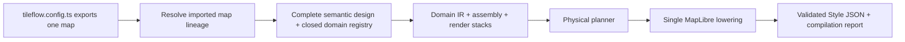

# @tileflow/core

Typed Tileflow map contracts, semantic modules, and deterministic MapLibre style compilation.

Every public `tileflow.config.ts` exports one map. Most maps import an existing map and override only
the design fields they own:

```ts
import {
  defineMap,
  defineTheme,
  fixed,
  labels,
  poi,
  roads,
  token,
  water,
  zoom,
} from '@tileflow/core';
import {streets, streetsThemes} from '@tileflow/maps';

const madridDark = defineTheme(streetsThemes.dark, {
  id: 'madrid-dark',
  version: 1,
  colorScheme: 'dark',
  tokens: {color: {'surface.land': '#0d1320', 'surface.water': '#081e2e'}},
});

export default defineMap({
  id: 'madrid',
  name: 'Madrid',
  version: 1,
  extends: streets,
  themes: {light: streetsThemes.light, dark: madridDark},
  defaultTheme: 'light',
  systemThemes: {light: 'light', dark: 'dark'},
  projection: 'globe',
  modules: {
    water: water({
      bodies: {
        fill: {
          opacity: fixed(0.95, {reason: 'Madrid keeps this water density in every theme'}),
        },
      },
    }),
    roads: roads({
      detail: 'streets',
      hierarchy: 'strong',
      classes: {
        primary: {
          surface: {
            fill: {
              color: fixed('#E4A85B', {reason: 'Madrid brand roads stay warm in every theme'}),
              width: zoom.linear([
                [7, fixed(0.6, {reason: 'Madrid keeps its primary-road hierarchy across themes'})],
                [16, fixed(8, {reason: 'Madrid keeps its primary-road hierarchy across themes'})],
              ]),
            },
          },
        },
        secondary: {surface: {fill: {color: token.color('roads.secondary')}}},
      },
    }),
    labels: labels({
      language: 'local',
      places: 'all',
      roads: 'streets',
      styles: {
        places: {
          city: {
            text: {
              size: fixed(18, {reason: 'Madrid keeps its city-label scale across themes'}),
              haloWidth: fixed(1.5, {reason: 'Madrid keeps its city-label halo across themes'}),
            },
          },
        },
      },
    }),
    poi: poi({categories: ['food-drink', 'arts-entertainment', 'transport'], color: 'category'}),
  },
  view: {center: [-3.7038, 40.4168], pitch: 35, zoom: 12},
});
```

Map identity and scenes belong to the leaf and do not inherit. Hosted browser policy is configured
in Tileflow and does not enter cartographic authoring or compilation.

Set `projection: 'globe'` for MapLibre's adaptive globe preset. Global zooms render as a sphere,
then transition to Mercator between zoom 10 and 12 so detailed streets remain planar. Omit the
property, or set it to `'mercator'`, for a consistently flat map.

Terrain keeps the original `'none' | 'hillshade' | '3d'` shorthand. The object form can style every
MapLibre hillshade paint control, or generate vector contours in the browser from an explicit DEM
tile template. Contours require `demUrl`, `demMaxZoom`, and zoom-indexed `[minor, index]`
`thresholds`; the raster `url` remains the separate TileJSON endpoint. Set `mode: 'none'` to compile
contours without adding a raster source, hillshade, or 3D terrain:

```ts
terrain: {
  mode: 'none',
  encoding: 'terrarium',
  contours: {
    demUrl: 'https://terrain.example.test/{z}/{x}/{y}.webp',
    demMaxZoom: 13,
    maxZoom: 15,
    overzoom: 2,
    thresholds: {
      9: [100, 500],
      11: [50, 250],
      13: [20, 100],
      15: [10, 50],
    },
    minor: {
      color: token.color('terrain.contour.minor'),
      width: token.number('terrain.contour.minor-width'),
    },
    index: {
      color: token.color('terrain.contour.index'),
      width: token.number('terrain.contour.index-width'),
    },
    labels: {
      color: token.color('terrain.contour.label'),
      haloColor: token.color('terrain.contour.halo'),
    },
  },
}
```

Declare those `terrain.*` color and number roles with the same keys in every map theme. The
compiled source is ordinary MapLibre vector data with source layer `contours`; its tile URL
contains the safely encoded DEM template and complete generation parameters. Register the generic
protocol before MapLibre reads the style. It lazily initializes the pinned, locally bundled
`maplibre-contour@0.1.0` browser module on the first contour tile; no public CDN runtime is needed.
`overzoom` may not exceed the lowest threshold zoom, so generated DEM requests never use a negative
zoom. Every index interval must be a whole multiple of its minor interval. Contour labels emit the
scaled numeric elevation without assuming a display unit. Source and layer visibility cannot begin
before the first configured threshold zoom. To bound main-thread work, effective minor intervals
must be at least 250 units at z0–4, 100 at z5–7, 50 at z8–10, 20 at z11–12, and 10 from z13 onward.
Use a trusted, size-bounded DEM tile service; the protocol intentionally accepts author-supplied
HTTP(S) templates rather than proxying or republishing terrain data.

```ts
import {registerTileflowContourProtocol} from '@tileflow/core/browser';

registerTileflowContourProtocol({addProtocol: maplibregl.addProtocol});
```

## Authoring model

Tileflow exposes one authoring concept and one constructor: `defineMap()`. A complete map omits
`extends`; an inherited map sets `extends` to another imported map object. All ten first-party
maps are independent standalone maps. They use the sole semantic compiler while defining
their complete designs and asset providers directly; no official map imports or extends another
official map. Applications can extend any of those maps through the same public API. Streets
itself owns coordinated light and dark themes.
There is no public compiler selector or alternate compiler. The authoring contract has no recipe or
cartographic compatibility alias.

### Machine-readable V1 surface

`tileflowAuthoringManifest` is the deterministic, deeply frozen description of the public semantic
language. Its schema version is `tileflowAuthoringManifestSchemaVersion`. The manifest's `domains`
array is generated from the compiler's closed registry and records exact compile order, module and
service dependencies, and provided services. `operations` lists only integrated public operations:
defining/extending a map, directly replacing, refining, disabling, or resetting a keyed domain,
and adding owner-local render passes or target refinements. Direct declaration is the sole
replacement syntax; there is no redundant `set()` helper.

Agents and other tools can discover this contract without importing executable configuration:
`tileflow language manifest --json` emits the manifest and `tileflow language schema --json` emits
the packaged generated authoring/resolved JSON Schema. Both commands are deterministic, read-only,
and network-free. The manifest links every domain to its authoring, options, patch, and resolved
schema definitions, and enumerates the closed expression and render-selector vocabulary with its
finite limits.

The manifest also describes the exact structured compiler contract. A successful
`createStyleResult()` has `{ok: true, diagnostics, report, style}`; a failure has
`{ok: false, diagnostics, report}` and forbids `style`. Report schema version 1 requires
`domains`, `map`, `planner`, `schemaVersion`, and sorted semantic `targets`; `theme`, source
`requirements`, and physical `provenance` are optional. Pass `{inspection: true}` only when the
read-only physical-output provenance sidecar is needed. Its IDs and indexes are diagnostic
observations, never stable or addressable authoring targets.

`diffTileflowMaps(before, after)` resolves both inputs before comparing them and returns semantic
diff schema version 1:

```ts
{
  schemaVersion: 1,
  from: {id, version},
  to: {id, version},
  summary: {add, remove, change, total},
  changes: [
    {kind: 'add', path: '/projection', after: 'globe'},
    {kind: 'remove', path: '/modules/water', before: {/* ... */}},
    {kind: 'change', path: '/view/zoom', before: 12, after: 13},
  ],
}
```

Paths are RFC 6901 JSON Pointers. Object keys compare recursively in code-unit order; arrays compare
atomically because map inheritance replaces arrays. Leaf identity (`id`, `name`, `version`) and
delivery metadata identify the endpoints but are not cartographic changes.

Custom build tooling can opt into a separate, read-only diagnostic sidecar from the explicit build
entrypoint:

```ts
import {createStyleWithInspection} from '@tileflow/core/build';

const {style, inspection} = createStyleWithInspection(map);
```

`inspection.layers` stays aligned with the final Style layer order and records the semantic
`owner`, `slot`, `target`, and ordered render passes/refinements represented by each layer, including
layers merged by the physical planner. `createStyleFromCatalogWithInspection` and
`createStylesFromCatalogWithInspection` provide the corresponding catalog-oriented forms. The
ordinary Style bytes are identical to compilation without inspection; private compiler metadata is
stripped before finalization, and the sidecar never enters a Style, runtime manifest, or production
artifact unless a caller deliberately stores it.

Resolution happens before validation, asset preparation, compilation, capture, build, or deploy.
Only `view` deep-merges (its nested arrays and expressions still replace). The `themes` collection
replaces atomically when declared and clears an inherited `systemThemes` mapping; omission inherits
the collection. `defaultTheme` may independently choose one inherited concrete theme, while an
explicit `systemThemes` replaces the complete light/dark mapping. Every resolved selector must name
a theme in the final collection.
`modules` merges by domain name: an omitted domain remains inherited, while declaring `roads(...)`
or another domain replaces that inherited module request and every compiler-owned contribution
attached to it as a unit. `data`, `projection`, `terrain`, `marine`, `icons`, and the text provider
are atomic; identity and tooling metadata are leaf-owned. `disable()` removes the domain and
its complete inherited render stack. The resolved result is a standalone map with no runtime dependency on
TypeScript imports.

`icons` is an intentional exception to implicit array composition: omission inherits the exact
parent array, any declaration replaces it atomically, and `[]` disables map icons. Compose with a
spread when the child should keep a parent's directories. `fonts` and `glyphs` are mutually
exclusive text providers; declaring either atomically replaces an inherited provider of either
kind. Unknown keys and former compatibility shapes are rejected.

Most authors should extend an existing official or application map. A complete standalone map uses
the same `defineMap()` call without `extends`:

```ts
import {defineMap} from '@tileflow/core';
import {streetsIcons, streetsThemes} from '@tileflow/maps';

const companyBase = defineMap({
  id: 'company-base',
  name: 'Company base',
  version: 1,
  glyphs: {
    kind: 'url',
    url: 'https://api.tileflow.dev/fonts/{fontstack}/{range}.pbf',
    fontStacks: ['Noto Sans Regular', 'Noto Sans Bold'],
  },
  icons: [streetsIcons],
  themes: {light: streetsThemes.light, dark: streetsThemes.dark},
  defaultTheme: 'light',
  systemThemes: {light: 'light', dark: 'dark'},
});

export default defineMap({
  id: 'company-navigation',
  version: 1,
  extends: companyBase,
  projection: 'globe',
});
```

The standalone map above is complete as written. A map always owns its complete text provider; Core does not
obtain fonts or sprites from World and never invents a fallback URL. The URL-backed first-party
`streets`, `baedeker`, `ferraris`, `harad`, `soundings`, `verdant`, and `sanFrancisto` maps declare their glyph
providers directly, while `siegfried` declares packaged fonts, so ordinary imports and derived
maps compile without out-of-band release metadata.



Modules are keyed by domain, so object order never controls rendering and a domain can appear only
once. A map extending Streets inherits its complete module set. Use `disable()` to remove a domain
deliberately. The public domains are `land`, `water`, `nautical`, `roads`, `buildings`, `boundaries`,
`labels`, `poi`, `aeroways`, `transit`, `vegetation`, `addresses`, and `landforms`.
The closed domain registry is exhaustive over that domain set and owns defaults, dependency order,
services, and compiler orchestration. Contract tests keep its keys and type tags in lockstep with
the strict resolved schema, generated authoring/options/patch/resolved schema aliases, and public
exports. Disabling `roads` also removes dependent road names, shields, and junction references;
independent place, water, aerodrome, and POI labels remain under the labels module.

Every styling module supports semantic shortcuts and exact semantic targets. Visual style values
accept typed token refs, documented `fixed(value, {reason})` values, closed data expressions through
`expr.*` plus `field(...)`, and zoom functions through `zoom.step(...)`, `zoom.linear(...)`, or
`zoom.exponential(...)`. Refs and fixed leaves also work inside typed expressions and zoom stops.
Structural controls such as presets, visibility, and zoom gates remain ordinary literals. Exact
controls address stable concepts such as `roads.classes.primary.surface.fill`, not renderer layer
IDs.

The `land` module exposes stable land-use targets for `cemetery`, `civic`, `commercial`,
`education`, `government`, `industrial`, `medical`, `military`, `parking`, `railway`,
`recreation`, and `residential`. Its land-cover taxonomy distinguishes physical cover from authored
urban green: `farmland`, `flowerbed`, `grass`, `ice`, `meadow`, `protected`,
`recreationGround`, `rock`, `sand`, `scrub`, `urbanPark`, `villageGreen`, `wetland`, and
`wood`. The plain `grass` branch excludes every typed grass subclass, so one source feature cannot
receive two opaque green fills. Parking areas are polygons from the configured land-use source;
parking access aisles remain road features under `roads.serviceTypes.parkingAisle`. The
`commercial` target recognizes ordinary `commercial` and `retail` values plus Tileflow's derived
`business_area` ground class. Its `globalLandcover` fill styles the optional low-zoom global
land-cover extension without a raw layer patch. The `water.bathymetry` fill does the same for the
typed Tileflow World V1 depth bands. An explicit `water({bathymetryContours: {}})` traces the
submerged edges between those discrete polygon bands; it is an approximate visual contour, not a
surveyed isoline. `water({bathymetryLabels: {}})` separately opts into numeric metre values derived
from each polygon's absolute minimum band depth. Existing maps gain neither detail by default, and
sources without bathymetry bindings omit both requested layers. These labels describe coarse band
floors, not measured survey soundings, and must not be presented as hydrographic sounding data.

`addresses` renders the standard OpenMapTiles `housenumber` points at detailed zooms and exposes a
single semantic `labels` style. `landforms` renders the standard `mountain_peak` classes (`peak`,
`volcano`, `saddle`, `ridge`, `cliff`, and `arete`) with rank-aware collision priority and optional
metric elevation. Both source-layer and field names remain remappable through `openMapTiles(...)`;
landform names share the language selected by `labels({language: ...})`.

`aeroways.runwayRef` owns high-zoom runway designators from the remappable OpenMapTiles `ref`
field. Aerodrome names stay under `labels.styles.aerodrome`; `labels.aerodromeCodes` controls whether
they append no code, IATA only, or IATA with an ICAO fallback (`'none' | 'iata' | 'all'`).

The `vegetation` module binds individual-tree points from the optional OpenMapTiles `tree`
extension. Its default `mode: '3d'` emits a portable circle fallback plus metadata for runtimes
that can upgrade the points to instanced 3D trees. `mode: 'flat'` keeps the MapLibre circles, and
`flat` exposes the complete `CircleStyle` fallback. `threeDimensional` controls bark color,
broadleaf and conifer palettes, and independent height and crown scales. The legacy `minZoom`
shortcut remains available; `flat.minZoom` takes precedence when both are present. The binding
includes height, crown diameter, genus, leaf type, and species fields so compatible runtimes can
preserve source measurements and botanical form without hard-coding raw property names. The
pitched-scene stack follows physical height: pedestrian and transport surfaces, transport markings
and road names, buildings, then vegetation. Place, water, aerodrome, and POI annotations remain
last so geographic names stay readable without making street paint or text float over 3D geometry.

## Shared visual primitives

The same small visual language is reused across every geographic domain. This keeps an agent from
having to learn different spellings for the same MapLibre behavior:

- `BackgroundStyle`: color, opacity, pattern, visibility, and zoom range.
- `FillStyle`: color, opacity, pattern, antialiasing, visibility, and zoom range.
- `LineStyle`: color, width, opacity, dash, blur, gap, offset, pattern, caps, joins, and zoom range.
- `LineHatchStyle`: repeated diagonal detail with color, opacity, spacing, size, angle, and zoom
  range for a road structure.
- `TextStyle`: field, exact font face, exact fallback faces, size, color, halo, spacing metrics, transform,
  collision policy, rotation, fixed/variable anchoring, line constraints, and zoom range.
- `IconStyle`: image, size, color, halo, rotation/alignment, collision policy, and zoom range.
- `CircleStyle`: radius, fill/stroke appearance, blur, opacity, pitch behavior, and zoom range.
- `ExtrusionStyle`: color, height, base, opacity, pattern, vertical gradient, and zoom range.

Compounds express common cartographic structures: `AreaStyle` has `fill` and `outline`,
`LineStackStyle` has `shadow`, `casing`, and `fill`, and `SymbolStyle` combines placement with
optional `text`, `icon`, and `marker`. Geographic selection remains owned by semantic modules;
ordinary visual styles intentionally do not accept raw source filters.

## Compiled-style performance

The semantic compiler resolves semantic modules and their owned contributions first, then compacts equivalent
physical MapLibre layers. At high-detail zooms, road classes become a small set of data-driven
cohorts; equivalent road labels and tunnel hatches share compatible buckets; and land-cover,
land-use, and waterway classes share compatible buckets. Compaction selects
cohorts from compiler-owned semantic targets, not by parsing physical IDs; its temporary
owner/slot/target provenance is stripped from the public Style JSON.

After physical planning, Core embeds a bounded private `tileflow:interaction-manifest` lookup for the
final POI representations. `@tileflow/interactions/maplibre` validates and consumes that metadata
so applications can bind to `domain: 'poi'` without depending on physical layer IDs. The lookup is
paired atomically with the exact style it describes; it is not a public style-authoring API.

Use the exported structural sweep to enforce budgets without loading tiles or a browser:

```ts
import {analyzeTileflowStylePerformance, createStyle} from '@tileflow/core';
import map from './tileflow.config';

const report = analyzeTileflowStylePerformance(createStyle(map));
console.log(report.zooms[16]);
```

The report covers z0–z22 by default and includes active layers, conservative bucket estimates,
symbols, and active layers per source-layer. It is intended for regression gates; browser traces
remain the source of truth for decode, upload, placement, and frame time.

A `SymbolStyle` root zoom range governs its text/icon layer and is inherited by its marker layer.
Because a marker is materialized as a separate circle layer, an explicit marker range may refine
that inherited default. Text and icon ranges must agree because MapLibre renders them together.

The road module distinguishes the path family semantically:

```ts
roads({
  extras: {paths: true},
  crossings: {image: token.image('roads.crosswalk')},
  sidewalks: {
    surface: {color: token.color('roads.city.casing'), minZoom: 17},
    pattern: {
      pattern: token.image('roads.sidewalkPattern'),
      minZoom: 17,
      opacity: fixed(0.6, {reason: 'Sidewalk texture strength is invariant'}),
    },
  },
  roundabouts: {
    casing: {strokeColor: token.color('roads.default.casing')},
    fill: {strokeColor: token.color('roads.default')},
  },
  areas: {
    pedestrian: {
      fill: {color: token.color('surface.land')},
      outline: {
        color: token.color('roads.default.casing'),
        width: fixed(1, {reason: 'Pedestrian-area outline weight is invariant'}),
      },
    },
  },
  classes: {
    primary: {
      tunnel: {
        casing: {
          color: token.color('roads.city.tunnelCasing'),
          width: fixed(10, {reason: 'Primary-tunnel hierarchy is invariant'}),
        },
        fill: {
          color: token.color('roads.city.tunnel'),
          width: fixed(8, {reason: 'Primary-tunnel hierarchy is invariant'}),
        },
        hatch: {
          color: token.color('roads.city.tunnelCasing'),
          opacity: fixed(0.25, {reason: 'Tunnel hatch strength is invariant'}),
          spacing: fixed(10, {reason: 'Tunnel hatch rhythm is invariant'}),
        },
      },
    },
    pedestrian: {
      surface: {
        fill: {
          color: token.color('roads.path.transition'),
          width: fixed(6, {reason: 'Pedestrian-road hierarchy is invariant'}),
        },
      },
    },
    footway: {
      surface: {
        fill: {
          color: token.color('roads.path'),
          width: fixed(1.2, {reason: 'Path hierarchy is invariant'}),
        },
      },
    },
    cycleway: {
      surface: {
        fill: {
          color: token.color('roads.cycleway'),
          width: fixed(1.5, {reason: 'Cycleway hierarchy is invariant'}),
        },
      },
    },
    steps: {
      surface: {
        fill: {
          color: token.color('roads.path.casing'),
          width: fixed(1.4, {reason: 'Step hierarchy is invariant'}),
        },
      },
    },
    pathway: {
      surface: {
        fill: {
          color: token.color('roads.path'),
          width: fixed(1.2, {reason: 'Path hierarchy is invariant'}),
        },
      },
    },
  },
  modifiers: {
    expressway: {widthScale: 1.06},
    ramp: {widthScale: 0.7},
    unpaved: {surface: {fill: {color: token.color('roads.path')}}},
    construction: {
      surface: {
        fill: {opacity: fixed(0.7, {reason: 'Construction emphasis is invariant'})},
      },
    },
    indoor: {
      surface: {fill: {opacity: fixed(0.4, {reason: 'Indoor-road emphasis is invariant'})}},
    },
  },
  restrictions: {
    access: {
      surface: {fill: {opacity: fixed(0.55, {reason: 'Restricted-road emphasis is invariant'})}},
    },
    toll: {
      surface: {
        casing: {color: fixed('#C5B7D8', {reason: 'Toll ink is regulatory and invariant'})},
      },
    },
  },
  serviceTypes: {
    driveway: {widthScale: 0.75},
    parkingAisle: {widthScale: 0.6},
  },
});
```

These targets are non-overlapping translations of the OpenMapTiles road class and subclass. The
same names are available under `labels().roadClasses` and `labels().styles.roads`. Surface, tunnel,
and bridge phases can be controlled independently for each target; each structure has
`shadow`/`casing`/`fill` and an optional `hatch`. Glyph hatch marks inherit the resolved fill width
when `size` is omitted and never participate in label collision. Setting `hatch.pattern` instead
emits a repeated sprite texture clipped to the resolved fill width. No raw source filter or generated
layer ID is needed. `hatch.patternWidths` can list intrinsic sprite heights named
`${pattern}-${width}`; the compiler selects the nearest height from the resolved road width so the
texture's marks remain approximately constant in screen pixels across classes, ramps, and zooms.

`classes.pedestrian` styles line-like pedestrian ways. Polygon pedestrian plazas are a distinct
geometry and use `areas.pedestrian`, including optional fill opacity, outline color, or sprite
pattern. This prevents plazas from degrading into a thin polygon outline.

Road treatments refine a class without creating another class or exposing source fields.
`construction`, `expressway`, `indoor`, `official`, `ramp`, and `unpaved` live under `modifiers`;
general, bicycle, foot, horse, and toll restrictions live under `restrictions`; `alley`,
`crossover`, `driveway`, `parkingAisle`, and `yard` live under `serviceTypes`; and exact
mountain-bike difficulty values live under `mountainBike`. Treatments reuse
surface/tunnel/bridge and casing/fill/shadow paint controls, plus a relative `widthScale`. The
compiler emits feature-driven paint expressions inside the existing stable class layers rather
than multiplying every possible combination.

Road names, shields, and motorway junctions remain label concerns:

```ts
labels({
  roads: 'all',
  shields: 'major',
  junctions: true,
  styles: {
    shields: {
      default: {
        icon: {
          image: token.image('roads.shield.rectangleNeutral'),
          optional: false,
          pitchAlignment: 'viewport',
          rotationAlignment: 'viewport',
          textFit: 'width',
          textFitPadding: [0, 4, 0, 4],
        },
        text: {
          color: token.color('labels.shieldDark'),
          font: token.font('places'),
          optional: false,
          pitchAlignment: 'viewport',
          rotationAlignment: 'viewport',
        },
      },
      overview: {minZoom: 6, maxZoom: 11, placement: 'point'},
      detail: {minZoom: 11, placement: 'line', spacing: 400},
      kinds: {
        'rectangle-neutral': {image: token.image('roads.shield.rectangleNeutral')},
        'rectangle-blue': {image: token.image('roads.shield.rectangleBlue')},
      },
      textColors: {
        dark: {color: token.color('labels.shieldDark')},
        light: {color: token.color('labels.shieldLight')},
      },
    },
    junctions: {
      text: {
        color: token.color('labels.strong'),
        haloColor: token.color('labels.halo'),
        haloWidth: fixed(2, {reason: 'Junction halo weight is invariant'}),
      },
    },
  },
});
```

`icon.textFit` and `icon.textFitPadding` let a symbol background grow with its text. Setting both
icon and text `optional: false` keeps a route shield atomic during collision placement: neither an
empty badge nor a detached reference can render alone. `overview` renders producer-selected points
at low zoom and `detail` switches to line placement at street zooms; exclusive `maxZoom: 11` and
inclusive `minZoom: 11` make that handoff atomic. Keeping both icon and text aligned to `viewport`
makes the badge horizontal regardless of road bearing.

`kinds` and `textColors` are closed presentation tables. The vector producer supplies semantic
`shield_kind`, `shield_text_color`, `shield_text`, and `shield_rank` values; Core only matches them
against the authored tables and falls back to `default`. Country, route-prefix, and network-shape
rules therefore stay in the data authority instead of leaking into a map theme or multiplying
runtime layers.

Tileflow World owns POI classification, editorial zoom eligibility, and cross-source ranking. Its
canonical `poi` layer exposes `category`, `type`, `icon`, `min_zoom`, `filter_rank`, and `size_rank`;
Core validates that complete contract and never reconstructs those decisions from OpenMapTiles
`class`, `subclass`, or `rank`. `filter_rank` is an
integer from 0 through 5, with lower values reserved for the strongest candidates. The numeric
`density` option is an inclusive threshold from 1 through 5 and defaults to 3. `size_rank` is an
integer from 0 through 16 used to order eligible candidates before MapLibre performs final
collision placement.

The closed category vocabulary is `arts-entertainment`, `education`, `food-drink`, `landmark`,
`lodging`, `medical`, `park-nature`, `public-services`, `religion`, `retail`, `sport-leisure`,
`transport`, and `visitor-amenity`. Producer `type` and `icon` values use stable snake_case names.
When an `icon` sprite exists it is used directly; an unknown or absent icon safely falls back to the
category's themed image role. `labels` and `icons` are booleans. Category styles control only
presentation and may hide or delay candidates, never promote them above the producer's selection.
`placement.coupleIconAndLabel` keeps a POI's icon and label atomic during collision placement.

```ts
poi({
  categories: ['food-drink', 'landmark', 'transport'],
  density: 3,
  icons: true,
  labels: true,
});
```

The same contract drives regular POI layers, custom HUD treatments, semantic interactions, and
feature inspection. There is intentionally no compatibility path for the former class mapping,
rank ceilings, or named density/detail presets.

## Themes and module styles

A map declares complete named appearances in `themes`, chooses one deterministic
`defaultTheme`, and may map the browser's light/dark preference through `systemThemes`. `system` is
never a compiled theme name: it is a runtime request that resolves immediately to one concrete
name. Disk builds write `styles/<map>/<theme>.json` beneath their output root. Public and
content-addressed Style URLs belong to the runtime manifest and may include a deployment prefix;
capture scenes and receipts store the concrete name rather than `system`.

Themes are flat, JSON-safe documents with `colorScheme`, identity, typography, lighting, and four
typed token catalogs: `color`, `font`, `image`, and `number`. Every theme on one map must expose the
same token keys, so changing a theme can never change map structure or silently lose a semantic
role. `defineTheme(base, definition)` is an authoring convenience that returns a fully materialized
document; it does not leave an inheritance edge in the resolved config.

The key in the `themes` record is its concrete runtime selector and output-path segment. The
theme's own `id` and `version` are its editorial identity and build provenance, so they need not
equal that key. Concrete keys may be names such as `day` and `night`; every `systemThemes.light` or
`systemThemes.dark` value must name an existing theme whose `colorScheme` matches that branch.

```ts
import {color, defineMap, defineTheme, fixed, roads, token} from '@tileflow/core';
import {streets, streetsThemes} from '@tileflow/maps';

const dark = defineTheme(streetsThemes.dark, {
  id: 'company-dark',
  version: 1,
  colorScheme: 'dark',
  tokens: {
    color: {
      'surface.land': '#101722',
      'labels.primary': color.mix('#eef3fb', token.color('surface.background'), {amount: 0.08}),
    },
  },
});

export default defineMap({
  id: 'company',
  version: 1,
  extends: streets,
  themes: {light: streetsThemes.light, dark},
  defaultTheme: 'light',
  systemThemes: {light: 'light', dark: 'dark'},
  modules: {
    roads: roads({
      classes: {
        primary: {
          surface: {
            fill: {
              color: fixed('#ff2d78', {reason: 'Regulatory primary-road ink is invariant'}),
            },
          },
        },
        secondary: {
          surface: {
            fill: {
              color: token.color('roads.secondary'),
            },
          },
        },
      },
    }),
  },
});
```

Semantic modules own structure and behavior; visual fields accept typed token references.
Use a visual literal only inside a theme. If a module value intentionally must not vary, wrap it in
`fixed(value, {reason})`. `tileflow inspect --json` reports stable `THEME_IMPLICIT_FIXED`
diagnostics: implicit color, font, and image literals block Style compilation, while direct visual
number literals are warnings so an agent can document their invariance deliberately. Structural
numbers such as zoom bounds and ranks are not visual-theme diagnostics. `color.alpha()` and
deterministic OKLCH `color.mix()` keep derived palette logic inspectable. Unknown refs, cycles,
cross-category refs, token-schema drift, and unresolved visual nodes fail before Style JSON is
emitted.

There is no physical-layer override or separate official-map authoring surface. New cartographic
behavior belongs to a typed control or owner-local render stack in its owning public module. Every
official and application map therefore follows the same schema, inheritance rules, diagnostics,
and lowering path. `createStyle()` validates the final planned Style JSON with the MapLibre style
spec and never returns an invalid style.

## Data is separate from design

Omitting `data` selects the compiler-owned Tileflow World `v1` compatibility generation:

```ts
import {streets} from '@tileflow/maps';

export default streets;
```

Theme typography can set `fallbacks`, `letterSpacing`, and `transform` globally or per label
domain, while the font token catalog gives module styles a stable semantic target. Text delivery is
explicit and atomic: a map may declare either ordered `fonts` directories
for browser font files or a `glyphs` provider for PBF glyphs, never both. Omitting both inherits the
parent's provider; declaring either replaces an inherited provider of either kind. After resolution,
a map that emits text must have exactly one provider. A text-free standalone map may omit both. On a derived
map, omission inherits the parent provider while `fonts: []` explicitly removes it; that empty array
is valid only when the resolved map emits no text.

```ts
import {defineMap, defineTheme} from '@tileflow/core';
import {streets, streetsThemes} from '@tileflow/maps';

const brandLight = defineTheme(streetsThemes.light, {
  id: 'brand-light',
  version: 1,
  colorScheme: 'light',
  tokens: {font: {default: 'Brand Sans Regular', places: 'Brand Sans Regular'}},
});
const brandDark = defineTheme(streetsThemes.dark, {
  id: 'brand-dark',
  version: 1,
  colorScheme: 'dark',
  tokens: {font: {default: 'Brand Sans Regular', places: 'Brand Sans Regular'}},
});

export default defineMap({
  id: 'brand-map',
  version: 1,
  extends: streets,
  fonts: ['./fonts'],
  themes: {light: brandLight, dark: brandDark},
  defaultTheme: 'light',
  systemThemes: {light: 'light', dark: 'dark'},
});
```

Node preparation reads TTF, OTF, and WOFF2 files, uses each OpenType full name as its exact
`text-font` ID, and requires `LICENSE.txt` in every contributing directory. Directories apply left
to right; a later exact name replaces an earlier face and case-only collisions fail. Only primary
faces used by the final style become content-addressed assets and strict `tileflow:fontFaces`
metadata. `font` names an exact OpenType full name or glyph face; local `fallbacks` name exact faces
or explicit CSS generic families. Tileflow never appends a weight suffix or derives one face from
another. Browser adapters load local faces before MapLibre. Native releases use a locked PBF
`glyphs` URL provider instead, which enumerates the exact comma-joined MapLibre request keys in
`fontStacks`.

Streets, Ferraris, Härad, Soundings, Verdant, and San Francisto each declare
`https://api.tileflow.dev/fonts/{fontstack}/{range}.pbf` with the exact `Noto Sans Regular` and
`Noto Sans Bold` stacks. That compatibility URL is canonical but not content-addressed; responses revalidate and
do not make a resolved map byte-reproducible. Exact official glyph identity belongs to the
separately published `/base/<assetSetSha256>/glyphs/...` global base-asset contract. In that URL,
`assetSetSha256` identifies the standalone glyph collection; it is not the same-domain value as the
per-map `assetSetSha256` in `build-manifest.json`.
Cyberpunk and Matrix each replace the URL provider with their own packaged Oxanium directory and
reference the exact local faces `Oxanium Medium` and `Oxanium SemiBold`. Baedeker and Siegfried
each own a packaged directory containing Cormorant Garamond Regular, SemiBold, and Italic.

Name the official generation deliberately, or use another OpenMapTiles-compatible vector source:

```ts
import {openMapTiles, tileflowWorld, vectorTiles} from '@tileflow/core';

const official = tileflowWorld();
const external = vectorTiles({
  tiles: ['pmtiles://./test/fixtures/world.pmtiles'],
  revision: 'fixture-1',
  attribution: '© Example © OpenStreetMap contributors',
  schema: openMapTiles(),
});
```

The resolved map controls how data is drawn; `data` controls where compatible features come from.
For Tileflow World, the compiler emits the selector TileJSON URL
`https://api.tileflow.dev/tiles/world/tiles.json`. Omitted data or `tileflowWorld()` selects
`world-v1/current`; `tileflowWorld({release: {releaseId, descriptorSha256}})` binds an exact release
through query parameters. Runtime and capture resolve `current` once per session or job and then
use the immutable release described by that response. `openMapTiles({layers, fields})` can bind renamed
source-layers or properties while preserving the versioned semantic contract. External browser
credentials do not belong in public Style JSON; supply them through the framework's
`transformRequest` integration.

External exact-test sources may use one TileJSON `url` or a bounded direct `tiles` list with optional
`bounds`, `minzoom`, and `maxzoom`. `pmtiles://` is supported for a checked-in or bring-your-own
archive. Public vector URLs are HTTPS, root-relative, or HTTP only on loopback development hosts.
A PMTiles URL names one `.pmtiles` archive through an HTTPS, loopback HTTP, root-relative, or safe
repository-relative target; credentials, fragments, traversal, and other protocols are rejected at
both authoring validation and compilation. An external `revision` participates in capture identity,
so changing fixture bytes cannot silently reuse a baseline.

Tileflow's OpenMapTiles contract also recognizes the optional `globallandcover` extension. The
official Streets map maps its `barren`, `crop`, `grass`, `shrub`, `snow`, `trees`, and
`urban` classes beneath the OSM land layers. Tileflow World V1 supplies native generalized
geometry through z10; Streets fades it progressively while detailed `landcover`/`landuse` gains
opacity and removes it at z11. This is a macro bridge, not local semantic detail. Sources with a
different layer name can use `openMapTiles({layers: {globalLandcover: 'my_landcover'}})`; archives
without the extension remain compatible and simply render no features for that style layer. Use
`land({globalLandcover: {...}})` to customize its fill, opacity, visibility, and zoom range. `crop`
shares the theme's semantic `landcover.farmland` color with detailed farmland, while `barren` uses
`landcover.rock`; neither class borrows a road color.

The normalized schema also records the meaning of the OpenMapTiles `park` layer. Generic
`openMapTiles()` defaults to `semantics.parkLayer: 'mixed'` and compiles a private compatibility
branch for ordinary legacy parks. `tileflowWorldV1Schema()` fixes it to `'protected-only'`: that
layer is a protection tint, while urban parks and gardens come from
`landcover.class=grass/subclass=park|garden`. The ambiguous legacy `park` class is therefore not
a public land-cover target.

Tileflow World V1 makes `bathymetry`, `globallandcover`, `circular_feature`, `sidewalk`, and
`street_furniture` mandatory. Use `tileflowWorldV1Schema()` for that product instead of making raw
layer names part of a style. Publication tooling calls `validateTileflowWorldV1Tilejson(...)` and
fails closed unless each layer occurs exactly once, declares its contracted native zooms, and
advertises the typed fields consumed by the maps. This includes bathymetry z0–z9, global land cover
z0–z10, the three detailed-city layers at native z15, and numeric
`transportation.clearance_extra_px_z15` for butt-capping procedural-roundabout approaches. Generic
OpenMapTiles sources keep the detailed extensions optional and the compiler omits unsupported
detail. Resolving omitted data or
`tileflowWorld(...)` uses the strict V1 schema directly, and `water({bathymetry: {...}})` styles the
emitted depth bands without raw layer IDs. Use `water({bathymetryContours: {...}})` to customize the
opt-in companion line layer; an empty style selects subtle defaults, and the zero-depth band is
excluded so the ordinary coastline remains authoritative. The lines follow discrete band polygon
edges and are therefore approximate rather than surveyed depth contours. Use
`water({bathymetryLabels: {...}})` to customize the separate opt-in symbol layer; an empty style
selects the defaults, whose text is the absolute band-minimum number in metres with no unit suffix.
It remains a band-floor annotation, not a survey sounding.

For independent ocean products, `marine` composes stable auxiliary vector sources without changing
the primary World source:

```ts
import {bathymetry, defineMap, fixed, nautical} from '@tileflow/core';
import {streets} from '@tileflow/maps';

export default defineMap({
  id: 'chart',
  version: 1,
  extends: streets,
  marine: 'chart', // 'none' | 'bathymetry' | 'nautical' | 'chart'
  modules: {
    nautical: nautical({
      soundings: {minZoom: 13},
      aids: {minZoom: 11},
      lights: {minZoom: 12},
      hazards: {minZoom: 12},
      hazardAreas: {
        fill: {opacity: fixed(0.1, {reason: 'Chart hazard wash is invariant'})},
      },
      wrecks: {minZoom: 12},
      wreckAreas: {
        outline: {opacity: fixed(0.6, {reason: 'Chart wreck outline is invariant'})},
      },
      reefs: {fill: {opacity: fixed(0.3, {reason: 'Chart reef wash is invariant'})}},
      navigationAreas: {
        fill: {opacity: fixed(0.05, {reason: 'Chart navigation-area wash is invariant'})},
      },
      coverage: {outline: {visible: false}},
      labels: {
        navigationAreas: {minZoom: 11},
        reefs: {minZoom: 13},
      },
    }),
  },
});
```

`bathymetry` resolves to vector source `tileflow-bathymetry` and supplies the 13-stop
`bathymetry-v1` band contract to `water(...)`. `nautical` resolves to `tileflow-nautical`; the
`nautical(...)` module
styles its `sounding`, `aid`, `light`, `hazard`, `wreck`, `reef`, `navigation_area`, and `coverage`
layers. The schema also names the product's provider-neutral provenance fields (`provenance`,
`provider`, `cell`, `edition`, `update`, `scale`, `coverage`, and `licence`). `chart` enables both.
Point features label depth, name, or light character as applicable. The `lighthouses` symbol style
targets `aid` points whose canonical `class` is `lighthouse`, leaving other aids under `aids`.
Polygon reefs, navigation
areas, hazards, wrecks, and named/provider coverage have separate collision-aware labels under
`nautical({labels: {...}})`; unnamed coverage does not emit empty text.
Core does not hard-code a nautical provider or attribution: the selected TileJSON owns its actual
coverage and attribution, and derived vector tiles are not represented as a certified ENC for
navigation. The V1 geometry contract preserves `sounding`, `aid`, and `light` as points;
`reef`, `navigation_area`, and `coverage` as polygons; and both point and polygon geometries for
`hazard` and `wreck`. Point symbols and polygon areas compile separately, without fabricated
centroids.
Advanced callers can override either TileJSON URL, attribution, or source ID and can set the other
member to `false`:

```ts
marine: {
  bathymetry: {url: 'https://tiles.example.test/depth/tiles.json'},
  nautical: false,
}
```

Use the `bathymetry(...)` helper when the map needs relief or product-level styling. Bathymetry is
one logical product with two independently loaded physical sources:

```ts
marine: {
  bathymetry: bathymetry({
    display: 'hybrid',
    bands: {
      opacity: fixed(0.72, {reason: 'Keep chart symbols above the depth wash'}),
    },
    contours: {visible: true},
    relief: {
      multidirectional: true,
      opacity: fixed(0.18, {reason: 'Relief stays legible beneath bands and labels'}),
    },
  }),
  nautical: false,
}
```

`display: 'bands'` loads only vector TileJSON `/tiles/bathymetry/tiles.json` as
`tileflow-bathymetry`. `display: 'relief'` loads only `/tiles/bathymetry/dem/tiles.json` as
`tileflow-bathymetry-dem` and emits continuous `color-relief` plus hillshade. `display: 'hybrid'`
loads both. The hosted DEM contract is 512 px, Terrarium-encoded, lossless WebP; advanced compatible
sources may override `url`, `sourceId`, `encoding`, or `tileSize` inside `relief`.
Multidirectional illumination uses directions 270°, 315°, 0°, and 45°. The simple
`marine: 'chart'` shorthand deliberately stays vector-only; DEM relief is an explicit advanced
opt-in.

The vector palette uses thresholds −11 000, −8 000, −6 000, −4 000, −2 000, −1 000, −500, −200,
−100, −50, −20, −10, and 0 metres. `bands`, `contours`, and `labels` remain separate controls.
Until native contour fields are contracted, contours are a visual fallback drawn from band polygon
edges, not surveyed isolines. The V1 schema exposes optional source-layer names
`bathymetry_contour`, `seafloor_landform`, `water_name`, and `bathymetry_coverage`, but promises
fields only for required `bathymetry.min_depth` and `bathymetry.sort_key`.

The DEM enables future client-side sampling and depth profiles, but Core intentionally exposes no
profile or remote sampling API yet. Rendered relief must not be interpreted as navigation-safe
depth data.

Omitting `marine` preserves the transitional Tileflow World V1 bathymetry fallback. Declaring
`marine: 'none'` suppresses that fallback, while a selected bathymetry sidecar always takes
precedence. Compiled styles retain the singular `tileflow:data` metadata for existing consumers and
add `tileflow:sources` plus `tileflow:sourceRequirements` for independent product validation.

Detailed city datasets can bind `sidewalk`, `streetFurniture`, and `circularFeature` source layers
through `openMapTiles({layers, fields})`. When present, `roads.sidewalks` owns source-backed
pedestrian polygons, `roads.crossings` owns oriented crossing icons, and `roads.roundabouts` owns
metric circular road rings. These bindings are optional: a generic OpenMapTiles source remains
valid and the compiler omits unsupported detail instead of inventing geometry. Crossing icons are
explicit because the data contract cannot assume a sprite name. They require positive physical
`markings` evidence and reject `crossing=no`; both fields are semantic bindings, so custom schemas
can remap them without weakening that rule.

The optional `business_corridor` extension contains activity-selected source footprints below
buildings. Its `activity_score`, `rank`, `min_zoom`, and `confidence` fields control a quiet local
warm tint without drawing POI-radius circles. Current building footprints may carry sparse
`building_tone=commercial|destination|active`; absence means the neutral base building. The three
values preserve why the warm tone was selected even when a theme maps them to the same color.
Building visibility is fixed by the layer zoom contract and never by optional semantics. Immutable
V8.9 archives carrying `building_kind` or `has_business` remain readable as a defensive
compatibility path, but new candidates do not emit those fields. The land module also exposes
`medical`, `education`, and `government` independently instead of collapsing their already distinct
source classes into one civic color.

World and text assets are independent contracts. `tileflowWorld()` selects `world-v1/current` or an
exact `releaseId + descriptorSha256`; a `glyphs` declaration contains its own complete URL. Ordinary
imports of Streets, Baedeker, Ferraris, Härad, Siegfried, Soundings, Cyberpunk, Matrix, Verdant,
and San Francisto
remain usable because each official map owns or inherits a URL or packaged-font provider.
URL-backed maps become exact-byte reproducible
when the immutable global base-asset set is published and their explicit URL is updated to its
`assetSetSha256` path; no World or compiler fallback participates in that rollout. The global
base-asset manifest's hash and a map build manifest's identically named `assetSetSha256` use
different contracts and must never be substituted for one another.

Upstream data attribution remains in the MapLibre source. `Map by Tileflow` is a separate product
credit/trademark surface and must not replace, obscure, or be presented as upstream attribution.

## Capture scenes

Commit named `scenes` on the singular exported map. A scene implicitly targets that map, so it does
not repeat a `map` selector. Scene metadata does not inherit and is removed before cartographic
compilation; it affects visual evidence, not style or manifest identity.

```ts
import {defineMap} from '@tileflow/core';
import {streets} from '@tileflow/maps';

export default defineMap({
  id: 'madrid',
  name: 'Madrid',
  version: 1,
  extends: streets,
  scenes: {
    'madrid-desktop': {
      theme: 'dark',
      camera: {type: 'center', center: [-3.7038, 40.4168], zoom: 12},
      viewport: {width: 1280, height: 800, dpr: 1},
    },
  },
});
```

Use `tileflow preview --scene madrid-desktop` (`tileflow dev` remains an alias) for live review and
`tileflow capture madrid-desktop` for exact pixels and a schema-version-4 receipt containing the
concrete theme plus Streets, data, style, renderer, and image identities. World capture resolves the selected TileJSON
once and records the exact `world-v1` release plus descriptor/archive/data-contract hashes;
external fixtures may identify their explicit revision.

Every exact World V1 release ID is already canonical at the producer boundary: 12–128 characters
matching `^world-v1-[a-z0-9][a-z0-9._-]*[a-z0-9]$`. Core validates the literal value and never trims,
lowercases, or upgrades it to another World generation.

## Public API and browser subpath

Config, data, modules, compilation, validation, runtime resolution, and capture-scene APIs remain
available from the package root. Capture scenes, manifests, and browser-runtime surfaces also have
explicit `@tileflow/core/capture`, `@tileflow/core/manifest`, and `@tileflow/core/runtime`
subpaths. Node build integrations import the small deterministic map-identity contract from
`@tileflow/core/build`: `collectTileflowMapBuildLineage`, `createTileflowMapBuildManifest`,
`hashTileflowMapRevision`, `hashTileflowAssetSet`, and `hashTileflowAssetSetIdentities`. The latter
reproduces the same asset-set v1 hash from exact per-file identities after another system has
independently confirmed the immutable bytes; package or bundle hashes are not substitutes. The
previous aggregate-wrapper and recipe-selector APIs, `renderer`, top-level `tiles`/`tileset`, module
arrays, and raw `layers` are not part of this API.

Advanced cartography remains in the same public language: `withRenderStack()`, `renderPass()`, and
`refineRenderTarget()` address owner-local semantic targets without exposing physical layer IDs,
sources, source layers, raw filters, or before/after anchors. Typed `field()` references and
`expr.*` builders stay semantic until the compiler's single lowering boundary. There is no recipe
subpath or alternate compiler integration API.

`mapRevisionSha256` hashes only resolved cartography: the effective design after `extends`, the
semantic language, compiler-owned effective contributions, and exact source icon/font identities.
Leaf `id`, `name`, editorial `mapVersion`, default `view`, capture `scenes`, and `delivery` policy do
not change that content identity. They remain explicit on the map, manifest, Style, capture receipt,
or Hosted deployment fingerprint that owns them. Compiler ABI, package versions, generated assets,
and the concrete release selected by World `current` likewise have separate identities.

Runtime manifest version 1 has one shape for local and Hosted delivery. Every map entry owns
`defaultTheme`, optional `systemThemes`, and a `themes` record whose leaves contain
`colorScheme`, `styleUrl`, and optional font/deployment identity. Hosted-only identity is additive
metadata on the same map entry; there is no delivery discriminator or parallel `styles` alias.
`parseTileflowRuntimeManifest()` accepts only this canonical shape. The strict bounded schema uses
the same portable map and theme IDs as authoring, rejects `system` as a published name, duplicate
font identities, unsafe owner-relative URLs, prototype-bearing input, unknown fields, and JSON
larger than 1 MiB.

```json
{
  "version": 1,
  "maps": {
    "madrid": {
      "defaultTheme": "light",
      "systemThemes": {"light": "light", "dark": "dark"},
      "themes": {
        "light": {"colorScheme": "light", "styleUrl": "/styles/madrid/light.json"},
        "dark": {"colorScheme": "dark", "styleUrl": "/styles/madrid/dark.json"}
      }
    }
  }
}
```

Runtime fetches share a successful result for 30 seconds, never cache failures, use
`cache: 'no-store'`, enforce a 10-second timeout (configurable up to 60 seconds), compose an
external abort signal, and can be invalidated with `clearTileflowManifestCache()`.

Named map `view` values travel in the manifest. `resolveTileflowRuntimeTheme()` turns an omitted,
explicit, or browser `system` request into one concrete published entry; unknown names fail closed.
`resolveTileflowRuntimeView()` defines the shared
precedence as explicit runtime values, then the manifest view, then the single exported
`defaultTileflowRuntimeView` (`[0, 20]`, zoom 2, bearing/pitch 0). Browser delivery is one
discriminated `TileflowRuntimeSource`: `kind: 'tileflow'` resolves a named map only through its
published manifest, while `kind: 'maplibre'` accepts a direct style object or URL. The runtime
subpath does not import the config compiler, invent a localhost style URL, or change image mode by
environment.

Framework adapters import the browser-only lifecycle kernel explicitly:

```ts
import {
  attachTileflowFairUseNotice,
  attachTileflowMapLifecycle,
  createTileflowSessionStarter,
  createTileflowTransformRequest,
  registerTileflowWorldRequestBridge,
} from '@tileflow/core/browser';
```

The browser entry is not re-exported from the root. It is SSR-safe to import, has no MapLibre
runtime dependency, and reads no browser global during module evaluation. See the
[framework browser runtime contract](../../docs/contracts/framework-browser-runtime.md) and the
[cartographic authoring contract](../../docs/contracts/cartographic-authoring.md). Exact field
resolution and asset rules live in the
[map inheritance contract](../../docs/contracts/map-inheritance.md).

## Hosted session authorization

The framework adapters use `createTileflowSessionController` to obtain one short-lived session
grant before eligible hosted style, tile, font, or sprite requests. Concurrent resources share the
same preflight, grants are attached only to reviewed HTTP(S) origins, and an expired unused session
rotates once when the server requests it. A controller also rotates after six hours or 10,000
eligible requests. The preflight has a 10-second client timeout by default; direct controller users
can set `grantTimeoutMs` from 1 to 120,000 milliseconds.

`analytics.enabled: false` disables only the optional analytics beacon. It does not disable this
server-owned commercial authorization. User `transformRequest` callbacks still run first; Tileflow
then decorates only the resulting eligible URL and preserves the other request options.

Set `analytics.surfaceId` to a stable product location when the same Map appears in several places:

```ts
const analytics = {surfaceId: 'store-locator'};
```

A Surface ID is 1–64 lowercase ASCII letters, digits, `.`, `_`, or `-`; it starts and ends with a
letter or digit. Missing or invalid values become `default`. Use a durable integration name such as
`checkout` or `dealer-search`, not a URL, branch, preview, random component instance, or user ID.
Surface labels do not change authorization, entitlement, or Session identity.

For exact Tileflow World release tiles, framework adapters also use the browser request bridge to
observe the response's safe fair-use state without adding identity, query parameters, credentials,
or user headers to the public World URL. The bridge requires the immutable release path and exactly
one lowercase descriptor digest; the retired mutable World template is never intercepted. Early
`GRACE` stays silent; signed late `GRACE` creates a compact
accessible owner-action pill, and `MANAGED_REQUIRED` creates a stronger in-map banner. A missing
header, absent tile, MapLibre error, or failed response cannot erase an existing manage action; a
later successful `OPEN` response can clear it. Shaped empty tiles remain render-safe while the owner
action stays available. Successful World tile bodies are streamed with a 16 MiB maximum: an
oversized `Content-Length` is rejected before reading, and chunked responses are cancelled as soon
as their accumulated bytes cross the same bound. Abort signals cancel an active reader; errors do
not include the remote response body.

Other subpaths under `src/`, `themes/`, `templates/`, and `modules/` are internal implementation
details and can change during alpha releases.

Official map definitions and the source assets they own ship together in `@tileflow/maps`, not in
Core. That package exports the maps and their reusable directory descriptors:

```ts
import {
  baedeker,
  baedekerFonts,
  baedekerIcons,
  cyberpunk,
  cyberpunkFonts,
  cyberpunkIcons,
  ferraris,
  ferrarisIcons,
  harad,
  haradIcons,
  matrix,
  matrixFonts,
  matrixIcons,
  sanFrancisto,
  sanFrancistoIcons,
  siegfried,
  siegfriedFonts,
  siegfriedIcons,
  soundings,
  soundingsIcons,
  streets,
  streetsIcons,
  streetsThemes,
  verdant,
  verdantIcons,
} from '@tileflow/maps';
```

All ten official maps are complete standalone maps. The sole semantic compiler is implicit; none
imports or extends another official map, and each declares its own icon directory.
Streets declares `[streetsIcons]` and exposes its complete coordinated appearances as
`streetsThemes.light` and `streetsThemes.dark`; image tokens select the matching sidewalk pattern
without changing the asset collection. Baedeker declares `[baedekerIcons]`, whose eight original
patterns support its travel-atlas design, and `[baedekerFonts]`, its own Cormorant Garamond
directory; it derives contours in the browser from unpackaged Mapterhorn terrain tiles. Cyberpunk
declares `[cyberpunkIcons]` and `[cyberpunkFonts]`; Matrix
independently declares `[matrixIcons]` and `[matrixFonts]`. San Francisto declares
`[sanFrancistoIcons]` for its four technical hatches and schematic POI node, derives contours from
unpackaged Mapterhorn tiles, and uses the canonical Noto Sans glyph provider. The same asset
operation is available to applications:

```ts
export default defineMap({
  id: 'brand-map',
  version: 1,
  extends: streets,
  icons: [...streets.icons, './icons'],
});
```

`icons` is a `readonly TileflowIconDirectory[]`. Omission inherits the parent's exact array,
declaration replaces it atomically, and `[]` means no icons. Directories apply left to right.
`<id>.<ext>` publishes an icon as `<id>`; `<id>.pattern.<ext>` publishes an intrinsic-size pattern
as `<id>`. The published ID must already be canonical lower-kebab; a later exact ID wins and a
case-only collision fails. There is no built-in selector, source object, external
sprite selector, icon mapping, icon-specific inheritance, additive command, or compatibility alias.

`@tileflow/dev` resolves local and package directory descriptors, verifies real-path containment,
and prepares ordinary public artifacts without serializing installation paths. It compiles one
deterministic sprite from the final icon composition and validates every literal `icon-image`,
`fill-pattern`, and `line-pattern` in the final style against it. It also prepares any declared font
directories generically; `baedekerFonts`, `cyberpunkFonts`, `matrixFonts`, and `siegfriedFonts` are
ordinary package descriptors rather than pipeline special cases. Calling the pure compiler for a map whose style needs unprepared
assets fails instead of emitting broken runtime references.
