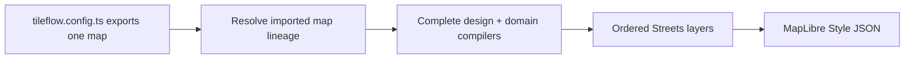

# @tileflow/core

Typed Tileflow map contracts, semantic modules, and deterministic MapLibre style compilation.

Every public `tileflow.config.ts` exports one map. Most maps import an existing map and override only
the design fields they own:

```ts
import {defineMap, labels, poi, roads, water, zoom} from '@tileflow/core';
import {streetsDark} from '@tileflow/maps';

export default defineMap({
  id: 'madrid',
  name: 'Madrid',
  version: 1,
  extends: streetsDark,
  projection: 'globe',
  modules: {
    water: water({bodies: {fill: {opacity: 0.95}}}),
    roads: roads({
      detail: 'streets',
      hierarchy: 'strong',
      classes: {
        primary: {
          surface: {
            fill: {
              color: '#E4A85B',
              width: zoom.linear([
                [7, 0.6],
                [16, 8],
              ]),
            },
          },
        },
      },
    }),
    labels: labels({
      language: 'local',
      places: 'all',
      roads: 'streets',
      styles: {places: {city: {text: {size: 18, haloWidth: 1.5}}}},
    }),
    poi: poi({categories: ['food', 'culture', 'major-transit'], color: 'category'}),
  },
  view: {center: [-3.7038, 40.4168], pitch: 35, zoom: 12},
});
```

Map identity, scenes, and delivery policy belong to the leaf and do not inherit. Hosting policy such
as allowed browser origins is delivery metadata because it does not change cartographic output.

Set `projection: 'globe'` for MapLibre's adaptive globe preset. Global zooms render as a sphere,
then transition to Mercator between zoom 10 and 12 so detailed streets remain planar. Omit the
property, or set it to `'mercator'`, for a consistently flat map.

Terrain keeps the original `'none' | 'hillshade' | '3d'` shorthand. The object form can style every
MapLibre hillshade paint control, or generate vector contours in the browser from an explicit DEM
tile template. Contours require `demUrl`, `demMaxZoom`, and zoom-indexed `[minor, index]`
`thresholds`; the raster `url` remains the separate TileJSON endpoint. Set `mode: 'none'` to compile
contours without adding a raster source, hillshade, or 3D terrain:

```ts
terrain: {
  mode: 'none',
  encoding: 'terrarium',
  contours: {
    demUrl: 'https://terrain.example.test/{z}/{x}/{y}.webp',
    demMaxZoom: 13,
    maxZoom: 15,
    overzoom: 2,
    thresholds: {
      9: [100, 500],
      11: [50, 250],
      13: [20, 100],
      15: [10, 50],
    },
    minor: {color: '#91683A', width: 0.55},
    index: {color: '#734F2A', width: 1.2},
    labels: {color: '#734F2A', haloColor: '#F7F0DE'},
  },
}
```

The compiled source is ordinary MapLibre vector data with source layer `contours`; its tile URL
contains the safely encoded DEM template and complete generation parameters. Register the generic
protocol before MapLibre reads the style. It lazily initializes the pinned, locally bundled
`maplibre-contour@0.1.0` browser module on the first contour tile; no public CDN runtime is needed.
`overzoom` may not exceed the lowest threshold zoom, so generated DEM requests never use a negative
zoom. Every index interval must be a whole multiple of its minor interval. Contour labels emit the
scaled numeric elevation without assuming a display unit. Source and layer visibility cannot begin
before the first configured threshold zoom. To bound main-thread work, effective minor intervals
must be at least 250 units at z0–4, 100 at z5–7, 50 at z8–10, 20 at z11–12, and 10 from z13 onward.
Use a trusted, size-bounded DEM tile service; the protocol intentionally accepts author-supplied
HTTP(S) templates rather than proxying or republishing terrain data.

```ts
import {registerTileflowContourProtocol} from '@tileflow/core/browser';

registerTileflowContourProtocol({addProtocol: maplibregl.addProtocol});
```

## Authoring model

Tileflow exposes one authoring concept: a map. `defineRootMap()` creates a complete compiler root;
`defineMap()` creates an ordinary map whose `extends` value is another imported map object. Streets,
Ferraris, Härad, Siegfried, Soundings, and Verdant are the first-party roots. All use the semantic
Streets compiler, but the five roots after Streets define their complete designs directly and do
not import or extend Streets. Streets Dark and Cyberpunk extend Streets through exactly the same API
available to applications, and Matrix extends Cyberpunk. There is no separate public recipe
selector or compatibility alias.

The serialized root literal `compiler: 'streets'` is the current compiler-family ABI identifier,
retained for compatibility. It selects Core's semantic map engine; it does not select or import the
official `streets` map, and it does not supply that map's modules, icons, fonts, or other assets.
`compilerVersion` versions this ABI independently from map and package versions.

Resolution happens before validation, asset preparation, compilation, capture, build, or deploy.
Only `theme`, `light`, and `view` deep-merge (their nested arrays and expressions still replace).
`modules` merges by domain name: an omitted domain remains inherited, while declaring `roads(...)`
or another domain replaces that inherited module request and every compiler-owned contribution
attached to it as a unit. `data`, `projection`, `terrain`, `icons`, and the text provider are atomic;
identity and tooling metadata are leaf-owned. `enabled: false` removes the domain and all of its
inherited effects. The resolved result is a standalone map with no runtime dependency on TypeScript
imports.

`icons` is an intentional exception to implicit array composition: omission inherits the exact
parent array, any declaration replaces it atomically, and `[]` disables map icons. Compose with a
spread when the child should keep a parent's directories. `fonts` and `glyphs` are mutually
exclusive text providers; declaring either atomically replaces an inherited provider of either
kind. Unknown keys and former compatibility shapes are rejected.

Most authors should extend an existing root. `defineRootMap()` is reserved for defining a complete
compiler-owned lineage:

```ts
import {defineMap, defineRootMap, tileflowStreetsCompilerVersion} from '@tileflow/core';
import {streetsIcons} from '@tileflow/maps';

const companyRoot = defineRootMap({
  id: 'company-root',
  name: 'Company root',
  version: 1,
  root: {compiler: 'streets', compilerVersion: tileflowStreetsCompilerVersion},
  glyphs: {
    kind: 'url',
    url: 'https://api.tileflow.dev/fonts/{fontstack}/{range}.pbf',
    fontStacks: ['Noto Sans Regular', 'Noto Sans Bold'],
  },
  icons: [streetsIcons],
});

export default defineMap({
  id: 'company-navigation',
  version: 1,
  extends: companyRoot,
  projection: 'globe',
});
```

The root above is complete as written. A map always owns its complete text provider; Core does not
obtain fonts or sprites from World and never invents a fallback URL. The URL-backed first-party
`streets`, `ferraris`, `harad`, `soundings`, and `verdant` roots declare their glyph providers
directly, while `siegfried` declares packaged fonts, so ordinary imports and derived maps compile
without out-of-band release metadata.



Modules are keyed by domain, so object order never controls rendering and a domain can appear only
once. A map extending Streets inherits its complete module set. Use `enabled: false` to replace and
remove a domain deliberately. The public domains are `land`, `water`, `roads`, `buildings`, `boundaries`, `labels`,
`poi`, `aeroways`, `transit`, `vegetation`, `addresses`, and `landforms`.
The typed default recipe is exhaustive over that domain set, and a schema contract test verifies
that every recipe entry keeps its key, type tag, validator, compiler orchestration, and root export
in lockstep. Disabling `roads` also removes dependent road names, shields, and junction references;
independent place, water, aerodrome, and POI labels remain under the labels module.

Every styling module supports semantic shortcuts and exact semantic targets. Style values accept
constants, raw MapLibre expressions through `expression(...)`, and zoom functions through
`zoom.step(...)`, `zoom.linear(...)`, or `zoom.exponential(...)`. Exact controls address stable
concepts such as `roads.classes.primary.surface.fill`, not renderer layer IDs.

The `land` module exposes stable land-use targets for `cemetery`, `civic`, `commercial`,
`education`, `government`, `industrial`, `medical`, `military`, `parking`, `railway`,
`recreation`, and `residential`. Its land-cover taxonomy distinguishes physical cover from authored
urban green: `farmland`, `flowerbed`, `grass`, `ice`, `meadow`, `protected`,
`recreationGround`, `rock`, `sand`, `scrub`, `urbanPark`, `villageGreen`, `wetland`, and
`wood`. The plain `grass` branch excludes every typed grass subclass, so one source feature cannot
receive two opaque green fills. Parking areas are polygons from the configured land-use source;
parking access aisles remain road features under `roads.serviceTypes.parkingAisle`. The
`commercial` target recognizes ordinary `commercial` and `retail` values plus Tileflow's derived
`business_area` ground class. Its `globalLandcover` fill styles the optional low-zoom global
land-cover extension without a raw layer patch. The `water.bathymetry` fill does the same for the
typed Tileflow World V1 depth bands. An explicit `water({bathymetryContours: {}})` traces the
submerged edges between those discrete polygon bands; it is an approximate visual contour, not a
surveyed isoline. `water({bathymetryLabels: {}})` separately opts into numeric metre values derived
from each polygon's absolute minimum band depth. Existing maps gain neither detail by default, and
sources without bathymetry bindings omit both requested layers. These labels describe coarse band
floors, not measured survey soundings, and must not be presented as hydrographic sounding data.

`addresses` renders the standard OpenMapTiles `housenumber` points at detailed zooms and exposes a
single semantic `labels` style. `landforms` renders the standard `mountain_peak` classes (`peak`,
`volcano`, `saddle`, `ridge`, `cliff`, and `arete`) with rank-aware collision priority and optional
metric elevation. Both source-layer and field names remain remappable through `openMapTiles(...)`;
landform names share the language selected by `labels({language: ...})`.

`aeroways.runwayRef` owns high-zoom runway designators from the remappable OpenMapTiles `ref`
field. Aerodrome names stay under `labels.styles.aerodrome`; `labels.aerodromeCodes` controls whether
they append no code, IATA only, or IATA with an ICAO fallback (`'none' | 'iata' | 'all'`).

The `vegetation` module binds individual-tree points from the optional OpenMapTiles `tree`
extension. Its default `mode: '3d'` emits a portable circle fallback plus metadata for runtimes
that can upgrade the points to instanced 3D trees. `mode: 'flat'` keeps the MapLibre circles, and
`flat` exposes the complete `CircleStyle` fallback. `threeDimensional` controls bark color,
broadleaf and conifer palettes, and independent height and crown scales. The legacy `minZoom`
shortcut remains available; `flat.minZoom` takes precedence when both are present. The binding
includes height, crown diameter, genus, leaf type, and species fields so compatible runtimes can
preserve source measurements and botanical form without hard-coding raw property names. The
pitched-scene stack follows physical height: pedestrian and transport surfaces, transport markings
and road names, buildings, then vegetation. Place, water, aerodrome, and POI annotations remain
last so geographic names stay readable without making street paint or text float over 3D geometry.

## Shared visual primitives

The same small visual language is reused across every geographic domain. This keeps an agent from
having to learn different spellings for the same MapLibre behavior:

- `BackgroundStyle`: color, opacity, pattern, visibility, and zoom range.
- `FillStyle`: color, opacity, pattern, antialiasing, visibility, and zoom range.
- `LineStyle`: color, width, opacity, dash, blur, gap, offset, pattern, caps, joins, and zoom range.
- `LineHatchStyle`: repeated diagonal detail with color, opacity, spacing, size, angle, and zoom
  range for a road structure.
- `TextStyle`: field, exact font face, exact fallback faces, size, color, halo, spacing metrics, transform,
  collision policy, rotation, fixed/variable anchoring, line constraints, and zoom range.
- `IconStyle`: image, size, color, halo, rotation/alignment, collision policy, and zoom range.
- `CircleStyle`: radius, fill/stroke appearance, blur, opacity, pitch behavior, and zoom range.
- `ExtrusionStyle`: color, height, base, opacity, pattern, vertical gradient, and zoom range.

Compounds express common cartographic structures: `AreaStyle` has `fill` and `outline`,
`LineStackStyle` has `shadow`, `casing`, and `fill`, and `SymbolStyle` combines placement with
optional `text`, `icon`, and `marker`. Geographic selection remains owned by semantic modules;
ordinary visual styles intentionally do not accept raw source filters.

## Compiled-style performance

The Streets compiler resolves semantic modules and their owned contributions first, then compacts equivalent
physical MapLibre layers. At high-detail zooms, road classes become a small set of data-driven
cohorts; equivalent road labels and tunnel hatches share compatible buckets; and land-cover,
land-use, and waterway classes share compatible buckets. Compaction selects
cohorts from compiler-owned semantic targets, not by parsing physical IDs; its temporary
owner/slot/target provenance is stripped from the public Style JSON.

After optimization, Core embeds a bounded private `tileflow:interaction-manifest` lookup for the
final POI representations. `@tileflow/interactions/maplibre` validates and consumes that metadata
so applications can bind to `domain: 'poi'` without depending on physical layer IDs. The lookup is
paired atomically with the exact style it describes; it is not a public style-authoring API.

Use the exported structural sweep to enforce budgets without loading tiles or a browser:

```ts
import {analyzeTileflowStylePerformance, createStyle} from '@tileflow/core';
import map from './tileflow.config';

const report = analyzeTileflowStylePerformance(createStyle(map));
console.log(report.zooms[16]);
```

The report covers z0–z22 by default and includes active layers, conservative bucket estimates,
symbols, and active layers per source-layer. It is intended for regression gates; browser traces
remain the source of truth for decode, upload, placement, and frame time.

A `SymbolStyle` root zoom range governs its text/icon layer and is inherited by its marker layer.
Because a marker is materialized as a separate circle layer, an explicit marker range may refine
that inherited default. Text and icon ranges must agree because MapLibre renders them together.

The road module distinguishes the path family semantically:

```ts
roads({
  extras: {paths: true},
  crossings: {image: 'crosswalk'},
  sidewalks: {
    surface: {color: '#F5F6F7', minZoom: 17},
    pattern: {pattern: 'sidewalk-dot', minZoom: 17, opacity: 0.6},
  },
  roundabouts: {
    casing: {strokeColor: '#FFFFFF'},
    fill: {strokeColor: '#B3BDCC'},
  },
  areas: {
    pedestrian: {
      fill: {color: '#F1F3F5'},
      outline: {color: '#D5DCE3', width: 1},
    },
  },
  classes: {
    primary: {
      tunnel: {
        casing: {color: '#8EA3B8', width: 10},
        fill: {color: '#F5F8FA', width: 8},
        hatch: {color: '#8EA3B8', opacity: 0.25, spacing: 10},
      },
    },
    pedestrian: {surface: {fill: {color: '#F5F6F7', width: 6}}},
    footway: {surface: {fill: {color: '#D9DEE3', width: 1.2}}},
    cycleway: {surface: {fill: {color: '#9ED8C5', width: 1.5}}},
    steps: {surface: {fill: {color: '#C7CED6', dash: [1, 1], width: 1.4}}},
    pathway: {surface: {fill: {color: '#E8ECEF', width: 1.2}}},
  },
  modifiers: {
    expressway: {widthScale: 1.06},
    ramp: {widthScale: 0.7},
    unpaved: {surface: {fill: {color: '#E6DFD3', dash: [2, 1]}}},
    construction: {surface: {fill: {dash: [2, 1], opacity: 0.7}}},
    indoor: {surface: {fill: {dash: [1, 1], opacity: 0.4}}},
  },
  restrictions: {
    access: {surface: {fill: {dash: [1.5, 1], opacity: 0.55}}},
    toll: {surface: {casing: {color: '#C5B7D8'}}},
  },
  serviceTypes: {
    driveway: {widthScale: 0.75},
    parkingAisle: {widthScale: 0.6},
  },
});
```

These targets are non-overlapping translations of the OpenMapTiles road class and subclass. The
same names are available under `labels().roadClasses` and `labels().styles.roads`. Surface, tunnel,
and bridge phases can be controlled independently for each target; each structure has
`shadow`/`casing`/`fill` and an optional `hatch`. Glyph hatch marks inherit the resolved fill width
when `size` is omitted and never participate in label collision. Setting `hatch.pattern` instead
emits a repeated sprite texture clipped to the resolved fill width. No raw source filter or generated
layer ID is needed. `hatch.patternWidths` can list intrinsic sprite heights named
`${pattern}-${width}`; the compiler selects the nearest height from the resolved road width so the
texture's marks remain approximately constant in screen pixels across classes, ramps, and zooms.

`classes.pedestrian` styles line-like pedestrian ways. Polygon pedestrian plazas are a distinct
geometry and use `areas.pedestrian`, including optional fill opacity, outline color, or sprite
pattern. This prevents plazas from degrading into a thin polygon outline.

Road treatments refine a class without creating another class or exposing source fields.
`construction`, `expressway`, `indoor`, `official`, `ramp`, and `unpaved` live under `modifiers`;
general, bicycle, foot, horse, and toll restrictions live under `restrictions`; `alley`,
`crossover`, `driveway`, `parkingAisle`, and `yard` live under `serviceTypes`; and exact
mountain-bike difficulty values live under `mountainBike`. Treatments reuse
surface/tunnel/bridge and casing/fill/shadow paint controls, plus a relative `widthScale`. The
compiler emits feature-driven paint expressions inside the existing stable class layers rather
than multiplying every possible combination.

Road names, shields, and motorway junctions remain label concerns:

```ts
labels({
  roads: 'all',
  shields: 'all',
  junctions: true,
  styles: {
    shields: {
      default: {
        text: {
          color: '#405264',
          font: 'Noto Sans Bold',
          haloColor: '#fff',
          haloWidth: 2,
        },
      },
      networks: {
        'network-value': {text: {color: '#B43A35'}},
      },
    },
    junctions: {text: {color: '#405264', haloColor: '#fff', haloWidth: 2}},
  },
});
```

POI `density`, `labels`, and `icons` are independent policies. Density bounds eligible feature
ranks, label detail controls text ranks, icon detail controls icon ranks, and
`placement.coupleIconAndLabel` deliberately keeps only features eligible for both. Without
coupling, icon and label layers collide normally but can be styled and zoomed independently.
The `balanced` policy keeps a practical cross-category candidate set from an overscaled
OpenMapTiles source tile; MapLibre collision placement still decides which candidates fit the
current viewport. An inclusive `maxRank` replaces the density/label/icon preset ceiling; it may be
a positive integer or a `zoom.step(...)`, `zoom.linear(...)`, or `zoom.exponential(...)` value that
reveals progressively lower-priority candidates. A category style's `maxRank` overrides the shared
module value when different feature families need different curves, without exposing a raw layer ID
or filter. Lower ranks are more important, and the ceiling is a candidate bound rather than a count
of labels that must appear. MapLibre evaluates zoom-dependent filters at integer zoom levels, so
`linear` and `exponential` ceilings still admit candidates in discrete zoom bands.

```ts
poi({
  minZoom: 14,
  maxRank: zoom.step([
    [14, 14], // z14–16.99: rank <= 14
    [17, 80], // z17–18.99: rank <= 80
    [19, 500], // z19+: rank <= 500
  ]),
});
```

Cyberpunk uses this policy for both its regular POI layers and its destination HUD. It keeps the
z15–16 candidate set tight, admits the principal attraction ranks at z17, and expands further at
z18–21. HUD brackets participate in normal collision placement, while `artwork` is treated as a
low-priority destination and is deferred to close zooms.

Theme tokens provide shared color and typography defaults. `theme` is always an object; it has no
name, registry, or nested `extends`. A derived map inherits and deep-merges those tokens only because
the map itself uses `extends`. A module-level exact style wins over a theme token for that target.
Precedence is deterministic:

1. Streets recipe defaults.
2. Resolved map theme.
3. Explicit keyed module fields.

`theme.mode` selects the compiler defaults and variant metadata used by style fields that remain
unspecified. It does not walk an inherited map and recolor exact values already authored in its
modules or compiler-owned contributions. Themes are therefore semantic defaults, not complete map
skins. For a coordinated dark Streets design, extend the official dark map:

```ts
import {defineMap} from '@tileflow/core';
import {streetsDark} from '@tileflow/maps';

export default defineMap({
  id: 'company-dark',
  version: 1,
  extends: streetsDark,
});
```

Extending the current official `streets` map with only `theme: {mode: 'dark'}` is not a visual dark
mode: Streets already specifies its coordinated appearance explicitly. It is not equivalent to
`streetsDark`.

There is no public physical-layer override surface. New cartographic behavior belongs to a typed
control in its owning module. Official maps may add compiler-private semantic contributions, but
each has exactly one module owner and is discarded atomically when that module is replaced or
disabled. `createStyle()` validates the final optimized Style JSON with the MapLibre style spec and
never returns an invalid style.

## Data is separate from design

Omitting `data` selects the compiler-owned Tileflow World `v1` compatibility generation:

```ts
import {streets} from '@tileflow/maps';

export default streets;
```

Theme typography can also set `fallbacks`, `letterSpacing`, and `transform` globally or per label
domain. Text delivery is explicit and atomic: a map may declare either ordered `fonts` directories
for browser font files or a `glyphs` provider for PBF glyphs, never both. Omitting both inherits the
parent's provider; declaring either replaces an inherited provider of either kind. After resolution,
a map that emits text must have exactly one provider. A text-free root may omit both. On a derived
map, omission inherits the parent provider while `fonts: []` explicitly removes it; that empty array
is valid only when the resolved map emits no text.

```ts
export default defineMap({
  id: 'brand-map',
  version: 1,
  extends: streets,
  fonts: ['./fonts'],
  theme: {typography: {font: 'Brand Sans Regular'}},
});
```

Node preparation reads TTF, OTF, and WOFF2 files, uses each OpenType full name as its exact
`text-font` ID, and requires `LICENSE.txt` in every contributing directory. Directories apply left
to right; a later exact name replaces an earlier face and case-only collisions fail. Only primary
faces used by the final style become content-addressed assets and strict `tileflow:fontFaces`
metadata. `font` names an exact OpenType full name or glyph face; local `fallbacks` name exact faces
or explicit CSS generic families. Tileflow never appends a weight suffix or derives one face from
another. Browser adapters load local faces before MapLibre. Native releases use a locked PBF
`glyphs` URL provider instead, which enumerates the exact comma-joined MapLibre request keys in
`fontStacks`.

Streets, Ferraris, Härad, Soundings, and Verdant each declare
`https://api.tileflow.dev/fonts/{fontstack}/{range}.pbf` with the exact `Noto Sans Regular` and
`Noto Sans Bold` stacks. That compatibility URL is canonical but not content-addressed; responses revalidate and
do not make a resolved map byte-reproducible. Exact official glyph identity belongs to the
separately published `/base/<assetSetSha256>/glyphs/...` global base-asset contract. In that URL,
`assetSetSha256` identifies the standalone glyph collection; it is not the same-domain value as the
per-map `assetSetSha256` in `build-manifest.json`.
Cyberpunk replaces the URL provider with its packaged Oxanium directory and references the exact
local faces `Oxanium Medium` and `Oxanium SemiBold`; Matrix reuses that provider. Siegfried owns its
packaged Cormorant Garamond Regular, SemiBold, and Italic faces.

Name the official generation deliberately, or use another OpenMapTiles-compatible vector source:

```ts
import {openMapTiles, tileflowWorld, vectorTiles} from '@tileflow/core';

const official = tileflowWorld();
const external = vectorTiles({
  tiles: ['pmtiles://./test/fixtures/world.pmtiles'],
  revision: 'fixture-1',
  attribution: '© Example © OpenStreetMap contributors',
  schema: openMapTiles(),
});
```

The resolved map controls how data is drawn; `data` controls where compatible features come from.
For Tileflow World, the compiler emits the selector TileJSON URL
`https://api.tileflow.dev/tiles/world/tiles.json`. Omitted data or `tileflowWorld()` selects
`world-v1/current`; `tileflowWorld({release: {releaseId, descriptorSha256}})` binds an exact release
through query parameters. Runtime and capture resolve `current` once per session or job and then
use the immutable release described by that response. `openMapTiles({layers, fields})` can bind renamed
source-layers or properties while preserving the versioned semantic contract. External browser
credentials do not belong in public Style JSON; supply them through the framework's
`transformRequest` integration.

External exact-test sources may use one TileJSON `url` or a bounded direct `tiles` list with optional
`bounds`, `minzoom`, and `maxzoom`. `pmtiles://` is supported for a checked-in or bring-your-own
archive. Public vector URLs are HTTPS, root-relative, or HTTP only on loopback development hosts.
A PMTiles URL names one `.pmtiles` archive through an HTTPS, loopback HTTP, root-relative, or safe
repository-relative target; credentials, fragments, traversal, and other protocols are rejected at
both authoring validation and compilation. An external `revision` participates in capture identity,
so changing fixture bytes cannot silently reuse a baseline.

Tileflow's OpenMapTiles contract also recognizes the optional `globallandcover` extension. The
official Streets map maps its `barren`, `crop`, `grass`, `shrub`, `snow`, `trees`, and
`urban` classes beneath the OSM land layers. Tileflow World V1 supplies native generalized
geometry through z10; Streets fades it progressively while detailed `landcover`/`landuse` gains
opacity and removes it at z11. This is a macro bridge, not local semantic detail. Sources with a
different layer name can use `openMapTiles({layers: {globalLandcover: 'my_landcover'}})`; archives
without the extension remain compatible and simply render no features for that style layer. Use
`land({globalLandcover: {...}})` to customize its fill, opacity, visibility, and zoom range. `crop`
shares the theme's semantic `landcover.farmland` color with detailed farmland, while `barren` uses
`landcover.rock`; neither class borrows a road color.

The normalized schema also records the meaning of the OpenMapTiles `park` layer. Generic
`openMapTiles()` defaults to `semantics.parkLayer: 'mixed'` and compiles a private compatibility
branch for ordinary legacy parks. `tileflowWorldV1Schema()` fixes it to `'protected-only'`: that
layer is a protection tint, while urban parks and gardens come from
`landcover.class=grass/subclass=park|garden`. The ambiguous legacy `park` class is therefore not
a public land-cover target.

Tileflow World V1 makes `bathymetry`, `globallandcover`, `circular_feature`, `sidewalk`, and
`street_furniture` mandatory. Use `tileflowWorldV1Schema()` for that product instead of making raw
layer names part of a style. Publication tooling calls `validateTileflowWorldV1Tilejson(...)` and
fails closed unless each layer occurs exactly once, declares its contracted native zooms, and
advertises the typed fields consumed by the maps. This includes bathymetry z0–z9, global land cover
z0–z10, and the three detailed-city layers at native z15. Generic OpenMapTiles sources keep these
extensions optional and the compiler omits unsupported detail. Resolving omitted data or
`tileflowWorld(...)` uses the strict V1 schema directly, and `water({bathymetry: {...}})` styles the
emitted depth bands without raw layer IDs. Use `water({bathymetryContours: {...}})` to customize the
opt-in companion line layer; an empty style selects subtle defaults, and the zero-depth band is
excluded so the ordinary coastline remains authoritative. The lines follow discrete band polygon
edges and are therefore approximate rather than surveyed depth contours. Use
`water({bathymetryLabels: {...}})` to customize the separate opt-in symbol layer; an empty style
selects the defaults, whose text is the absolute band-minimum number in metres with no unit suffix.
It remains a band-floor annotation, not a survey sounding.

Detailed city datasets can bind `sidewalk`, `streetFurniture`, and `circularFeature` source layers
through `openMapTiles({layers, fields})`. When present, `roads.sidewalks` owns source-backed
pedestrian polygons, `roads.crossings` owns oriented crossing icons, and `roads.roundabouts` owns
metric circular road rings. These bindings are optional: a generic OpenMapTiles source remains
valid and the compiler omits unsupported detail instead of inventing geometry. Crossing icons are
explicit because the data contract cannot assume a sprite name.

The optional `business_corridor` extension contains activity-selected source footprints below
buildings. Its `activity_score`, `rank`, `min_zoom`, and `confidence` fields control a quiet local
warm tint without drawing POI-radius circles. Current building footprints may carry sparse
`building_tone=commercial|destination|active`; absence means the neutral base building. The three
values preserve why the warm tone was selected even when a theme maps them to the same color.
Building visibility is fixed by the layer zoom contract and never by optional semantics. Immutable
V8.9 archives carrying `building_kind` or `has_business` remain readable as a defensive
compatibility path, but new candidates do not emit those fields. The land module also exposes
`medical`, `education`, and `government` independently instead of collapsing their already distinct
source classes into one civic color.

World and text assets are independent contracts. `tileflowWorld()` selects `world-v1/current` or an
exact `releaseId + descriptorSha256`; a `glyphs` declaration contains its own complete URL. Ordinary
imports of Streets, Ferraris, Härad, Siegfried, Soundings, Streets Dark, Cyberpunk, Matrix, and
Verdant remain usable because each official map owns or inherits a URL or packaged-font provider.
URL-backed maps become exact-byte reproducible
when the immutable global base-asset set is published and their explicit URL is updated to its
`assetSetSha256` path; no World or compiler fallback participates in that rollout. The global
base-asset manifest's hash and a map build manifest's identically named `assetSetSha256` use
different contracts and must never be substituted for one another.

Upstream data attribution remains in the MapLibre source. `Map by Tileflow` is a separate product
credit/trademark surface and must not replace, obscure, or be presented as upstream attribution.

## Capture scenes

Commit named `scenes` on the singular exported map. A scene implicitly targets that map, so it does
not repeat a `map` selector. Scene metadata does not inherit and is removed before cartographic
compilation; it affects visual evidence, not style or manifest identity.

```ts
import {defineMap} from '@tileflow/core';
import {streets} from '@tileflow/maps';

export default defineMap({
  id: 'madrid',
  name: 'Madrid',
  version: 1,
  extends: streets,
  scenes: {
    'madrid-desktop': {
      camera: {type: 'center', center: [-3.7038, 40.4168], zoom: 12},
      viewport: {width: 1280, height: 800, dpr: 1},
    },
  },
});
```

Use `tileflow preview --scene madrid-desktop` (`tileflow dev` remains an alias) for live review and
`tileflow capture madrid-desktop` for exact pixels and a schema-version-3 receipt containing the
Streets, data, style, renderer, and image identities. World capture resolves the selected TileJSON
once and records the exact `world-v1` release plus descriptor/archive/data-contract hashes;
external fixtures may identify their explicit revision.

Every exact World V1 release ID is already canonical at the producer boundary: 12–128 characters
matching `^world-v1-[a-z0-9][a-z0-9._-]*[a-z0-9]$`. Core validates the literal value and never trims,
lowercases, or upgrades it to another World generation.

## Public API and browser subpath

Config, data, modules, compilation, validation, runtime resolution, and capture-scene APIs remain
available from the package root. Capture scenes, manifests, and browser-runtime surfaces also have
explicit `@tileflow/core/capture`, `@tileflow/core/manifest`, and `@tileflow/core/runtime`
subpaths. Node build integrations import the small deterministic map-identity contract from
`@tileflow/core/build`: `collectTileflowMapBuildLineage`, `createTileflowMapBuildManifest`,
`hashTileflowMapRevision`, `hashTileflowAssetSet`, and `hashTileflowAssetSetIdentities`. The latter
reproduces the same asset-set v1 hash from exact per-file identities after another system has
independently confirmed the immutable bytes; package or bundle hashes are not substitutes. The
previous aggregate-wrapper and recipe-selector APIs, `renderer`, top-level `tiles`/`tileset`, module
arrays, and raw `layers` are not part of this API.

`@tileflow/core/recipe` is nevertheless a real exported ABI used by `@tileflow/maps` to declare
owner-scoped semantic effects for first-party recipes. It is a low-level compiler integration
surface, not a recipe selector and not the ordinary application authoring API; application maps
should use typed modules from the package root. Because Maps imports this subpath from its installed
Core peer, incompatible changes to it participate in Core SemVer and package compatibility checks.

`mapRevisionSha256` hashes only resolved cartography: the effective design after `extends`, the
compiler family, compiler-owned effective contributions, and exact source icon/font identities.
Leaf `id`, `name`, editorial `mapVersion`, default `view`, capture `scenes`, and `delivery` policy do
not change that content identity. They remain explicit on the map, manifest, Style, capture receipt,
or Hosted deployment fingerprint that owns them. Compiler ABI, package versions, generated assets,
and the concrete release selected by World `current` likewise have separate identities.

Runtime manifest version 3 is discriminated as `kind: 'self-hosted'` or `kind: 'hosted'`.
`parseTileflowRuntimeManifest()` accepts only that canonical shape; version-2 manifests and old
aliases are rejected rather than normalized. The strict bounded schema uses the same portable map
IDs as authoring, requires an exact `maps`/`styles` closure, rejects duplicate font identities and
unsafe owner-relative URLs, prototype-bearing input, unknown fields, and JSON larger than 1 MiB.
Runtime fetches share a successful result for 30 seconds, never cache failures, use
`cache: 'no-store'`, enforce a 10-second timeout (configurable up to 60 seconds), compose an
external abort signal, and can be invalidated with `clearTileflowManifestCache()`.

Named map `view` values travel in the manifest. `resolveTileflowRuntimeView()` defines the shared
precedence as explicit runtime values, then the manifest view, then the single exported
`defaultTileflowRuntimeView` (`[0, 20]`, zoom 2, bearing/pitch 0). Browser delivery is one
discriminated `TileflowRuntimeSource`: `kind: 'tileflow'` resolves a named map only through its
published manifest, while `kind: 'maplibre'` accepts a direct style object or URL. The runtime
subpath does not import the config compiler, invent a localhost style URL, or change image mode by
environment.

Framework adapters import the browser-only lifecycle kernel explicitly:

```ts
import {
  attachTileflowFairUseNotice,
  attachTileflowMapLifecycle,
  createTileflowMarkerController,
  createTileflowSessionStarter,
  createTileflowTransformRequest,
  registerTileflowWorldRequestBridge,
} from '@tileflow/core/browser';
```

The browser entry is not re-exported from the root. It is SSR-safe to import, has no MapLibre
runtime dependency, and reads no browser global during module evaluation. See the
[framework browser runtime contract](../../docs/contracts/framework-browser-runtime.md) and the
[cartographic authoring contract](../../docs/contracts/cartographic-authoring.md). Exact field
resolution and asset rules live in the
[map inheritance contract](../../docs/contracts/map-inheritance.md).

## Hosted session authorization

The framework adapters use `createTileflowSessionController` to obtain one short-lived session
grant before eligible hosted style, tile, font, or sprite requests. Concurrent resources share the
same preflight, grants are attached only to reviewed HTTP(S) origins, and an expired unused session
rotates once when the server requests it. A controller also rotates after six hours or 10,000
eligible requests. The preflight has a 10-second client timeout by default; direct controller users
can set `grantTimeoutMs` from 1 to 120,000 milliseconds.

`analytics.enabled: false` disables only the optional analytics beacon. It does not disable this
server-owned commercial authorization. User `transformRequest` callbacks still run first; Tileflow
then decorates only the resulting eligible URL and preserves the other request options.

For exact Tileflow World release tiles, framework adapters also use the browser request bridge to
observe the response's safe fair-use state without adding identity, query parameters, credentials,
or user headers to the public World URL. The bridge requires the immutable release path and exactly
one lowercase descriptor digest; the retired mutable World template is never intercepted. Early
`GRACE` stays silent; signed late `GRACE` creates a compact
accessible owner-action pill, and `CLAIM_REQUIRED` creates a stronger in-map banner. A missing
header, absent tile, MapLibre error, or failed response cannot erase an existing claim action; a
later successful `OPEN` response can clear it. Shaped empty tiles remain render-safe while the owner
action stays available. Successful World tile bodies are streamed with a 16 MiB maximum: an
oversized `Content-Length` is rejected before reading, and chunked responses are cancelled as soon
as their accumulated bytes cross the same bound. Abort signals cancel an active reader; errors do
not include the remote response body.

Other subpaths under `src/`, `themes/`, `templates/`, and `modules/` are internal implementation
details and can change during alpha releases.

Official map definitions and the source assets they own ship together in `@tileflow/maps`, not in
Core. That package exports the maps and their reusable directory descriptors:

```ts
import {
  cyberpunk,
  cyberpunkFonts,
  cyberpunkIcons,
  ferraris,
  ferrarisIcons,
  harad,
  haradIcons,
  matrix,
  matrixIcons,
  siegfried,
  siegfriedFonts,
  siegfriedIcons,
  soundings,
  soundingsIcons,
  streets,
  streetsDark,
  streetsDarkIcons,
  streetsIcons,
  verdant,
  verdantIcons,
} from '@tileflow/maps';
```

`streets`, `ferraris`, `harad`, `siegfried`, `soundings`, and `verdant` are complete compiler roots.
All select the semantic Streets compiler, but the five roots after Streets neither import nor extend
Streets; each declares its own icon directory, and Siegfried also declares `siegfriedFonts`.
`streetsDark` and `cyberpunk` extend Streets. Streets Dark preserves the root's content and hierarchy
while owning its complete night palette and lighting. Streets declares `[streetsIcons]`; Streets Dark
declares `[streetsIcons, streetsDarkIcons]` so its later dark `sidewalk-dot` overrides the shared
source. Matrix extends Cyberpunk, replaces the inherited icons with `[streetsIcons, matrixIcons]`,
and reuses `cyberpunkFonts`. The same operation is available to applications:

```ts
export default defineMap({
  id: 'brand-map',
  version: 1,
  extends: streets,
  icons: [...streets.icons, './icons'],
});
```

`icons` is a `readonly TileflowIconDirectory[]`. Omission inherits the parent's exact array,
declaration replaces it atomically, and `[]` means no icons. Directories apply left to right.
`<id>.<ext>` publishes an icon as `<id>`; `<id>.pattern.<ext>` publishes an intrinsic-size pattern
as `<id>`. The published ID must already be canonical lower-kebab; a later exact ID wins and a
case-only collision fails. There is no built-in selector, source object, external
sprite selector, icon mapping, icon-specific inheritance, additive command, or compatibility alias.

`@tileflow/dev` resolves local and package directory descriptors, verifies real-path containment,
and prepares ordinary public artifacts without serializing installation paths. It compiles one
deterministic sprite from the final icon composition and validates every literal `icon-image`,
`fill-pattern`, and `line-pattern` in the final style against it. It also prepares any declared font
directories generically; `cyberpunkFonts` and `siegfriedFonts` are ordinary package descriptors
rather than pipeline special cases. Calling the pure compiler for a map whose style needs unprepared
assets fails instead of emitting broken runtime references.
