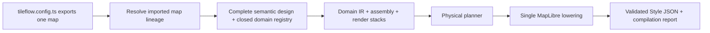

# Authoring model

Start with the [@tileflow/core guide](https://github.com/tileflow/tileflow-sdk/blob/main/packages/core/README.md) for installation and a complete first example.

Tileflow exposes one authoring concept and one constructor: `defineMap()`. A complete map omits
`extends`; an inherited map sets `extends` to another imported map object. All ten first-party
maps are independent standalone maps. They use the sole semantic compiler while defining
their complete designs and asset providers directly; no official map imports or extends another
official map. Applications can extend any of those maps through the same public API. Streets
itself owns coordinated light and dark themes.
There is no public compiler selector or alternate compiler. The authoring contract has no recipe or
cartographic compatibility alias.

### Machine-readable language surface

`tileflowAuthoringManifest` is the deterministic, deeply frozen description of the public semantic
language. Its schema version is `tileflowAuthoringManifestSchemaVersion`. The manifest's `domains`
array is generated from the compiler's closed registry and records exact compile order, module and
service dependencies, and provided services. `operations` lists only integrated public operations:
defining/extending a map, directly replacing, refining, disabling, or resetting a keyed domain,
and adding owner-local render passes or target refinements. Direct declaration is the sole
replacement syntax; there is no redundant `set()` helper.

Agents and other tools can discover this contract without importing executable configuration:
`tileflow language manifest --json` emits the manifest and `tileflow language schema --json` emits
the packaged generated authoring/resolved JSON Schema. Both commands are deterministic, read-only,
and network-free. The manifest links every domain to its authoring, options, patch, and resolved
schema definitions, and enumerates the closed expression and render-selector vocabulary with its
finite limits.

The manifest also describes the exact structured compiler contract. A successful
`createStyleResult()` has `{ok: true, diagnostics, report, style}`; a failure has
`{ok: false, diagnostics, report}` and forbids `style`. Report schema version 1 requires
`domains`, `map`, `planner`, `schemaVersion`, and sorted semantic `targets`; `theme`, source
`requirements`, and physical `provenance` are optional. Pass `{inspection: true}` only when the
read-only physical-output provenance sidecar is needed. Its IDs and indexes are diagnostic
observations, never stable or addressable authoring targets.

`diffTileflowMaps(before, after)` resolves both inputs before comparing them and returns semantic
diff schema version 1:

```ts
{
  schemaVersion: 1,
  from: {id, version},
  to: {id, version},
  summary: {add, remove, change, total},
  changes: [
    {kind: 'add', path: '/projection', after: 'globe'},
    {kind: 'remove', path: '/modules/water', before: {/* ... */}},
    {kind: 'change', path: '/view/zoom', before: 12, after: 13},
  ],
}
```

Paths are RFC 6901 JSON Pointers. Object keys compare recursively in code-unit order; arrays compare
atomically because map inheritance replaces arrays. Leaf identity (`id`, `name`, `version`) and
delivery metadata identify the endpoints but are not cartographic changes.

Custom build tooling can opt into a separate, read-only diagnostic sidecar from the explicit build
entrypoint:

```ts
import {createStyleWithInspection} from '@tileflow/core/build';

const {style, inspection} = createStyleWithInspection(map);
```

`inspection.layers` stays aligned with the final Style layer order and records the semantic
`owner`, `slot`, `target`, and ordered render passes/refinements represented by each layer, including
layers merged by the physical planner. `createStyleFromCatalogWithInspection` and
`createStylesFromCatalogWithInspection` provide the corresponding catalog-oriented forms. The
ordinary Style bytes are identical to compilation without inspection; private compiler metadata is
stripped before finalization, and the sidecar never enters a Style, runtime manifest, or production
artifact unless a caller deliberately stores it.

Resolution happens before validation, asset preparation, compilation, capture, build, or deploy.
Only `view` deep-merges (its nested arrays and expressions still replace). The `themes` collection
replaces atomically when declared and clears an inherited `systemThemes` mapping; omission inherits
the collection. `defaultTheme` may independently choose one inherited concrete theme, while an
explicit `systemThemes` replaces the complete light/dark mapping. Every resolved selector must name
a theme in the final collection.
`modules` merges by domain name: an omitted domain remains inherited, while declaring `roads(...)`
or another domain replaces that inherited module request and every compiler-owned contribution
attached to it as a unit. `data`, `projection`, `terrain`, `marine`, `icons`, and the text provider
are atomic; identity and tooling metadata are leaf-owned. `disable()` removes the domain and
its complete inherited render stack. The resolved result is a standalone map with no runtime dependency on
TypeScript imports.

`icons` is an intentional exception to implicit array composition: omission inherits the exact
parent array, any declaration replaces it atomically, and `[]` disables map icons. Compose with a
spread when the child should keep a parent's directories. `fonts` and `glyphs` are mutually
exclusive text providers; declaring either atomically replaces an inherited provider of either
kind. Unknown keys and former compatibility shapes are rejected.

Most authors should extend an existing official or application map. A complete standalone map uses
the same `defineMap()` call without `extends`:

```ts
import {defineMap} from '@tileflow/core';
import {streetsIcons, streetsThemes} from '@tileflow/maps';

const companyBase = defineMap({
  id: 'company-base',
  name: 'Company base',
  version: 1,
  glyphs: {
    kind: 'url',
    url: 'https://api.tileflow.dev/fonts/{fontstack}/{range}.pbf',
    fontStacks: ['Noto Sans Regular', 'Noto Sans Bold'],
  },
  icons: [streetsIcons],
  themes: {light: streetsThemes.light, dark: streetsThemes.dark},
  defaultTheme: 'light',
  systemThemes: {light: 'light', dark: 'dark'},
});

export default defineMap({
  id: 'company-navigation',
  version: 1,
  extends: companyBase,
  projection: 'globe',
});
```

The standalone map above is complete as written. A map always owns its complete text provider; Core does not
obtain fonts or sprites from World and never invents a fallback URL. The URL-backed first-party
`streets`, `ferraris`, `harad`, `soundings`, `verdant`, and `sanFrancisto` maps declare their glyph
providers directly, while `baedeker`, `siegfried`, `cyberpunk`, and `matrix` declare packaged fonts, so ordinary imports and derived
maps compile without out-of-band release metadata.



Modules are keyed by domain, so object order never controls rendering and a domain can appear only
once. A map extending Streets inherits its complete module set. Use `disable()` to remove a domain
deliberately. The public domains are `land`, `water`, `nautical`, `roads`, `buildings`, `boundaries`,
`labels`, `poi`, `aeroways`, `transit`, `vegetation`, `addresses`, and `landforms`.
The closed domain registry is exhaustive over that domain set and owns defaults, dependency order,
services, and compiler orchestration. Contract tests keep its keys and type tags in lockstep with
the strict resolved schema, generated authoring/options/patch/resolved schema aliases, and public
exports. Disabling `roads` also removes dependent road names, shields, and junction references;
independent place, water, aerodrome, and POI labels remain under the labels module.

Every styling module supports semantic shortcuts and exact semantic targets. Visual style values
accept typed token refs, documented `fixed(value, {reason})` values, closed data expressions through
`expr.*` plus `field(...)`, and zoom functions through `zoom.step(...)`, `zoom.linear(...)`, or
`zoom.exponential(...)`. Refs and fixed leaves also work inside typed expressions and zoom stops.
Structural controls such as presets, visibility, and zoom gates remain ordinary literals. Exact
controls address stable concepts such as `roads.classes.primary.surface.fill`, not renderer layer
IDs.

The `land` module exposes stable land-use targets for `cemetery`, `civic`, `commercial`,
`education`, `government`, `industrial`, `medical`, `military`, `parking`, `railway`,
`recreation`, and `residential`. Its land-cover taxonomy distinguishes physical cover from authored
urban green: `farmland`, `flowerbed`, `grass`, `ice`, `meadow`, `protected`,
`recreationGround`, `rock`, `sand`, `scrub`, `urbanPark`, `villageGreen`, `wetland`, and
`wood`. The plain `grass` branch excludes every typed grass subclass, so one source feature cannot
receive two opaque green fills. Parking areas are polygons from the configured land-use source;
parking access aisles remain road features under `roads.serviceTypes.parkingAisle`. The
`commercial` target recognizes ordinary `commercial` and `retail` values plus Tileflow's derived
`business_area` ground class. Its `globalLandcover` fill styles the optional low-zoom global
land-cover extension without a raw layer patch. The `water.bathymetry` fill does the same for the
typed Tileflow World V1 depth bands. An explicit `water({bathymetryContours: {}})` traces the
submerged edges between those discrete polygon bands; it is an approximate visual contour, not a
surveyed isoline. `water({bathymetryLabels: {}})` separately opts into numeric metre values derived
from each polygon's absolute minimum band depth. Existing maps gain neither detail by default, and
sources without bathymetry bindings omit both requested layers. These labels describe coarse band
floors, not measured survey soundings, and must not be presented as hydrographic sounding data.

`addresses` renders the standard OpenMapTiles `housenumber` points at detailed zooms and exposes a
single semantic `labels` style. `landforms` renders the standard `mountain_peak` classes (`peak`,
`volcano`, `saddle`, `ridge`, `cliff`, and `arete`) with rank-aware collision priority and optional
metric elevation. Both source-layer and field names remain remappable through `openMapTiles(...)`;
landform names share the language selected by `labels({language: ...})`.

`aeroways.runwayRef` owns high-zoom runway designators from the remappable OpenMapTiles `ref`
field. Aerodrome names stay under `labels.styles.aerodrome`; `labels.aerodromeCodes` controls whether
they append no code, IATA only, or IATA with an ICAO fallback (`'none' | 'iata' | 'all'`).

The `vegetation` module binds individual-tree points from the optional OpenMapTiles `tree`
extension. Its default `mode: '3d'` emits a portable circle fallback plus metadata for runtimes
that can upgrade the points to instanced 3D trees. `mode: 'flat'` keeps the MapLibre circles, and
`flat` exposes the complete `CircleStyle` fallback. `threeDimensional` controls bark color,
broadleaf and conifer palettes, and independent height and crown scales. The legacy `minZoom`
shortcut remains available; `flat.minZoom` takes precedence when both are present. The binding
includes height, crown diameter, genus, leaf type, and species fields so compatible runtimes can
preserve source measurements and botanical form without hard-coding raw property names. The
pitched-scene stack follows physical height: pedestrian and transport surfaces, transport markings
and road names, buildings, then vegetation. Place, water, aerodrome, and POI annotations remain
last so geographic names stay readable without making street paint or text float over 3D geometry.
